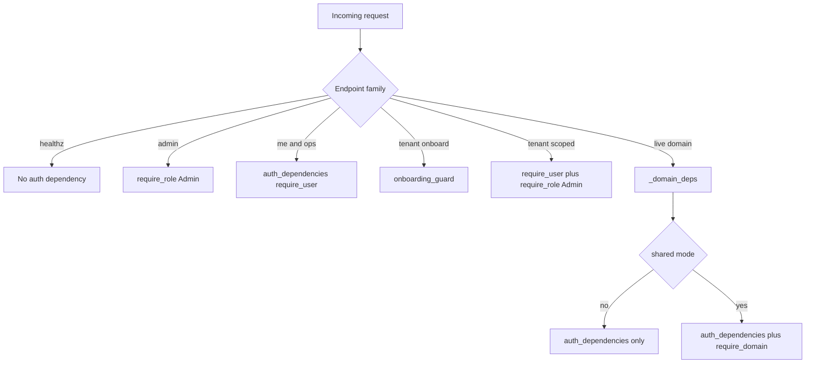

# Backend API surface

The backend exposes two different kinds of entrypoints: router-based HTTP routes aggregated under `api_router`, and domain endpoints mounted directly on the FastAPI app by `mount_domains(app)`. That split matters because the live domain endpoints are not all ordinary JSON APIs: some are AG-UI endpoints, some are SSE bridges, and some are mounted only when the corresponding runtime subsystem is configured. [api/__init__.py](https://github.com/ruinosus/foundry-assured/blob/4d10c9a42e5d5c2a2b7f60d26a3e694620a9bcaa/apps/backend/app/api/__init__.py#L1-L18) [main.py](https://github.com/ruinosus/foundry-assured/blob/4d10c9a42e5d5c2a2b7f60d26a3e694620a9bcaa/apps/backend/app/main.py#L35-L49) [domains.py](https://github.com/ruinosus/foundry-assured/blob/4d10c9a42e5d5c2a2b7f60d26a3e694620a9bcaa/apps/backend/app/domains.py#L167-L176)

## Endpoint families

| Family | Paths | Registration | Protocol | Main auth/dependency model |
|---|---|---|---|---|
| Operational | `/healthz`, `/tickets`, `/eval/runs`, `/eval/foundry` | `api_router` | JSON | health open, others `auth_dependencies()` |
| Identity and admin | `/me`, `/admin/*` | `api_router` | JSON | `require_user` or `require_role("Admin")` |
| Tenant management | `/tenant*` | `api_router` only in shared mode | JSON | admin plus tenant resolution or onboarding guard |
| Hosted twins | `/helpdesk-hosted`, `/platform-hosted` | `api_router` | AG-UI SSE bridge | `auth_dependencies()` or `_domain_deps("platform")` |
| Live helpdesk | `/helpdesk` | `mount_domains` | AG-UI workflow | `_domain_deps("helpdesk")` when KB path active |
| Live grounded domains | `/cockpit`, `/selfwiki` | `mount_domains` | SSE via `StreamingResponse` | `_domain_deps(domain_id)` |
| Live platform | `/platform` | `mount_domains` | AG-UI tool agent | `_domain_deps("platform")` |

This table captures the main boundary in the backend surface: mounted live domains are runtime-composed protocol endpoints, while router routes are conventional HTTP APIs and operational helpers. [api/chat.py](https://github.com/ruinosus/foundry-assured/blob/4d10c9a42e5d5c2a2b7f60d26a3e694620a9bcaa/apps/backend/app/api/chat.py#L1-L34) [api/evals.py](https://github.com/ruinosus/foundry-assured/blob/4d10c9a42e5d5c2a2b7f60d26a3e694620a9bcaa/apps/backend/app/api/evals.py#L1-L42) [api/tickets.py](https://github.com/ruinosus/foundry-assured/blob/4d10c9a42e5d5c2a2b7f60d26a3e694620a9bcaa/apps/backend/app/api/tickets.py#L1-L16) [api/health.py](https://github.com/ruinosus/foundry-assured/blob/4d10c9a42e5d5c2a2b7f60d26a3e694620a9bcaa/apps/backend/app/api/health.py#L1-L8)

## Mounted live endpoints

### `/helpdesk`

`/helpdesk` is mounted by `_mount_helpdesk`. When `_knowledge_configured()` is true, the backend wires `OrderedAgentFrameworkWorkflow(workflow_factory=build_helpdesk_workflow)` through `add_agent_framework_fastapi_endpoint`. Without KB configuration, it serves `build_concierge_agent()` instead. The comments call out that hosted twins remain in `app/api/chat.py`, so `/helpdesk` is the live internal workflow path, not the hosted-agent path. [domains.py](https://github.com/ruinosus/foundry-assured/blob/4d10c9a42e5d5c2a2b7f60d26a3e694620a9bcaa/apps/backend/app/domains.py#L132-L149) [agents/concierge.py](https://github.com/ruinosus/foundry-assured/blob/4d10c9a42e5d5c2a2b7f60d26a3e694620a9bcaa/apps/backend/app/agents/concierge.py#L27-L62)

### `/cockpit` and `/selfwiki`

These are mounted by `_mount_grounded` as POST routes returning `StreamingResponse(stream_grounded(...), media_type="text/event-stream")`. The endpoint body explicitly captures `current_user()` and forwards it into `stream_grounded`, because the request contextvar does not survive inside the generator. This is why grounded-domain auth behavior is described in terms of endpoint capture, not just dependency injection. [domains.py](https://github.com/ruinosus/foundry-assured/blob/4d10c9a42e5d5c2a2b7f60d26a3e694620a9bcaa/apps/backend/app/domains.py#L111-L129) [grounded.py](https://github.com/ruinosus/foundry-assured/blob/4d10c9a42e5d5c2a2b7f60d26a3e694620a9bcaa/apps/backend/app/services/grounded.py#L76-L83) [grounded.py](https://github.com/ruinosus/foundry-assured/blob/4d10c9a42e5d5c2a2b7f60d26a3e694620a9bcaa/apps/backend/app/services/grounded.py#L103-L145)

### `/platform`

`/platform` is mounted by `_mount_platform` only when `platform_configured()` is true. It serves `platform_agent_proxy`, not a prebuilt agent, so every request rebuilds the inner agent with tools filtered to the caller's roles and request-time credential. [domains.py](https://github.com/ruinosus/foundry-assured/blob/4d10c9a42e5d5c2a2b7f60d26a3e694620a9bcaa/apps/backend/app/domains.py#L152-L164) [agents/platform.py](https://github.com/ruinosus/foundry-assured/blob/4d10c9a42e5d5c2a2b7f60d26a3e694620a9bcaa/apps/backend/app/agents/platform.py#L25-L56)

## Hosted twins versus live endpoints

The hosted twins are router routes in `app/api/chat.py`, not part of `mount_domains`. `/helpdesk-hosted` proxies a hosted agent and streams Responses output back as AG-UI SSE. `/platform-hosted` is the hosted twin of `/platform`, but uses `_domain_deps("platform")`, so it gets both sign-in and, in shared mode, the per-tenant domain-entitlement gate. [api/chat.py](https://github.com/ruinosus/foundry-assured/blob/4d10c9a42e5d5c2a2b7f60d26a3e694620a9bcaa/apps/backend/app/api/chat.py#L12-L34) [hosted.py](https://github.com/ruinosus/foundry-assured/blob/4d10c9a42e5d5c2a2b7f60d26a3e694620a9bcaa/apps/backend/app/services/hosted.py#L72-L105) [hosted.py](https://github.com/ruinosus/foundry-assured/blob/4d10c9a42e5d5c2a2b7f60d26a3e694620a9bcaa/apps/backend/app/services/hosted.py#L121-L182)

The protocol distinction is important:

- `/helpdesk` is an AG-UI workflow endpoint over the internal workflow runtime.
- `/helpdesk-hosted` is a Responses-to-AG-UI bridge for a hosted agent.
- `/platform` is a live AG-UI tool-driven agent.
- `/platform-hosted` is intended as an Invocations-protocol passthrough, with explicit TODOs in the code about request-body shape and SSE framing that are not yet verified offline. [domains.py](https://github.com/ruinosus/foundry-assured/blob/4d10c9a42e5d5c2a2b7f60d26a3e694620a9bcaa/apps/backend/app/domains.py#L132-L164) [hosted.py](https://github.com/ruinosus/foundry-assured/blob/4d10c9a42e5d5c2a2b7f60d26a3e694620a9bcaa/apps/backend/app/services/hosted.py#L107-L182)

## Router-based JSON APIs

### Health and operational read APIs

- `GET /healthz` returns `{"status": "ok"}` and is the only explicitly open liveness route. [api/health.py](https://github.com/ruinosus/foundry-assured/blob/4d10c9a42e5d5c2a2b7f60d26a3e694620a9bcaa/apps/backend/app/api/health.py#L1-L8)
- `GET /tickets` is sign-in gated and returns real tickets opened by the HITL approval flow, backed by `app.tools.tickets.list_tickets`. [api/tickets.py](https://github.com/ruinosus/foundry-assured/blob/4d10c9a42e5d5c2a2b7f60d26a3e694620a9bcaa/apps/backend/app/api/tickets.py#L1-L16)
- `GET /eval/runs` reads the local `eval/runs.jsonl` mirror produced by the offline eval harness. [api/evals.py](https://github.com/ruinosus/foundry-assured/blob/4d10c9a42e5d5c2a2b7f60d26a3e694620a9bcaa/apps/backend/app/api/evals.py#L12-L33)
- `GET /eval/foundry` returns live Foundry evaluation summaries via `list_eval_runs(limit)`. [api/evals.py](https://github.com/ruinosus/foundry-assured/blob/4d10c9a42e5d5c2a2b7f60d26a3e694620a9bcaa/apps/backend/app/api/evals.py#L36-L42)

### Identity and admin APIs

`GET /me` is the backend's answer to a frontend limitation: API-app roles live in the access token for this backend, not the SPA's ID token, so the frontend asks `/me` for the effective role list. When auth is disabled, `/me` returns all roles so local development remains usable. [api/me.py](https://github.com/ruinosus/foundry-assured/blob/4d10c9a42e5d5c2a2b7f60d26a3e694620a9bcaa/apps/backend/app/api/me.py#L1-L31)

The `/admin` family is fully Admin-gated and delegates all user lifecycle and app-role assignment work to Microsoft Graph through `app.services.graph`. Routes include role vocabulary, user listing, B2B invite, user creation/deletion, role assignment listing, assignment creation, and assignment revocation. [api/admin.py](https://github.com/ruinosus/foundry-assured/blob/4d10c9a42e5d5c2a2b7f60d26a3e694620a9bcaa/apps/backend/app/api/admin.py#L1-L88) [services/graph.py](https://github.com/ruinosus/foundry-assured/blob/4d10c9a42e5d5c2a2b7f60d26a3e694620a9bcaa/apps/backend/app/services/graph.py#L1-L18) [services/graph.py](https://github.com/ruinosus/foundry-assured/blob/4d10c9a42e5d5c2a2b7f60d26a3e694620a9bcaa/apps/backend/app/services/graph.py#L101-L166)

### Shared-mode tenant APIs

The tenant router is included only when `settings.deployment_mode == "shared"`. `GET /tenant` is unusual on purpose: it uses `require_role("Admin")` without `require_user`, because the route must tolerate a tenant that is not onboarded yet. `POST /tenant/onboard` uses `onboarding_guard`, which checks Admin role plus allow-list membership without resolving a tenant record. Subsequent tenant-scoped config and connection routes require both `require_user` and Admin. [api/__init__.py](https://github.com/ruinosus/foundry-assured/blob/4d10c9a42e5d5c2a2b7f60d26a3e694620a9bcaa/apps/backend/app/api/__init__.py#L17-L18) [api/tenant.py](https://github.com/ruinosus/foundry-assured/blob/4d10c9a42e5d5c2a2b7f60d26a3e694620a9bcaa/apps/backend/app/api/tenant.py#L1-L28) [api/tenant.py](https://github.com/ruinosus/foundry-assured/blob/4d10c9a42e5d5c2a2b7f60d26a3e694620a9bcaa/apps/backend/app/api/tenant.py#L72-L151)

Notable tenant routes:

- `GET /tenant` returns either the redacted onboarded record or `{onboarded: false, can_onboard: ...}`. [api/tenant.py](https://github.com/ruinosus/foundry-assured/blob/4d10c9a42e5d5c2a2b7f60d26a3e694620a9bcaa/apps/backend/app/api/tenant.py#L67-L80)
- `POST /tenant/onboard` creates the tenant record idempotently and seeds `enabled_domains` from the chosen tier. [api/tenant.py](https://github.com/ruinosus/foundry-assured/blob/4d10c9a42e5d5c2a2b7f60d26a3e694620a9bcaa/apps/backend/app/api/tenant.py#L82-L100)
- `PUT /tenant/config` updates selected `TenantConfig` fields. [api/tenant.py](https://github.com/ruinosus/foundry-assured/blob/4d10c9a42e5d5c2a2b7f60d26a3e694620a9bcaa/apps/backend/app/api/tenant.py#L103-L107)
- `GET/POST/DELETE /tenant/connections` manages tenant-owned MCP/credential connection records. [api/tenant.py](https://github.com/ruinosus/foundry-assured/blob/4d10c9a42e5d5c2a2b7f60d26a3e694620a9bcaa/apps/backend/app/api/tenant.py#L110-L129)
- `GET/PUT /tenant/domains` exposes and tightens per-tenant domain entitlement. [api/tenant.py](https://github.com/ruinosus/foundry-assured/blob/4d10c9a42e5d5c2a2b7f60d26a3e694620a9bcaa/apps/backend/app/api/tenant.py#L132-L151)

## Auth and dependency model by route family

This diagram shows why two routes with similar payloads may still behave differently: dependency composition, not just path naming, determines whether tenant resolution and domain entitlement are enforced.

The key invariant is `_domain_deps(domain_id)`: it starts with `auth_dependencies()` and only appends `Depends(require_domain(domain_id))` in shared mode. The tests assert that this helper is identical to `auth_dependencies()` in self-hosted mode and grows by one gate in shared mode. [domains.py](https://github.com/ruinosus/foundry-assured/blob/4d10c9a42e5d5c2a2b7f60d26a3e694620a9bcaa/apps/backend/app/domains.py#L102-L109) [domain_registry_test.py](https://github.com/ruinosus/foundry-assured/blob/4d10c9a42e5d5c2a2b7f60d26a3e694620a9bcaa/apps/backend/eval/domain_registry_test.py#L73-L85)

## API invariants protected by tests

- `eval.domain_registry_test` verifies the four domain rows, grounded guardrails, and dispatch-by-kind mounting. [domain_registry_test.py](https://github.com/ruinosus/foundry-assured/blob/4d10c9a42e5d5c2a2b7f60d26a3e694620a9bcaa/apps/backend/eval/domain_registry_test.py#L30-L145)
- `eval.domains_api_test` verifies onboarding seeds `enabled_domains`, `/tenant/domains` reads them, and PUT rejects unknown IDs. [domains_api_test.py](https://github.com/ruinosus/foundry-assured/blob/4d10c9a42e5d5c2a2b7f60d26a3e694620a9bcaa/apps/backend/eval/domains_api_test.py#L21-L59)
- `eval.domain_gate_test` proves the per-domain entitlement gate is fail-closed. [domain_gate_test.py](https://github.com/ruinosus/foundry-assured/blob/4d10c9a42e5d5c2a2b7f60d26a3e694620a9bcaa/apps/backend/eval/domain_gate_test.py#L24-L72)
- `eval.grounded_archetype_roundtrip_test` exercises the unified `/cockpit` HTTP path and asserts on cited source filenames rather than prose. [grounded_archetype_roundtrip_test.py](https://github.com/ruinosus/foundry-assured/blob/4d10c9a42e5d5c2a2b7f60d26a3e694620a9bcaa/apps/backend/eval/grounded_archetype_roundtrip_test.py#L1-L18)
- `eval.platform_hosted_bridge_test` checks the hosted platform bridge emits a clean AG-UI envelope on the failure path. [platform_hosted_bridge_test.py](https://github.com/ruinosus/foundry-assured/blob/4d10c9a42e5d5c2a2b7f60d26a3e694620a9bcaa/apps/backend/eval/platform_hosted_bridge_test.py#L1-L56)

## Focused validation

- Route and dependency shape: `uv run python -m eval.domain_registry_test`
- Tenant domain APIs: `uv run python -m eval.domains_api_test`
- Shared-mode entitlement gate: `uv run python -m eval.domain_gate_test`
- Hosted platform failure envelope: `uv run python -m eval.platform_hosted_bridge_test`
