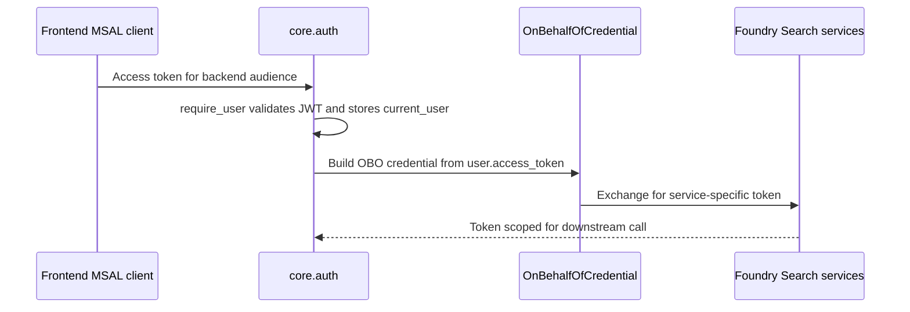
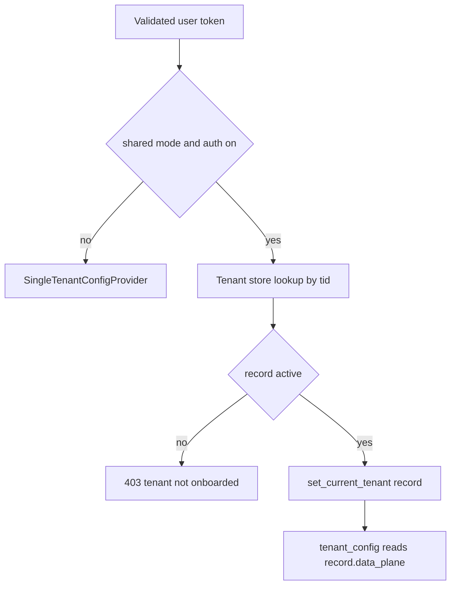

# Backend auth and tenancy

The backend's auth and tenancy model is centered in two files:

- [`apps/backend/app/core/auth.py`](../../apps/backend/app/core/auth.py)
- [`apps/backend/app/core/tenant.py`](../../apps/backend/app/core/tenant.py)

Together they define how the backend validates callers, derives Azure credentials, selects tenant-specific data-plane pointers, and restricts access by app role and domain entitlement.

## Authentication modes

`PlatformSettings.auth_enabled` in `core/settings.py` returns true only when `entra_tenant_id` and `entra_api_client_id` are configured. That creates two runtime postures:

- **Auth off**: local development fallback. `require_user()` becomes a no-op, `credential_for_request()` returns `DefaultAzureCredential()`, and role checks degrade open.
- **Auth on**: backend validates incoming Entra JWTs and can mint OBO credentials.

The backend intentionally remains bootable without Entra so local development and some offline validation paths still work.

## Bearer scheme selection

`azure_scheme` is configured once at import time in `core/auth.py`.

| Deployment mode | Scheme | Why |
| --- | --- | --- |
| `self_hosted` | `SingleTenantAzureAuthorizationCodeBearer` | One Entra tenant, classic single-tenant backend API audience. |
| `dedicated` | `SingleTenantAzureAuthorizationCodeBearer` | Dedicated stamp still runs for one customer tenant. |
| `shared` | `MultiTenantAzureAuthorizationCodeBearer` | Shared SaaS needs per-request issuer validation and tenant-specific resolution. |

The shared-mode bearer scheme uses `_iss_callable(tid)` so `fastapi-azure-auth` can validate the issuer against the actual `tid` claim in each request.

## OBO credential flow

The most important runtime identity rule is: **live backend calls can run as the signed-in user**.

`credential_for_request()` in `core/auth.py` returns:

- `OnBehalfOfCredential(...)` when auth is enabled and a `User` is present,
- otherwise `DefaultAzureCredential()`.

That credential is consumed by:

- the live helpdesk workflow in `workflow/graph.py`,
- grounded synthesis in `services/grounded.py`,
- retrieval's end-user search token exchange in `services/retrieval.py`,
- platform live tool building, which relies on caller-scoped credentials.



This diagram shows the user-token to OBO-token exchange the live backend performs.

## Request-scoped identity propagation

The workflow factory only receives a `thread_id`, not the FastAPI request. To bridge that gap, `core/auth.py` stores the validated `User` in `_current_user`, a `contextvars.ContextVar`.

This is used by:

- `current_user()` to expose the caller identity,
- `current_roles()` and `has_role()` to check app roles inside non-route logic,
- `memory_scope()` to derive per-user memory isolation,
- `credential_for_request()` to build OBO credentials.

A subtle but important boundary appears in grounded streaming: `services/grounded.py` documents that the `current_user()` contextvar is lost inside the `StreamingResponse` async generator, so the endpoint captures `current_user()` in `domains._mount_grounded()` and passes it explicitly into `stream_grounded(...)`. That is a deliberate fix for a real runtime boundary, not redundant plumbing.

## App roles

The backend's app-role vocabulary is hard-coded in `APP_ROLES`:

- `Admin`
- `Author`
- `Approver`
- `Reader`

`require_role(*roles)` checks whether the caller token has any of the listed values in its `roles` claim. Important semantics:

- the check is server-side and used by protected APIs such as `/admin/*` and `/tenant/*`,
- `Admin` is **not** implied by other roles; endpoints list it explicitly where needed,
- when auth is disabled, the role dependency degrades open so local development does not dead-end.

The `Approver` role has a special runtime consequence in `workflow/escalation.py`: even after a human approves a ticket interrupt, the backend still refuses to create the ticket unless `has_role("Approver", "Admin")` is true.

## Tenant configuration seam

`core/tenant.py` defines `TenantConfig`, the repository's canonical per-tenant data-plane shape. It intentionally contains **pointers and identifiers, not secrets**. Examples include:

- Foundry project endpoint and model names,
- Azure Search endpoint and KB/index names,
- storage account and corpus container names,
- ACL group IDs,
- memory store name,
- hosted agent names,
- per-tenant MCP connection-related fields retained for backward compatibility.

Two providers implement the seam:

- `SingleTenantConfigProvider`: loads one `_TenantEnv` from `.env`, used in `self_hosted` and `dedicated` modes.
- `MultiTenantConfigProvider`: resolves the active tenant record from `_current_tenant`, used in `shared` mode.

All runtime code is expected to call `tenant_config()` instead of reading environment directly.

## Shared-mode tenant resolution

When auth is enabled and `deployment_mode == "shared"`, `core/auth.py` does two things at import time:

1. switches the active config provider to `MultiTenantConfigProvider`,
2. creates `_tenant_store` using `_make_tenant_store()`.

`_make_tenant_store()` supports two backends:

| Backend | Setting | Use |
| --- | --- | --- |
| Table Storage | `tenant_store_backend == "table"` | Production path. Requires `tenant_store_account_url` and persists records across instances. |
| In-memory store | `tenant_store_backend == "memory"` | Dev and CI only. Lets shared mode boot offline but is explicitly non-production. |

After JWT validation, `require_user()` in shared mode calls `resolve_tenant(user, _tenant_store)`. That function:

- looks up the tenant record by `user.tid`,
- rejects missing or non-`active` tenants with HTTP 403,
- stores the resolved record with `set_current_tenant(rec)`.

The result is that the tenant record becomes available to all later `tenant_config()` reads in that request.



This diagram shows how shared-mode requests resolve their active tenant configuration.

## Domain entitlements

Shared-mode multi-tenancy is not only about data-plane pointers. `core/tenant.py` also defines:

- `DOMAIN_IDS = ("helpdesk", "cockpit", "selfwiki", "platform")`
- `TIER_DOMAINS`, a seed map from product tier to enabled domains
- `require_domain(domain_id)`, a FastAPI dependency that fails closed unless the current tenant record lists the requested domain

`app/domains.py` applies `require_domain()` through `_domain_deps(domain_id)` only in shared mode. That preserves byte-identical dependency behavior in single-tenant modes while still enforcing entitlement in SaaS mode.

## Memory scoping

`memory_scope()` in `core/auth.py` derives the scope string used by `FoundryMemoryProvider`.

Rules:

- in single-tenant mode, the scope is just the user's `oid` when available,
- in shared mode, the scope becomes `tid:oid`,
- when no user exists, it falls back to `dev-local`.

The tenant prefix is only applied in multi-tenant mode because existing single-tenant memory keys are persisted and should not be orphaned by a format change.

## Onboarding and allow-listing

`PlatformSettings.allowed_tids` parses `onboarding_allowed_tids` into a set. The tenant onboarding API uses this as a control-plane rollout guard.

This matters because `/tenant/onboard` must tolerate a tenant that does not yet exist in the store. That is why `app/api/tenant.py` uses `require_role("Admin")` alone for `GET /tenant`: using `require_user` there would run tenant resolution first and 403 before the tenant had the chance to onboard.

## Secrets boundary

The backend auth and tenancy system is explicit about what it stores and what it refuses to store:

- `TenantConfig` is intended for connection references and resource pointers, not secret values.
- `tenant.py` redacts secret-bearing fields like `mcp_github_pat` from API responses with `_redacted(rec)`.
- Admin and tenant management APIs use Graph or Key Vault / Foundry references rather than echoing back secrets.

That boundary is part of the architecture, not a documentation convention.

## Focused tests

Representative tests that define auth and tenancy behavior include:

- `tenant_resolution_test.py`: validates that active tenants resolve from the incoming request identity and that unknown or suspended tenants are denied with 403.
- `tenant_provider_test.py`: checks provider seam behavior, including the shared-mode requirement that a tenant be resolved before config access.
- `tenant_scope_test.py` and `memory_scope_test.py`: ensure tenant-prefixed memory scoping is correct.
- `multitenant_scheme_test.py`: verifies multi-tenant auth scheme setup.
- `tenant_store_test.py`: covers tenant store behavior.
- `domain_gate_test.py`: proves fail-closed denial when no tenant is resolved or a domain is not enabled.
- `tier_domains_test.py`: proves tier seeding behavior.
- `onboarding_guard_test.py`: covers onboarding allow-list behavior.

## Validation

Focused checks from `apps/backend/`:

```bash
uv run pytest eval/tenant_resolution_test.py eval/tenant_provider_test.py eval/domain_gate_test.py eval/memory_scope_test.py
```

For broader auth and tenancy confidence:

```bash
uv run pytest eval/*tenant* eval/*domain* eval/multitenant_scheme_test.py
```

## Related pages

- [Backend application overview](application-overview.md)
- [Domains and endpoints](domains-and-endpoints.md)
- [Admin and tenant APIs](admin-and-tenant-apis.md)
- [Infrastructure identity and access](../infrastructure/identity-and-access.md)
test.py
```

## Related pages

- [Backend application overview](application-overview.md)
- [Domains and endpoints](domains-and-endpoints.md)
- [Admin and tenant APIs](admin-and-tenant-apis.md)
- [Infrastructure identity and access](../infrastructure/identity-and-access.md)
