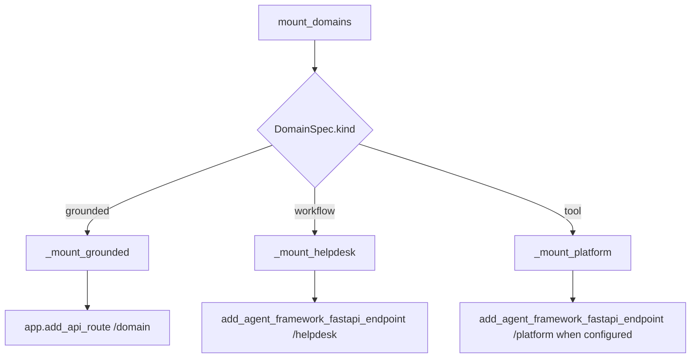

# Backend domains and endpoints

The backend exposes two related but distinct endpoint families:

1. **live domain endpoints**, mounted directly on the FastAPI app by [`apps/backend/app/domains.py`](../../apps/backend/app/domains.py),
2. **REST router endpoints**, aggregated by [`apps/backend/app/api/__init__.py`](../../apps/backend/app/api/__init__.py).

This page is the canonical map from public path to owning symbol and behavior.

## Domain registry

`app/domains.py` defines `DomainSpec`, the backend's domain row type. Each row contains:

- `id`
- `kind` of `grounded`, `workflow`, or `tool`
- optional `instructions`
- `kb_name`, `ks_name`, `search_index`, and `search_endpoint` for grounded domains
- `acl_group_map` for ACL-aware retrieval
- `hosted_agent_name` for hosted helpdesk support

`DomainSpec.__post_init__()` enforces an important invariant: every grounded domain must define either `kb_name` or `search_index`. That prevents a misconfigured grounded domain from falling through to a malformed search URL.

### Active domain rows

`_domains()` builds four rows lazily from `tenant_config()`:

| ID | Kind | Mounted live path | Main runtime target |
| --- | --- | --- | --- |
| `helpdesk` | `workflow` | `/helpdesk` | AG-UI workflow or concierge fallback |
| `cockpit` | `grounded` | `/cockpit` | `stream_grounded()` over cockpit KB/index |
| `selfwiki` | `grounded` | `/selfwiki` | `stream_grounded()` over selfwiki KB/index |
| `platform` | `tool` | `/platform` | `platform_agent_proxy` when configured |

`_domains()` is lazy on purpose. It avoids import-time side effects and lets the current tenant configuration determine which values the rows carry.

## Live endpoint mount loop

`mount_domains(app)` loops over `_domains()` and dispatches by `kind`.



This diagram shows the single dispatch loop that mounts all live domain endpoints.

### Grounded domains

`_mount_grounded()` creates an ordinary `app.add_api_route()` handler that:

- reads the JSON body,
- captures `current_user()` before entering the stream generator,
- returns `StreamingResponse(stream_grounded(...), media_type="text/event-stream")`.

The capture step matters because the `current_user()` contextvar does not survive reliably inside the async generator.

### Helpdesk workflow

`_mount_helpdesk()` decides between two behaviors:

- if `_knowledge_configured()` is true, it mounts an AG-UI workflow endpoint using `OrderedAgentFrameworkWorkflow(workflow_factory=build_helpdesk_workflow)`;
- otherwise it falls back to a single concierge agent built by `build_concierge_agent()`.

That fallback preserves a usable chat surface even when the KB is not yet provisioned.

### Platform domain

`_mount_platform()` mounts the platform agent only when `platform_configured()` returns true. It uses `platform_agent_proxy`, a `PerRequestAgent`, so the tool set can be rebuilt for each caller with the right roles and credentials.

## Domain dependencies

`_domain_deps(domain_id)` is the canonical dependency helper shared by live mounts and hosted platform bridging.

Behavior:

- always starts with `auth_dependencies()`, which is either `[Depends(require_user)]` or an empty list,
- in shared mode, appends `Depends(require_domain(domain_id))`.

That means the same helper expresses both caller authentication and per-tenant entitlement.

## REST router inventory

`app/api/__init__.py` includes routers in this order:

- `health`
- `tickets`
- `evals`
- `chat`
- `admin`
- `me`
- `tenant` only when `settings.deployment_mode == "shared"`

### Health

- **Path**: `GET /health`
- **Owner**: `app/api/health.py`
- **Purpose**: minimal liveness probe used by the frontend shell.

### Tickets

- **Path**: `GET /tickets`
- **Owner**: `app/api/tickets.py`
- **Purpose**: exposes persisted tickets written by `app/tools/tickets.py`.

### Eval APIs

- **Paths**: `GET /eval/runs`, `GET /eval/foundry`
- **Owner**: `app/api/evals.py`
- **Purpose**:
  - `/eval/runs` returns local JSONL-recorded eval runs from `apps/backend/eval/runs.jsonl`, newest first.
  - `/eval/foundry` returns live Foundry project eval runs and criteria summaries through `services/foundry_evals.py`.

Both endpoints are gated by `auth_dependencies()`.

### Hosted bridges

Defined in `app/api/chat.py`:

| Path | Dependencies | Behavior |
| --- | --- | --- |
| `POST /helpdesk-hosted` | `auth_dependencies()` | Proxies the named hosted helpdesk agent and re-emits Responses output as AG-UI. |
| `POST /platform-hosted` | `_domain_deps("platform")` | Bridges the platform hosted agent back into AG-UI using the platform-specific path. |

These are not the live domain endpoints; they are frontend-facing bridges to Foundry-hosted runtimes.

### Admin APIs

Defined in `app/api/admin.py`, all behind `Depends(require_role("Admin"))`:

- `GET /admin/roles`
- `GET /admin/users`
- `POST /admin/users/invite`
- `POST /admin/users`
- `DELETE /admin/users/{user_id}`
- `GET /admin/role-assignments`
- `POST /admin/role-assignments`
- `DELETE /admin/role-assignments/{assignment_id}`

All operational work is delegated to `app/services/graph.py`, and `GraphError` is translated into clean HTTP errors.

### Me API

- **Path**: `GET /me`
- **Owner**: `app/api/me.py`
- **Purpose**: exposes caller info used by frontend auth-role helpers.

### Tenant APIs

Only included in shared mode, defined in `app/api/tenant.py`:

- `GET /tenant`
- `POST /tenant/onboard`
- `PUT /tenant/config`
- `GET /tenant/connections`
- `POST /tenant/connections`
- `DELETE /tenant/connections/{conn_id}`
- `GET /tenant/domains`
- `PUT /tenant/domains`

These APIs are described in [Admin and tenant APIs](admin-and-tenant-apis.md).

## Frontend-to-backend mapping

The frontend does not talk to every backend path directly. The notable mappings are:

- CopilotKit runtime targets frontend API routes, which then proxy to backend domain or hosted-bridge endpoints.
- The frontend shell polls `/api/health`, which proxies to backend `/health`.
- Admin pages hit `/api/admin/*`, then backend `/admin/*`.
- Tenant connection pages hit `/api/tenant/*`, then backend `/tenant/*`.
- Evals page hits `/api/evals`, then backend `/eval/foundry`.
- Tickets page hits `/api/tickets`, then backend `/tickets`.

See [Frontend application overview](../frontend/application-overview.md) and [Frontend admin, evals, and tickets](../frontend/admin-evals-and-tickets.md).

## Important endpoint invariants

1. **Live domain endpoints are mounted centrally**. Do not add ad hoc AG-UI routes elsewhere if they belong to the domain model.
2. **Hosted bridges are separate from live domains**. They serve as compatibility layers for the frontend, not as replacements for the live endpoints.
3. **Shared-mode tenant APIs are conditional at router registration time**. Code that assumes `/tenant/*` always exists will be wrong in single-tenant deployments.
4. **Platform live and hosted paths use stricter dependency semantics than helpdesk-hosted**. `platform-hosted` reuses `_domain_deps("platform")`, so it inherits shared-mode entitlement checks.

## Focused tests

Representative tests for endpoint shape and routing behavior:

- `domains_api_test.py`: backend API exposure.
- `domain_registry_test.py`: backend registry row correctness.
- `domains_api_test.py` and `enabled_domains_roundtrip_test.py`: domain enablement and route gating.
- `platform_hosted_bridge_test.py`: hosted platform bridge behavior.
- `platform_hosted_e2e_test.py` and `grounded_deployed_roundtrip_test.py`: deployed path expectations.

## Validation

From `apps/backend/`:

```bash
uv run pytest eval/domain_registry_test.py eval/domains_api_test.py eval/platform_hosted_bridge_test.py
```

## Related pages

- [Backend application overview](application-overview.md)
- [Helpdesk workflow](helpdesk-workflow.md)
- [Grounded domains](grounded-domains.md)
- [Platform domain](platform-domain.md)
- [Admin and tenant APIs](admin-and-tenant-apis.md)
