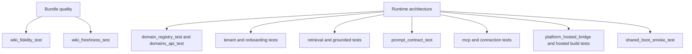

# Evaluation and assurance

`apps/backend/eval/` is not just a loose test folder. It is the backend's assurance harness for runtime architecture, ACL behavior, tenancy, MCP brokering, prompt contracts, and knowledge-bundle quality. The repo's own OpenWiki brief points at `wiki_fidelity_test.py` and `assurance.yaml` as ingest gates, and the source tree adds many more focused invariants around request-time authorization, shared-mode boot, and hosted bridge behavior. [wiki_fidelity_test.py](https://github.com/ruinosus/foundry-assured/blob/4d10c9a42e5d5c2a2b7f60d26a3e694620a9bcaa/apps/backend/eval/wiki_fidelity_test.py#L1-L20) [wiki_freshness_test.py](https://github.com/ruinosus/foundry-assured/blob/4d10c9a42e5d5c2a2b7f60d26a3e694620a9bcaa/apps/backend/eval/wiki_freshness_test.py#L1-L13)

## Assurance layers

### Bundle quality gates

- **Fidelity**: `wiki_fidelity_test.py` reuses the wiki builder's fidelity logic and rejects external bundles whose citations do not resolve to real source files or that cite worktrees. [wiki_fidelity_test.py](https://github.com/ruinosus/foundry-assured/blob/4d10c9a42e5d5c2a2b7f60d26a3e694620a9bcaa/apps/backend/eval/wiki_fidelity_test.py#L1-L20) [wiki_fidelity_test.py](https://github.com/ruinosus/foundry-assured/blob/4d10c9a42e5d5c2a2b7f60d26a3e694620a9bcaa/apps/backend/eval/wiki_fidelity_test.py#L80-L101)
- **Freshness**: `wiki_freshness_test.py` compares bundle `generatedAt` timestamps to recent git activity in the covered source area. [wiki_freshness_test.py](https://github.com/ruinosus/foundry-assured/blob/4d10c9a42e5d5c2a2b7f60d26a3e694620a9bcaa/apps/backend/eval/wiki_freshness_test.py#L23-L52) [wiki_freshness_test.py](https://github.com/ruinosus/foundry-assured/blob/4d10c9a42e5d5c2a2b7f60d26a3e694620a9bcaa/apps/backend/eval/wiki_freshness_test.py#L54-L88)
- **Contract conformance**: `docbundle_schema.py` names `eval/docbundle_contract_test.py` as the guard for schema drift between readers, writers, and the vendored producer contract. [docbundle_schema.py](https://github.com/ruinosus/foundry-assured/blob/4d10c9a42e5d5c2a2b7f60d26a3e694620a9bcaa/apps/backend/app/knowledge/docbundle_schema.py#L27-L30)

### Runtime architecture and API tests

Domain-registry tests lock the backend's public domain surface: exactly four domains, grounded domains must declare retrieval targets, and mount dispatch must register `/cockpit`, `/selfwiki`, `/helpdesk`, and `/platform` through the expected branches. [domain_registry_test.py](https://github.com/ruinosus/foundry-assured/blob/4d10c9a42e5d5c2a2b7f60d26a3e694620a9bcaa/apps/backend/eval/domain_registry_test.py#L38-L71) [domain_registry_test.py](https://github.com/ruinosus/foundry-assured/blob/4d10c9a42e5d5c2a2b7f60d26a3e694620a9bcaa/apps/backend/eval/domain_registry_test.py#L87-L141)

Tenant API tests cover the control-plane HTTP semantics: onboarding seeds `enabled_domains`, GET returns the domain catalog and current entitlement, and PUT rejects unknown domain ids without mutation. [domains_api_test.py](https://github.com/ruinosus/foundry-assured/blob/4d10c9a42e5d5c2a2b7f60d26a3e694620a9bcaa/apps/backend/eval/domains_api_test.py#L21-L59)

## Invariant areas and representative tests

### 1. Domain registry and API composition

- `domain_registry_test.py` verifies the four-domain registry, kind map, mount dispatch, and mode-specific dependency helper behavior. [domain_registry_test.py](https://github.com/ruinosus/foundry-assured/blob/4d10c9a42e5d5c2a2b7f60d26a3e694620a9bcaa/apps/backend/eval/domain_registry_test.py#L30-L145)
- `domains_api_test.py` verifies shared-mode `/tenant/domains` semantics and onboarding domain seeding. [domains_api_test.py](https://github.com/ruinosus/foundry-assured/blob/4d10c9a42e5d5c2a2b7f60d26a3e694620a9bcaa/apps/backend/eval/domains_api_test.py#L21-L59)
- `configured_mode_test.py` proves that domain-configured checks short-circuit in shared mode without reading tenant config at boot. [configured_mode_test.py](https://github.com/ruinosus/foundry-assured/blob/4d10c9a42e5d5c2a2b7f60d26a3e694620a9bcaa/apps/backend/eval/configured_mode_test.py#L1-L10) [configured_mode_test.py](https://github.com/ruinosus/foundry-assured/blob/4d10c9a42e5d5c2a2b7f60d26a3e694620a9bcaa/apps/backend/eval/configured_mode_test.py#L48-L73)

### 2. Tenancy, onboarding, and store behavior

- `tenant_resolution_test.py` proves that only onboarded active tenants resolve and everything else gets `403`. [tenant_resolution_test.py](https://github.com/ruinosus/foundry-assured/blob/4d10c9a42e5d5c2a2b7f60d26a3e694620a9bcaa/apps/backend/eval/tenant_resolution_test.py#L20-L54)
- `domain_gate_test.py` proves `require_domain()` is fail-closed. [domain_gate_test.py](https://github.com/ruinosus/foundry-assured/blob/4d10c9a42e5d5c2a2b7f60d26a3e694620a9bcaa/apps/backend/eval/domain_gate_test.py#L24-L72)
- `onboarding_guard_test.py` proves Admin-plus-allow-list onboarding semantics without tenant resolution. [onboarding_guard_test.py](https://github.com/ruinosus/foundry-assured/blob/4d10c9a42e5d5c2a2b7f60d26a3e694620a9bcaa/apps/backend/eval/onboarding_guard_test.py#L18-L48)
- `connection_store_test.py` and `enabled_domains_roundtrip_test.py` cover control-plane serialization invariants. [connection_store_test.py](https://github.com/ruinosus/foundry-assured/blob/4d10c9a42e5d5c2a2b7f60d26a3e694620a9bcaa/apps/backend/eval/connection_store_test.py#L1-L44) [enabled_domains_roundtrip_test.py](https://github.com/ruinosus/foundry-assured/blob/4d10c9a42e5d5c2a2b7f60d26a3e694620a9bcaa/apps/backend/eval/enabled_domains_roundtrip_test.py#L1-L53)
- `tier_domains_test.py` locks tier-to-domain seeding behavior. [tier_domains_test.py](https://github.com/ruinosus/foundry-assured/blob/4d10c9a42e5d5c2a2b7f60d26a3e694620a9bcaa/apps/backend/eval/tier_domains_test.py#L18-L44)
- `tenant_admin_e2e_test.py` is the infra-gated persistence proof for live Table Storage onboarding and connection CRUD. [tenant_admin_e2e_test.py](https://github.com/ruinosus/foundry-assured/blob/4d10c9a42e5d5c2a2b7f60d26a3e694620a9bcaa/apps/backend/eval/tenant_admin_e2e_test.py#L1-L23)

### 3. Retrieval, ACL, and citation-shape guarantees

- `retrieval_shape_test.py` locks `retrieve()` output to `[{index, source, url, snippet}]`, 1-based indexing, and URL-based dedupe. [retrieval_shape_test.py](https://github.com/ruinosus/foundry-assured/blob/4d10c9a42e5d5c2a2b7f60d26a3e694620a9bcaa/apps/backend/eval/retrieval_shape_test.py#L1-L16) [retrieval_shape_test.py](https://github.com/ruinosus/foundry-assured/blob/4d10c9a42e5d5c2a2b7f60d26a3e694620a9bcaa/apps/backend/eval/retrieval_shape_test.py#L43-L97)
- `retrieval_acl_parity_test.py` proves the production retrieval seam preserves per-user ACL. [retrieval_acl_parity_test.py](https://github.com/ruinosus/foundry-assured/blob/4d10c9a42e5d5c2a2b7f60d26a3e694620a9bcaa/apps/backend/eval/retrieval_acl_parity_test.py#L1-L29) [retrieval_acl_parity_test.py](https://github.com/ruinosus/foundry-assured/blob/4d10c9a42e5d5c2a2b7f60d26a3e694620a9bcaa/apps/backend/eval/retrieval_acl_parity_test.py#L104-L143)
- `grounded_archetype_roundtrip_test.py` proves the live `/cockpit` HTTP endpoint preserves ACL in cited source filenames. [grounded_archetype_roundtrip_test.py](https://github.com/ruinosus/foundry-assured/blob/4d10c9a42e5d5c2a2b7f60d26a3e694620a9bcaa/apps/backend/eval/grounded_archetype_roundtrip_test.py#L1-L18) [grounded_archetype_roundtrip_test.py](https://github.com/ruinosus/foundry-assured/blob/4d10c9a42e5d5c2a2b7f60d26a3e694620a9bcaa/apps/backend/eval/grounded_archetype_roundtrip_test.py#L77-L147)

### 4. Prompt contracts and loader safety

`prompt_contract_test.py` is the guard of record for the declarative prompt subsystem. It checks semantic contracts that other runtime code branches on and also verifies that the loader refuses unknown agents, PowerFx indirection, and unknown schema fields. [prompt_contract_test.py](https://github.com/ruinosus/foundry-assured/blob/4d10c9a42e5d5c2a2b7f60d26a3e694620a9bcaa/apps/backend/eval/prompt_contract_test.py#L1-L30) [prompt_contract_test.py](https://github.com/ruinosus/foundry-assured/blob/4d10c9a42e5d5c2a2b7f60d26a3e694620a9bcaa/apps/backend/eval/prompt_contract_test.py#L109-L166)

### 5. MCP, connection brokering, and RBAC

- `mcp_registry_test.py` proves registry shape, role gating, and fail-closed classification. [mcp_registry_test.py](https://github.com/ruinosus/foundry-assured/blob/4d10c9a42e5d5c2a2b7f60d26a3e694620a9bcaa/apps/backend/eval/mcp_registry_test.py#L1-L77)
- `connection_tools_build_test.py` covers shared-mode connection-to-tool mapping. [connection_tools_build_test.py](https://github.com/ruinosus/foundry-assured/blob/4d10c9a42e5d5c2a2b7f60d26a3e694620a9bcaa/apps/backend/eval/connection_tools_build_test.py#L1-L41)
- `credential_wiring_test.py` checks OBO and Foundry-connection credential wiring paths. [credential_wiring_test.py](https://github.com/ruinosus/foundry-assured/blob/4d10c9a42e5d5c2a2b7f60d26a3e694620a9bcaa/apps/backend/eval/credential_wiring_test.py#L1-L46)
- `approval_mode_test.py` checks write-versus-read approval dict construction for connection-built tools. [approval_mode_test.py](https://github.com/ruinosus/foundry-assured/blob/4d10c9a42e5d5c2a2b7f60d26a3e694620a9bcaa/apps/backend/eval/approval_mode_test.py#L1-L39)
- `hosted_build_test.py` covers the hosted builder contract. [hosted_build_test.py](https://github.com/ruinosus/foundry-assured/blob/4d10c9a42e5d5c2a2b7f60d26a3e694620a9bcaa/apps/backend/eval/hosted_build_test.py#L1-L50)
- `mcp_brokering_e2e_test.py` is the infra-gated proof for live Foundry connection brokering and OBO token minting. [mcp_brokering_e2e_test.py](https://github.com/ruinosus/foundry-assured/blob/4d10c9a42e5d5c2a2b7f60d26a3e694620a9bcaa/apps/backend/eval/mcp_brokering_e2e_test.py#L1-L21)

### 6. Hosted bridge, workflow, and shared-mode boot

- `platform_hosted_bridge_test.py` guards the hosted platform bridge's clean AG-UI error envelope. [platform_hosted_bridge_test.py](https://github.com/ruinosus/foundry-assured/blob/4d10c9a42e5d5c2a2b7f60d26a3e694620a9bcaa/apps/backend/eval/platform_hosted_bridge_test.py#L1-L56)
- `per_request_override_test.py` proves the generic per-request proxy still satisfies `SupportsAgentRun` while carrying overridden identity metadata. [per_request_override_test.py](https://github.com/ruinosus/foundry-assured/blob/4d10c9a42e5d5c2a2b7f60d26a3e694620a9bcaa/apps/backend/eval/per_request_override_test.py#L1-L39)
- `memory_scope_test.py` locks the single-tenant versus multi-tenant memory naming rule. [memory_scope_test.py](https://github.com/ruinosus/foundry-assured/blob/4d10c9a42e5d5c2a2b7f60d26a3e694620a9bcaa/apps/backend/eval/memory_scope_test.py#L1-L44)
- `shared_boot_smoke_test.py` ensures shared-mode import succeeds with auth enabled and in-memory store selected. [shared_boot_smoke_test.py](https://github.com/ruinosus/foundry-assured/blob/4d10c9a42e5d5c2a2b7f60d26a3e694620a9bcaa/apps/backend/eval/shared_boot_smoke_test.py#L1-L40)

## Assurance map

This diagram shows how the eval suite is organized by guarantee rather than by source directory.

## Recommended validation batches

- Domain and tenancy changes: `uv run python -m eval.domain_registry_test && uv run python -m eval.domain_gate_test && uv run python -m eval.domains_api_test`
- Grounded retrieval changes: `uv run python -m eval.retrieval_shape_test && uv run python -m eval.retrieval_acl_parity_test`
- Prompt-system changes: `uv run python -m eval.prompt_contract_test`
- MCP/platform changes: `uv run python -m eval.mcp_registry_test && uv run python -m eval.connection_tools_build_test && uv run python -m eval.approval_mode_test`
- Wiki/docbundle pipeline changes: `uv run python -m eval.wiki_fidelity_test --component foundry-helpdesk-backend && uv run python -m eval.wiki_freshness_test`
