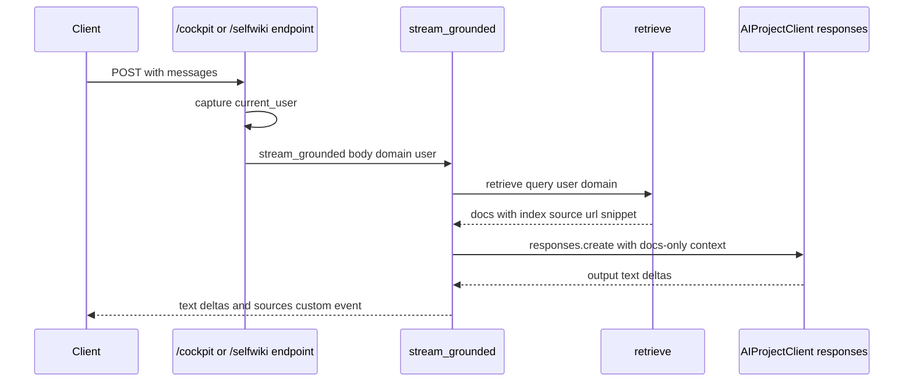

# Grounded domains

`cockpit` and `selfwiki` share one serving archetype: a grounded question-answering bridge that retrieves authorized documents, synthesizes an answer strictly from those documents, and emits AG-UI-compatible SSE with a `sources` custom event. The backend documents this as a single path in `app.services.grounded`, with retrieval delegated to `app.services.retrieval.retrieve()`. [domains.py](https://github.com/ruinosus/foundry-assured/blob/4d10c9a42e5d5c2a2b7f60d26a3e694620a9bcaa/apps/backend/app/domains.py#L111-L129) [grounded.py](https://github.com/ruinosus/foundry-assured/blob/4d10c9a42e5d5c2a2b7f60d26a3e694620a9bcaa/apps/backend/app/services/grounded.py#L1-L18)

## Domain intent and configuration

The domain registry builds both grounded rows lazily from `tenant_config()`:

- `cockpit` uses `COCKPIT_INSTRUCTIONS`, a searchIndex-backed KB/search-index pair, and the tenant's parsed `acl_group_map`. [domains.py](https://github.com/ruinosus/foundry-assured/blob/4d10c9a42e5d5c2a2b7f60d26a3e694620a9bcaa/apps/backend/app/domains.py#L75-L84)
- `selfwiki` uses `SELFWIKI_INSTRUCTIONS`, its own searchIndex-backed KB/search-index pair, and a single-audience ACL map derived from `app_users_group_id` when present. [domains.py](https://github.com/ruinosus/foundry-assured/blob/4d10c9a42e5d5c2a2b7f60d26a3e694620a9bcaa/apps/backend/app/domains.py#L85-L97)

The lightweight `cockpit_configured()` and `selfwiki_configured()` helpers are mode-aware: in shared mode they return `True` without reading `tenant_config()`, because shared-mode boot happens before any tenant is resolved. [agents/cockpit.py](https://github.com/ruinosus/foundry-assured/blob/4d10c9a42e5d5c2a2b7f60d26a3e694620a9bcaa/apps/backend/app/agents/cockpit.py#L17-L25) [agents/selfwiki.py](https://github.com/ruinosus/foundry-assured/blob/4d10c9a42e5d5c2a2b7f60d26a3e694620a9bcaa/apps/backend/app/agents/selfwiki.py#L17-L25) [configured_mode_test.py](https://github.com/ruinosus/foundry-assured/blob/4d10c9a42e5d5c2a2b7f60d26a3e694620a9bcaa/apps/backend/eval/configured_mode_test.py#L1-L10)

## Request flow

This diagram shows the grounded archetype's central promise: retrieval and authorization happen before synthesis, and the model only sees the retrieved snippets rather than raw corpus access.

## `stream_grounded()` stations

The code organizes `stream_grounded()` into four stations:

1. **Identity**: `_async_credential(user)` builds an OBO credential for the signed-in user when auth is enabled. The code comment emphasizes that the `user` must be captured in the endpoint and passed in because `current_user()` is lost inside the async generator. [grounded.py](https://github.com/ruinosus/foundry-assured/blob/4d10c9a42e5d5c2a2b7f60d26a3e694620a9bcaa/apps/backend/app/services/grounded.py#L58-L73)
2. **Retrieve**: `docs = await retrieve(user_text, user, domain)`. [grounded.py](https://github.com/ruinosus/foundry-assured/blob/4d10c9a42e5d5c2a2b7f60d26a3e694620a9bcaa/apps/backend/app/services/grounded.py#L114-L116)
3. **Synthesize**: `build_synthesis_kwargs(...)` turns the retrieved docs into the model's only grounding context. [grounded.py](https://github.com/ruinosus/foundry-assured/blob/4d10c9a42e5d5c2a2b7f60d26a3e694620a9bcaa/apps/backend/app/services/grounded.py#L38-L56) [grounded.py](https://github.com/ruinosus/foundry-assured/blob/4d10c9a42e5d5c2a2b7f60d26a3e694620a9bcaa/apps/backend/app/services/grounded.py#L120-L121)
4. **Emit**: the bridge re-emits text deltas plus a `sources` custom event whose `content` comes from the document snippet, capped to 800 characters so the UI can show sources inline even when blob URLs are private. [grounded.py](https://github.com/ruinosus/foundry-assured/blob/4d10c9a42e5d5c2a2b7f60d26a3e694620a9bcaa/apps/backend/app/services/grounded.py#L123-L141)

## Retrieval seam

`retrieve(query, user, domain, top=8)` is the single retrieval seam for all grounded domains. It hides two engines behind one interface:

- primary native Foundry IQ KB retrieval when `domain.kb_name` is set
- fallback direct-search-as-user when there is no KB name [retrieval.py](https://github.com/ruinosus/foundry-assured/blob/4d10c9a42e5d5c2a2b7f60d26a3e694620a9bcaa/apps/backend/app/services/retrieval.py#L1-L35) [retrieval.py](https://github.com/ruinosus/foundry-assured/blob/4d10c9a42e5d5c2a2b7f60d26a3e694620a9bcaa/apps/backend/app/services/retrieval.py#L48-L79)

The seam also centralizes identity handling:

- the service credential on the retrieve call is the app managed identity via `DefaultAzureCredential()` [retrieval.py](https://github.com/ruinosus/foundry-assured/blob/4d10c9a42e5d5c2a2b7f60d26a3e694620a9bcaa/apps/backend/app/services/retrieval.py#L60-L73)
- the per-user distinction is the `x-ms-query-source-authorization` header, attached only when the domain has a truthy `acl_group_map` [retrieval.py](https://github.com/ruinosus/foundry-assured/blob/4d10c9a42e5d5c2a2b7f60d26a3e694620a9bcaa/apps/backend/app/services/retrieval.py#L64-L69)

That conditional header attach is a deliberate data-driven rule: truly public domains omit the header and run under app identity, while ACL domains send the user's OBO search token. If an ACL domain has no user token, the request fails closed because the search index evaluates no group membership. [retrieval.py](https://github.com/ruinosus/foundry-assured/blob/4d10c9a42e5d5c2a2b7f60d26a3e694620a9bcaa/apps/backend/app/services/retrieval.py#L21-L23) [retrieval.py](https://github.com/ruinosus/foundry-assured/blob/4d10c9a42e5d5c2a2b7f60d26a3e694620a9bcaa/apps/backend/app/services/retrieval.py#L157-L163)

## Native retrieval details and citation shape

`_native_retrieve()` posts to `{search}/knowledgebases/{kb}/retrieve?api-version=2026-05-01-preview` with `knowledgeSourceParams.kind = "searchIndex"` and `includeReferenceSourceData = True`. The implementation comment says the request shape is copied from the repository's proven probe rather than invented. [retrieval.py](https://github.com/ruinosus/foundry-assured/blob/4d10c9a42e5d5c2a2b7f60d26a3e694620a9bcaa/apps/backend/app/services/retrieval.py#L105-L169)

The citation projection logic is more subtle than just reading filenames. `_decode_dockey()` decodes the opaque `docKey` back into a blob URL, `_sourcedata_snippet()` reads the verified `sourceData.snippet`, and `_parse_native()` turns each reference into `{source, url, snippet}` rows before `_project()` deduplicates by URL and adds 1-based citation indices. [retrieval.py](https://github.com/ruinosus/foundry-assured/blob/4d10c9a42e5d5c2a2b7f60d26a3e694620a9bcaa/apps/backend/app/services/retrieval.py#L172-L245) [retrieval.py](https://github.com/ruinosus/foundry-assured/blob/4d10c9a42e5d5c2a2b7f60d26a3e694620a9bcaa/apps/backend/app/services/retrieval.py#L278-L295)

The fallback direct-search path, `_direct_search_authorized()`, uses the same app bearer plus optional query-source-authorization header and returns rows shaped the same way so callers do not care which engine was used. [retrieval.py](https://github.com/ruinosus/foundry-assured/blob/4d10c9a42e5d5c2a2b7f60d26a3e694620a9bcaa/apps/backend/app/services/retrieval.py#L248-L275)

## Synthesis invariants

`SYNTHESIS_DIRECTIVE` forces the answering model to respond only from the provided documents, cite every claim by `[n]`, and say it does not know if the documents do not contain the answer. `build_synthesis_kwargs()` embeds the snippets as the only `=== DOCUMENTOS ===` context. If no documents were retrieved, it still asks the question but explicitly states that no authorized document was found. [grounded.py](https://github.com/ruinosus/foundry-assured/blob/4d10c9a42e5d5c2a2b7f60d26a3e694620a9bcaa/apps/backend/app/services/grounded.py#L29-L56)

That means the model does not perform retrieval on its own here; `retrieve()` is the only retrieval path, and any ACL or citation-shape bug must be fixed there, not by changing the synthesis prompt. [grounded.py](https://github.com/ruinosus/foundry-assured/blob/4d10c9a42e5d5c2a2b7f60d26a3e694620a9bcaa/apps/backend/app/services/grounded.py#L79-L83)

## Hosted versus live grounded behavior

The live grounded endpoints are `/cockpit` and `/selfwiki`. The hosted-twin router currently exists only for helpdesk and platform, not for grounded domains. `app.services.hosted` is still relevant here because `stream_grounded()` reuses `_last_user_text()` from that module to normalize the user's latest message before retrieval and synthesis. [api/chat.py](https://github.com/ruinosus/foundry-assured/blob/4d10c9a42e5d5c2a2b7f60d26a3e694620a9bcaa/apps/backend/app/api/chat.py#L12-L34) [grounded.py](https://github.com/ruinosus/foundry-assured/blob/4d10c9a42e5d5c2a2b7f60d26a3e694620a9bcaa/apps/backend/app/services/grounded.py#L96-L99) [hosted.py](https://github.com/ruinosus/foundry-assured/blob/4d10c9a42e5d5c2a2b7f60d26a3e694620a9bcaa/apps/backend/app/services/hosted.py#L59-L69)

## Assurance and regression tests

The retrieval and grounded path has a dense test surface:

- `eval.retrieval_shape_test` locks the projected output shape, deduping, and 1-based indexing. [retrieval_shape_test.py](https://github.com/ruinosus/foundry-assured/blob/4d10c9a42e5d5c2a2b7f60d26a3e694620a9bcaa/apps/backend/eval/retrieval_shape_test.py#L1-L16) [retrieval_shape_test.py](https://github.com/ruinosus/foundry-assured/blob/4d10c9a42e5d5c2a2b7f60d26a3e694620a9bcaa/apps/backend/eval/retrieval_shape_test.py#L43-L97)
- `eval.retrieval_acl_parity_test` proves the production retrieval seam enforces per-user document ACL end to end. [retrieval_acl_parity_test.py](https://github.com/ruinosus/foundry-assured/blob/4d10c9a42e5d5c2a2b7f60d26a3e694620a9bcaa/apps/backend/eval/retrieval_acl_parity_test.py#L1-L29) [retrieval_acl_parity_test.py](https://github.com/ruinosus/foundry-assured/blob/4d10c9a42e5d5c2a2b7f60d26a3e694620a9bcaa/apps/backend/eval/retrieval_acl_parity_test.py#L104-L143)
- `eval.grounded_archetype_roundtrip_test` proves the unified `/cockpit` HTTP path preserves ACL in the cited source set, not just prose. [grounded_archetype_roundtrip_test.py](https://github.com/ruinosus/foundry-assured/blob/4d10c9a42e5d5c2a2b7f60d26a3e694620a9bcaa/apps/backend/eval/grounded_archetype_roundtrip_test.py#L1-L18) [grounded_archetype_roundtrip_test.py](https://github.com/ruinosus/foundry-assured/blob/4d10c9a42e5d5c2a2b7f60d26a3e694620a9bcaa/apps/backend/eval/grounded_archetype_roundtrip_test.py#L77-L147)

## Focused validation

- Retrieval seam contract: `uv run python -m eval.retrieval_shape_test`
- Per-user ACL parity in retrieval: `uv run python -m eval.retrieval_acl_parity_test`
- Live `/cockpit` end-to-end round-trip: `uv run python -m eval.grounded_archetype_roundtrip_test`
