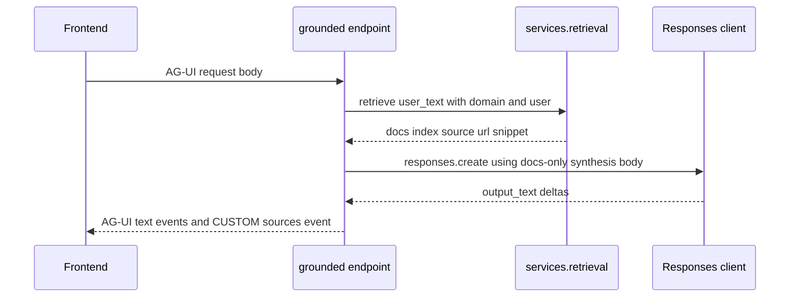

# Grounded domains

The backend has a shared grounded-domain runtime used by `selfwiki` and `cockpit`. The live endpoints are mounted in [`apps/backend/app/domains.py`](../../apps/backend/app/domains.py), but the core implementation lives in [`apps/backend/app/services/grounded.py`](../../apps/backend/app/services/grounded.py).

The key design rule is simple: **grounded domains answer only from retrieved documents**. They do not let the model answer from general prior knowledge.

## Owning entrypoints

Grounded behavior is assembled across these symbols:

- `domains._domains()` defines the `cockpit` and `selfwiki` `DomainSpec` rows.
- `domains._mount_grounded()` creates the streaming endpoint for any grounded domain.
- `services.grounded.stream_grounded(body, domain, user)` runs the retrieve → synthesize → emit loop.
- `services.retrieval.retrieve(query, user, domain)` supplies the authorized grounding documents.

## Domain-specific configuration

The two grounded domains share one archetype but differ in their data-plane pointers.

### `cockpit`

`_domains()` defines `cockpit` with:

- `instructions = COCKPIT_INSTRUCTIONS`
- `kb_name = cfg.cockpit_searchindex_knowledge_base`
- `ks_name = cfg.cockpit_searchindex_knowledge_source`
- `search_index = cfg.cockpit_search_index`
- `search_endpoint = cfg.azure_search_endpoint`
- `acl_group_map = cfg.acl_group_map`

This means cockpit is the main ACL-sensitive grounded domain.

### `selfwiki`

`_domains()` defines `selfwiki` with:

- `instructions = SELFWIKI_INSTRUCTIONS`
- `kb_name = cfg.selfwiki_searchindex_knowledge_base`
- `ks_name = cfg.selfwiki_searchindex_knowledge_source`
- `search_index = cfg.selfwiki_search_index`
- `search_endpoint = cfg.azure_search_endpoint`
- `acl_group_map = {"app-users": cfg.app_users_group_id}` when `app_users_group_id` is set

So selfwiki is still ACL-aware, but its audience is intentionally simpler: it uses the app-users group rather than a richer classification map.

## Grounded stream lifecycle

`stream_grounded(...)` has four documented stations.



This diagram shows the full grounded-domain execution path from request to structured citations.

### Station 1: identity

`stream_grounded()` builds an async credential with `_async_credential(user)`:

- OBO via `OnBehalfOfCredential` when auth is enabled and `user` is present,
- `DefaultAzureCredential` otherwise.

The function is explicit that the `user` must be passed in from the endpoint because the `current_user()` contextvar is not reliable inside the stream generator.

### Station 2: retrieve

`docs = await retrieve(user_text, user, domain)` is the only retrieval call. Retrieval handles:

- native KB retrieve versus direct search fallback,
- optional end-user ACL header wiring,
- dedupe by URL,
- 1-based citation indexing,
- snippet extraction.

See [Retrieval and ACL](retrieval-and-acl.md).

### Station 3: synthesize

`build_synthesis_kwargs(...)` turns retrieved docs into the only model grounding context.

Important properties:

- it prepends `SYNTHESIS_DIRECTIVE`, which tells the model to answer only from provided documents and cite by `[n]`,
- it builds a context block from `[{index, source, snippet}]`,
- when no docs are available, it explicitly states that no authorized documents were found.

This is a strong invariant: the final synthesis call does not receive the KB directly. It receives the retrieved snippets only.

### Station 4: emit

The service re-emits AG-UI SSE events:

- `RunStartedEvent`
- `TextMessageStartEvent`
- `TextMessageContentEvent` deltas
- `TextMessageEndEvent`
- `CustomEvent(name="sources", value=sources)` when citations exist
- `RunFinishedEvent`
- `RunErrorEvent` on failure

The custom `sources` event is what the frontend evidence panel subscribes to for structured citations.

## Structured citations and evidence panel contract

The emitted `sources` payload contains rows shaped like:

- `index`
- `source`
- `url`
- `content`

`content` is capped to 800 characters. The reason is operational: the underlying blob URLs are private, so the frontend cannot rely on opening them directly. Instead the UI shows the retrieved snippet inline.

This contract is consumed by `apps/frontend/components/console/EvidencePanel.tsx`, which prefers structured sources and falls back to heuristic text parsing only when structured citations are absent.

## Failure behavior

Grounded domains fail cleanly rather than hallucinating.

- If retrieval returns no authorized docs, synthesis receives a body that explicitly says no authorized documents were found.
- If anything inside the stream fails, the backend emits a `RunErrorEvent` so the frontend can surface a clean run failure.
- The synthesis directive tells the model to say it does not know when the documents do not contain the answer.

## Why grounded domains use a service seam

The repository used to have more split logic between ACL and non-ACL retrieval. `services/grounded.py` explicitly documents that the old fork is gone and all retrieval now lives behind `app.services.retrieval`. That matters when modifying the system: new grounded-domain logic should extend the retrieval seam instead of creating domain-specific ad hoc fetch paths.

## Focused tests

Representative tests for grounded-domain behavior include:

- `grounded_payload_test.py`: validates grounded payload shape.
- `grounded_archetype_roundtrip_test.py`: proves the grounded archetype behavior.
- `grounded_deployed_roundtrip_test.py`: validates deployed grounded path assumptions.
- `retrieval_shape_test.py`: verifies retrieval output shape expected by grounded synthesis.
- `native_snippet_test.py`: proves native retrieve snippet extraction.

## Validation

From `apps/backend/`:

```bash
uv run pytest eval/grounded_payload_test.py eval/grounded_archetype_roundtrip_test.py eval/retrieval_shape_test.py eval/native_snippet_test.py
```

## Related pages

- [Retrieval and ACL](retrieval-and-acl.md)
- [Frontend domain console](../frontend/domain-console.md)
- [Knowledge pipeline](knowledge-pipeline.md)
- [Hosted selfwiki and cockpit](../hosted-agents/selfwiki-and-cockpit.md)
