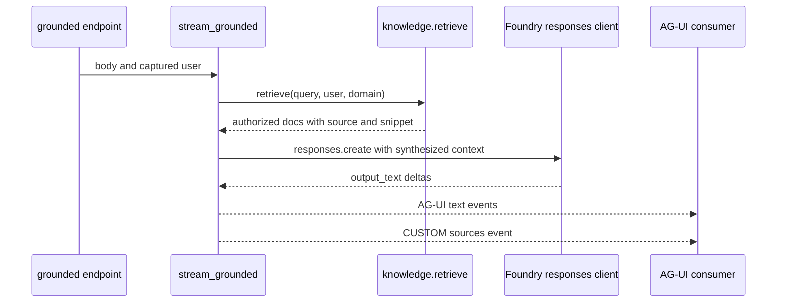

# Grounded domains archetype

The grounded module exists so `cockpit` and `selfwiki` do not each reinvent secure cited Q&A. Its public surface exports `stream_grounded`, synthesis helpers, the fallback concierge builder, and `PerRequestAgent`, while its module docstring states the invariant: every answer from this module must carry at least one source citation, enforced by evaluation rather than by transport protocol ([apps/backend/app/modules/grounded/public.py](https://github.com/ruinosus/foundry-assured/blob/08e078d7f2b6febbc5135f0b7928b5a204c667e3/apps/backend/app/modules/grounded/public.py#L1-L9), [apps/backend/app/modules/grounded/public.py](https://github.com/ruinosus/foundry-assured/blob/08e078d7f2b6febbc5135f0b7928b5a204c667e3/apps/backend/app/modules/grounded/public.py#L24-L33)).

## How grounded endpoints are mounted

The backend registry mounts each grounded domain as a POST route whose handler captures `current_user()` before constructing the `StreamingResponse`, because the auth context variable does not survive into the async generator used by `stream_grounded()` ([apps/backend/app/registry.py](https://github.com/ruinosus/foundry-assured/blob/08e078d7f2b6febbc5135f0b7928b5a204c667e3/apps/backend/app/registry.py#L103-L121)). This is one of the easiest ways to accidentally break authorization: if an endpoint starts reading `current_user()` inside `stream_grounded()` instead of passing `user`, it will silently degrade toward the wrong identity path.

## Four-stage runtime flow

`grounded.py` documents its own four-stage path:

1. build an async credential representing the signed-in user,
2. retrieve authorized documents through the knowledge seam,
3. synthesize only from those documents,
4. emit AG-UI text deltas plus a `sources` custom event ([apps/backend/app/modules/grounded/internal/grounded.py](https://github.com/ruinosus/foundry-assured/blob/08e078d7f2b6febbc5135f0b7928b5a204c667e3/apps/backend/app/modules/grounded/internal/grounded.py#L1-L18)).

The code matches that comment exactly. `stream_grounded()` derives `user_text`, starts AG-UI run/message envelopes, gets tenant config, builds the async credential, calls `retrieve(user_text, user, domain)`, creates a Foundry OpenAI client, builds synthesis kwargs, emits source metadata, and streams `response.output_text.delta` events back into AG-UI message-content events ([apps/backend/app/modules/grounded/internal/grounded.py](https://github.com/ruinosus/foundry-assured/blob/08e078d7f2b6febbc5135f0b7928b5a204c667e3/apps/backend/app/modules/grounded/internal/grounded.py#L76-L150)).

This sequence shows the grounded path from request to structured citations.

## OBO and auth-off fallback

`_async_credential(user)` uses `OnBehalfOfCredential` when auth is enabled and a user exists, otherwise `DefaultAzureCredential` ([apps/backend/app/modules/grounded/internal/grounded.py](https://github.com/ruinosus/foundry-assured/blob/08e078d7f2b6febbc5135f0b7928b5a204c667e3/apps/backend/app/modules/grounded/internal/grounded.py#L58-L73)). The comments explain why this is duplicated from shared auth rather than reused directly: the generator loses access to the request-scoped `current_user()` contextvar, so the endpoint must capture the user and pass it in ([apps/backend/app/modules/grounded/internal/grounded.py](https://github.com/ruinosus/foundry-assured/blob/08e078d7f2b6febbc5135f0b7928b5a204c667e3/apps/backend/app/modules/grounded/internal/grounded.py#L59-L63), [apps/backend/app/modules/grounded/internal/grounded.py](https://github.com/ruinosus/foundry-assured/blob/08e078d7f2b6febbc5135f0b7928b5a204c667e3/apps/backend/app/modules/grounded/internal/grounded.py#L82-L83)).

This is the core auth invariant for grounded domains: retrieval and synthesis should run as the user when possible, but local development must still work when auth is off.

## Synthesis contract

`SYNTHESIS_DIRECTIVE` is intentionally strict: answer only from provided documents, cite every factual claim by bracketed index, and say you do not know when the documents do not contain the answer ([apps/backend/app/modules/grounded/internal/grounded.py](https://github.com/ruinosus/foundry-assured/blob/08e078d7f2b6febbc5135f0b7928b5a204c667e3/apps/backend/app/modules/grounded/internal/grounded.py#L29-L35)). `build_synthesis_kwargs()` injects retrieved snippets as the only grounding context and includes domain-specific instructions separately ([apps/backend/app/modules/grounded/internal/grounded.py](https://github.com/ruinosus/foundry-assured/blob/08e078d7f2b6febbc5135f0b7928b5a204c667e3/apps/backend/app/modules/grounded/internal/grounded.py#L38-L55)). If you weaken this prompt contract, you are changing both retrieval assurance semantics and the EvidencePanel’s expected source behavior.

## Structured citations and the frontend contract

After retrieval, `stream_grounded()` constructs `sources = [{index, source, url, content}]`, where `content` is the snippet capped at 800 characters, then emits that list as a `CustomEvent(name="sources", value=sources)` after the text stream finishes ([apps/backend/app/modules/grounded/internal/grounded.py](https://github.com/ruinosus/foundry-assured/blob/08e078d7f2b6febbc5135f0b7928b5a204c667e3/apps/backend/app/modules/grounded/internal/grounded.py#L123-L141)). The frontend `EvidencePanel` is built around that exact event shape: it subscribes to agent events, clears citations on `RUN_STARTED`, and stores citation data when it sees `CUSTOM` with `name === "sources"` ([apps/frontend/components/console/EvidencePanel.tsx](https://github.com/ruinosus/foundry-assured/blob/08e078d7f2b6febbc5135f0b7928b5a204c667e3/apps/frontend/components/console/EvidencePanel.tsx#L8-L13), [apps/frontend/components/console/EvidencePanel.tsx](https://github.com/ruinosus/foundry-assured/blob/08e078d7f2b6febbc5135f0b7928b5a204c667e3/apps/frontend/components/console/EvidencePanel.tsx#L71-L108)).

Because storage blobs are private, the inline `content` preview is often more important to the UX than the URL itself. The UI renders `.citation-content` from that snippet, not by opening blob URLs directly ([apps/frontend/components/console/EvidencePanel.tsx](https://github.com/ruinosus/foundry-assured/blob/08e078d7f2b6febbc5135f0b7928b5a204c667e3/apps/frontend/components/console/EvidencePanel.tsx#L117-L149)). So a change to snippet shape or absence will show up as a user-visible citation regression.

## Concierge fallback and PerRequestAgent

The module also exports a concierge fallback and `PerRequestAgent`. The registry uses `knowledge_configured()` to decide whether `/helpdesk` should run the full workflow or a single concierge agent ([apps/backend/app/registry.py](https://github.com/ruinosus/foundry-assured/blob/08e078d7f2b6febbc5135f0b7928b5a204c667e3/apps/backend/app/registry.py#L124-L140), [apps/backend/app/modules/grounded/public.py](https://github.com/ruinosus/foundry-assured/blob/08e078d7f2b6febbc5135f0b7928b5a204c667e3/apps/backend/app/modules/grounded/public.py#L11-L22)). `PerRequestAgent` lives here because grounded domains needed it first and platform ops reused it later ([apps/backend/app/modules/grounded/public.py](https://github.com/ruinosus/foundry-assured/blob/08e078d7f2b6febbc5135f0b7928b5a204c667e3/apps/backend/app/modules/grounded/public.py#L6-L9), [apps/backend/app/modules/platform_ops/internal/platform.py](https://github.com/ruinosus/foundry-assured/blob/08e078d7f2b6febbc5135f0b7928b5a204c667e3/apps/backend/app/modules/platform_ops/internal/platform.py#L17-L23)).

## Focused tests and validation

The grounded test family focuses on event shape and end-to-end citation behavior. `grounded_archetype_roundtrip_test.py` posts real authenticated A/B requests through `/cockpit` and asserts on cited source filenames from the `sources` custom event, not on prose ([apps/backend/tests/grounded/grounded_archetype_roundtrip_test.py](https://github.com/ruinosus/foundry-assured/blob/08e078d7f2b6febbc5135f0b7928b5a204c667e3/apps/backend/tests/grounded/grounded_archetype_roundtrip_test.py#L1-L18), [apps/backend/tests/grounded/grounded_archetype_roundtrip_test.py](https://github.com/ruinosus/foundry-assured/blob/08e078d7f2b6febbc5135f0b7928b5a204c667e3/apps/backend/tests/grounded/grounded_archetype_roundtrip_test.py#L77-L105), [apps/backend/tests/grounded/grounded_archetype_roundtrip_test.py](https://github.com/ruinosus/foundry-assured/blob/08e078d7f2b6febbc5135f0b7928b5a204c667e3/apps/backend/tests/grounded/grounded_archetype_roundtrip_test.py#L125-L147)). The browser equivalent is `e2e/cockpit-acl.spec.ts`, which signs in as two users, asserts that only the cleared user sees the confidential source, and clicks the first citation to confirm inline snippet rendering ([e2e/cockpit-acl.spec.ts](https://github.com/ruinosus/foundry-assured/blob/08e078d7f2b6febbc5135f0b7928b5a204c667e3/e2e/cockpit-acl.spec.ts#L6-L19), [e2e/cockpit-acl.spec.ts](https://github.com/ruinosus/foundry-assured/blob/08e078d7f2b6febbc5135f0b7928b5a204c667e3/e2e/cockpit-acl.spec.ts#L124-L145), [e2e/cockpit-acl.spec.ts](https://github.com/ruinosus/foundry-assured/blob/08e078d7f2b6febbc5135f0b7928b5a204c667e3/e2e/cockpit-acl.spec.ts#L152-L177)).

Minimal validation after grounded changes:

- Verify one live `/cockpit` or `/selfwiki` answer shows structured citations.
- Re-run the A/B ACL round-trip if retrieval or event shape changed.
- Confirm the frontend EvidencePanel still receives and displays `sources` data.
