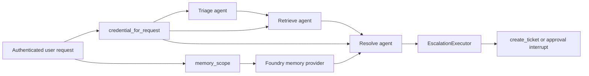

# Helpdesk workflow domain

The helpdesk domain is the repository’s canonical multi-step concierge flow. In the backend registry it is the `workflow` domain mounted at `/helpdesk`, and in the README it is the product story: triage → retrieve → resolve → escalate. [Source](https://github.com/ruinosus/foundry-assured/blob/b0a07a129bc3557f4a4d324dc1b7d050cf7bc1ad/apps/backend/app/registry.py#L71-L76) [Source](https://github.com/ruinosus/foundry-assured/blob/b0a07a129bc3557f4a4d324dc1b7d050cf7bc1ad/apps/backend/app/registry.py#L164-L180) [Source](https://github.com/ruinosus/foundry-assured/blob/b0a07a129bc3557f4a4d324dc1b7d050cf7bc1ad/README.md#L31-L34) [Source](https://github.com/ruinosus/foundry-assured/blob/b0a07a129bc3557f4a4d324dc1b7d050cf7bc1ad/README.md#L75-L77)

## Runtime entrypoint

The live runtime is built by `build_helpdesk_workflow(thread_id=None)`. It is per-request by design: the function reads `credential_for_request()` and `memory_scope()` at build time, then constructs triage, retrieve, and resolve agents plus an `EscalationExecutor`. That per-request factory is wrapped by `OrderedAgentFrameworkWorkflow` and mounted through the registry. [Source](https://github.com/ruinosus/foundry-assured/blob/b0a07a129bc3557f4a4d324dc1b7d050cf7bc1ad/apps/backend/app/modules/helpdesk/internal/graph.py#L1-L13) [Source](https://github.com/ruinosus/foundry-assured/blob/b0a07a129bc3557f4a4d324dc1b7d050cf7bc1ad/apps/backend/app/modules/helpdesk/internal/graph.py#L29-L55) [Source](https://github.com/ruinosus/foundry-assured/blob/b0a07a129bc3557f4a4d324dc1b7d050cf7bc1ad/apps/backend/app/registry.py#L164-L176)

The important invariant is in the docstring: AG-UI’s workflow factory only receives a `thread_id`, so user identity comes from request-scoped auth context. If someone caches the workflow globally, OBO identity and memory scope would leak across callers. [Source](https://github.com/ruinosus/foundry-assured/blob/b0a07a129bc3557f4a4d324dc1b7d050cf7bc1ad/apps/backend/app/modules/helpdesk/internal/graph.py#L3-L12) [Source](https://github.com/ruinosus/foundry-assured/blob/b0a07a129bc3557f4a4d324dc1b7d050cf7bc1ad/apps/backend/app/modules/helpdesk/internal/graph.py#L29-L34)

## Step responsibilities

The workflow composes four executors in a fixed chain:

1. **triage** classifies and restates the request.
2. **retrieve** gathers relevant grounded context.
3. **resolve** answers using retrieved context and memory.
4. **escalate** converts a ticket signal into a human approval interrupt and only opens the ticket once approved. [Source](https://github.com/ruinosus/foundry-assured/blob/b0a07a129bc3557f4a4d324dc1b7d050cf7bc1ad/apps/backend/app/modules/helpdesk/internal/graph.py#L36-L55)

The chain ordering is part of the product contract. The comments explicitly note that escalation turns a `TICKET:` signal into a human approval interrupt and avoids duplicate `TOOL_CALL_START` events by letting step streaming come from executor `STEP` events instead. [Source](https://github.com/ruinosus/foundry-assured/blob/b0a07a129bc3557f4a4d324dc1b7d050cf7bc1ad/apps/backend/app/modules/helpdesk/internal/graph.py#L43-L46)

## Identity and memory

Helpdesk is the domain where OBO and per-user memory matter most. `build_memory_provider` creates a `FoundryMemoryProvider` only when tenant config has both a project endpoint and memory store name, and scopes it to one user. In shared mode, `memory_scope()` prefixes the user object id with tenant id; in single-tenant modes it preserves the bare user id to avoid orphaning existing memories. [Source](https://github.com/ruinosus/foundry-assured/blob/b0a07a129bc3557f4a4d324dc1b7d050cf7bc1ad/apps/backend/app/modules/helpdesk/internal/memory.py#L1-L10) [Source](https://github.com/ruinosus/foundry-assured/blob/b0a07a129bc3557f4a4d324dc1b7d050cf7bc1ad/apps/backend/app/modules/helpdesk/internal/memory.py#L22-L40) [Source](https://github.com/ruinosus/foundry-assured/blob/b0a07a129bc3557f4a4d324dc1b7d050cf7bc1ad/apps/backend/app/modules/tenancy/internal/tenant_resolution.py#L71-L82)

Two failure modes are guarded here:

- If auth is disabled, the workflow degrades to `DefaultAzureCredential` and a dev memory scope instead of failing. [Source](https://github.com/ruinosus/foundry-assured/blob/b0a07a129bc3557f4a4d324dc1b7d050cf7bc1ad/apps/backend/app/modules/helpdesk/internal/graph.py#L9-L12)
- If memory is configured but not scoped correctly, one user can poison another user’s future answers. The memory docstring explicitly names scoping as the primary defense. [Source](https://github.com/ruinosus/foundry-assured/blob/b0a07a129bc3557f4a4d324dc1b7d050cf7bc1ad/apps/backend/app/modules/helpdesk/internal/memory.py#L1-L7)

## HITL escalation and ticket persistence

The live workflow can pause for human approval before creating a ticket. The UI later renders that as a ticket approval card, but the backend-side meaning is: the workflow does not claim success until escalation is approved and the ticket is written. Ticket retrieval is exposed through `/tickets`, whose docstring states these are the real tickets opened by the HITL approval flow and persisted to Azure Files-backed storage in deployed environments. [Source](https://github.com/ruinosus/foundry-assured/blob/b0a07a129bc3557f4a4d324dc1b7d050cf7bc1ad/README.md#L147-L150) [Source](https://github.com/ruinosus/foundry-assured/blob/b0a07a129bc3557f4a4d324dc1b7d050cf7bc1ad/apps/backend/app/modules/tickets/api.py#L9-L15)

The missing detail lives in `EscalationExecutor`: `on_resolve()` detects `TICKET:` output, builds `TicketApprovalRequest(summary=...)`, and pauses with `ctx.request_info(request_data=..., response_type=object)`. The resume path is `on_decision(request, answer, ctx)`, which normalizes either legacy booleans (`True` → approve, `False` → reject) or structured dictionaries like `{type: "edit", args: {...}}` through `_read_answer()`. Anything malformed or unsupported becomes `reject`, so malformed payloads fail closed. Authorization is then enforced by `decide()` on an `ApprovalRequest(action="create_ticket", required_role=("Approver", "Admin"), allowed_decisions=("approve", "edit", "reject"))`: approve and edit both require `Approver` or `Admin`, reject is always allowed, and edit without args is refused because it would secretly execute the model’s original proposal. Only after that shared HITL decision succeeds does the executor call `create_ticket(summary)` and yield the success message that later appears in `/tickets`. [Source](https://github.com/ruinosus/foundry-assured/blob/b0a07a129bc3557f4a4d324dc1b7d050cf7bc1ad/apps/backend/app/modules/helpdesk/internal/escalation.py#L37-L64) [Source](https://github.com/ruinosus/foundry-assured/blob/b0a07a129bc3557f4a4d324dc1b7d050cf7bc1ad/apps/backend/app/modules/helpdesk/internal/escalation.py#L69-L125) [Source](https://github.com/ruinosus/foundry-assured/blob/b0a07a129bc3557f4a4d324dc1b7d050cf7bc1ad/apps/backend/app/modules/helpdesk/internal/escalation.py#L128-L141) [Source](https://github.com/ruinosus/foundry-assured/blob/b0a07a129bc3557f4a4d324dc1b7d050cf7bc1ad/apps/backend/app/modules/hitl/public.py#L47-L58) [Source](https://github.com/ruinosus/foundry-assured/blob/b0a07a129bc3557f4a4d324dc1b7d050cf7bc1ad/apps/backend/app/modules/hitl/public.py#L75-L117)

This is a lifecycle ordering invariant: approval must happen before `create_ticket`, not after, and the persisted ticket list is the observable proof that approval led to an action.

## Hosted twin

The helpdesk domain also has a hosted variant. The backend exposes `/helpdesk-hosted`, an AG-UI endpoint that proxies a hosted agent and streams Responses output back as AG-UI events. That path is auth-gated like `/helpdesk` but intentionally weaker in capability: no live workflow steps, no approval card, and no per-user OBO memory semantics. [Source](https://github.com/ruinosus/foundry-assured/blob/b0a07a129bc3557f4a4d324dc1b7d050cf7bc1ad/apps/backend/app/modules/hosted/api.py#L12-L25) [Source](https://github.com/ruinosus/foundry-assured/blob/b0a07a129bc3557f4a4d324dc1b7d050cf7bc1ad/apps/backend/app/modules/hosted/internal/hosted.py#L1-L8) [Source](https://github.com/ruinosus/foundry-assured/blob/b0a07a129bc3557f4a4d324dc1b7d050cf7bc1ad/apps/backend/app/modules/hosted/internal/hosted.py#L72-L105)

The hosted package itself is deliberately self-contained. `apps/hosted-agent/main.py` recreates triage → retrieve → resolve against Foundry and Search, but its header comment explicitly says it drops OBO, per-user memory, and human-in-the-loop escalation because those do not fit the hosted single-identity request/response model. [Source](https://github.com/ruinosus/foundry-assured/blob/b0a07a129bc3557f4a4d324dc1b7d050cf7bc1ad/apps/hosted-agent/main.py#L1-L16) [Source](https://github.com/ruinosus/foundry-assured/blob/b0a07a129bc3557f4a4d324dc1b7d050cf7bc1ad/apps/hosted-agent/main.py#L53-L108)

## Extension surface

If you change helpdesk behavior, the repository-defined extension seams are:

- The declarative prompt/instruction assets under `apps/backend/agents/helpdesk/`.
- The workflow factory in `app/modules/helpdesk/internal/graph.py`.
- The memory provider and tenancy memory scope.
- The hosted twin in `apps/hosted-agent/main.py` and the hosted bridge in `app/modules/hosted/*`.

A change is incomplete if it touches only one of those seams but claims to alter both live and hosted behavior.

## Focused tests

Representative tests for this domain:

- `tests/e2e/configured_mode_test.py` and `tests/e2e/shared_boot_smoke_test.py` for runtime boot and configured paths.
- `tests/hitl/decision_test.py` for approval behavior.
- `tests/tenancy/memory_scope_test.py` for scoping invariants.
- `tests/hosted/hosted_build_test.py` for hosted helpdesk packaging.

Those tests are the narrow validation set after changing workflow order, approval semantics, or memory wiring.
