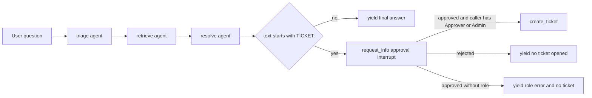

# Helpdesk workflow

The live helpdesk domain is the backend's richest runtime path. It is a per-request workflow built in [`apps/backend/app/workflow/graph.py`](../../apps/backend/app/workflow/graph.py) and mounted at `POST /helpdesk` by [`apps/backend/app/domains.py`](../../apps/backend/app/domains.py).

Its chain is:

1. `triage`
2. `retrieve`
3. `resolve`
4. `escalate`

The final step is not an LLM agent. It is a workflow executor that translates a resolve sentinel into a human approval interrupt and a real ticket action.

## Why it is built per request

`build_helpdesk_workflow(thread_id: str | None = None)` constructs the workflow at request time, not process startup. That is necessary because the workflow must use:

- the current caller's OBO or fallback credential via `credential_for_request()`,
- the current caller's memory namespace via `memory_scope()`,
- the current tenant's data-plane settings via `tenant_config()`.

If the workflow were built once at startup, all later requests would risk sharing the wrong identity, wrong memory scope, or wrong tenant configuration.

## Workflow construction

`build_helpdesk_workflow()` does the following in order:

1. get `credential = credential_for_request()`
2. compute `scope = memory_scope()`
3. build `memory = build_memory_provider(credential, scope)`
4. build the `triage`, `retrieve`, and `resolve` agents
5. create `EscalationExecutor()`
6. assemble a `WorkflowBuilder(...).add_chain([triage, retrieve, resolve, escalate]).build()`

Unlike the hosted helpdesk agent, the live workflow keeps memory and human-in-the-loop escalation.



This diagram shows the structural rule that prevents ticket creation without both approval and role authority.

## The three LLM-backed workflow agents

Defined in [`apps/backend/app/workflow/agents.py`](../../apps/backend/app/workflow/agents.py), each executor uses `FoundryChatClient(...).as_agent(...)` and reads tenant-specific Foundry configuration.

### `build_triage_agent`

- Name: `triage`
- Description: classifies intent and urgency, restates the question
- Prompt source: `TRIAGE_INSTRUCTIONS` from `app.agents.prompts`

Its output is meant to be self-contained for the next step, not user-facing.

### `build_retrieve_agent`

- Name: `retrieve`
- Description: retrieves grounding passages and sources from the knowledge base
- Prompt source: `RETRIEVE_INSTRUCTIONS`
- Context provider: `AzureAISearchContextProvider` in `mode="agentic"`

This is the workflow-specific retrieval path for the helpdesk knowledge base, distinct from the grounded-domain retrieval seam in `services/retrieval.py`.

### `build_resolve_agent`

- Name: `resolve`
- Description: writes the grounded, cited answer or signals escalation
- Prompt source: `RESOLVE_INSTRUCTIONS`
- Optional context providers: includes the memory provider when configured

The resolve step is responsible for deciding whether the answer should become a ticket request. It signals that by returning text beginning with `TICKET:`.

## Memory integration

Memory is configured in [`apps/backend/app/workflow/memory.py`](../../apps/backend/app/workflow/memory.py).

`build_memory_provider(credential, scope)` returns `FoundryMemoryProvider(...)` only when both:

- `tenant_config().foundry_project_endpoint` is present,
- `tenant_config().foundry_memory_store` is present.

Important settings:

- `scope` is per-user, and tenant-prefixed in shared mode,
- `context_prompt` is `Known facts about this developer from past sessions...`,
- `update_delay=0` forces immediate persistence instead of waiting 5 minutes.

That last choice means new memories are written promptly during live use, which matches the interactive workflow expectation.

## Escalation executor

The most important file for workflow safety is [`apps/backend/app/workflow/escalation.py`](../../apps/backend/app/workflow/escalation.py).

### Sentinel contract

`TICKET_PREFIX = "TICKET:"`

`EscalationExecutor.on_resolve(...)` inspects the resolve agent's text output:

- if it begins with `TICKET:`, the executor extracts the summary and pauses the workflow with `ctx.request_info(...)`,
- otherwise it yields the resolve answer directly.

This means the human approval path is structurally outside the LLM agent. The model cannot directly call the ticket tool in the live workflow.

### Approval path

`on_decision(...)` receives:

- the original `TicketApprovalRequest(summary=...)`,
- a boolean `approved`,
- the workflow context.

Behavior:

- if approved but caller lacks `Approver` or `Admin`, no ticket is created and the workflow yields a role error message,
- if approved and authorized, `create_ticket(request.summary)` persists a real ticket and the workflow yields a success message,
- if rejected, the workflow yields a no-ticket message.

This creates a double gate:

1. explicit human approval,
2. explicit role authorization.

### Why request_info instead of an approval-mode tool

The file documents a specific framework issue: approval-gated tool calls through `agent-framework-ag-ui 1.0.0rc5` duplicated `TOOL_CALL_START` events and broke the stream. The native workflow `request_info` mechanism produced clean interrupts that CopilotKit could render reliably. That is why escalation is modeled as a workflow node instead of a resolve-agent tool call.

## Ticket action

The actual side effect is in [`apps/backend/app/tools/tickets.py`](../../apps/backend/app/tools/tickets.py):

- `create_ticket(summary, severity="medium")` appends a JSON row to `apps/backend/data/tickets.jsonl`,
- `list_tickets(limit=50)` reads it back newest-first,
- `create_ticket_tool` wraps the same function as an agent-framework tool for hosted or autonomous use.

The live workflow does not expose the tool directly to the model. It calls the Python function only after the approval and RBAC gates pass.

## AG-UI behavior

The helpdesk endpoint is mounted with `OrderedAgentFrameworkWorkflow(workflow_factory=build_helpdesk_workflow)`. This wrapper exists because step ordering matters to the frontend workflow renderer.

On the frontend side:

- `WorkflowSteps` renders step streaming,
- `TicketApproval` renders the interrupt card,
- the generic console only shows these widgets for `domain.kind === "workflow"`.

## Live versus hosted helpdesk

The hosted helpdesk agent in `apps/hosted-agent/main.py` mirrors the triage → retrieve → resolve chain, but it intentionally drops:

- OBO user identity,
- per-user memory,
- the human approval interrupt,
- the live AG-UI step stream semantics of the FastAPI path.

That difference is architectural, not temporary. See [Hosted helpdesk](../hosted-agents/helpdesk-hosted.md).

## Focused tests

Representative tests for workflow behavior:

- `approval_mode_test.py`: covers approval semantics.
- `memory_scope_test.py`: proves memory isolation assumptions used by workflow memory.
- `prompt_contract_test.py`: protects prompt-layer sentinels like escalation behavior.
- `shared_boot_smoke_test.py`: validates boot behavior in shared mode where workflow identity resolution matters.
- `grounded_payload_test.py` and `retrieval_shape_test.py`: adjacent invariants on retrieved grounding structure.

## Validation

From `apps/backend/`:

```bash
uv run pytest eval/approval_mode_test.py eval/memory_scope_test.py eval/prompt_contract_test.py
```

Manual narrow validation when running the app locally:

```bash
uv run uvicorn app.main:app --port 8000 --reload
```

Then exercise `/helpdesk` through the frontend and verify:

- steps appear in order,
- a ticket request pauses for approval,
- approval without `Approver` or `Admin` yields refusal,
- approved authorized actions create a visible ticket in `/tickets`.

## Related pages

- [Backend application overview](application-overview.md)
- [Evaluations and tickets](evaluations-and-tickets.md)
- [Frontend domain console](../frontend/domain-console.md)
- [Hosted helpdesk](../hosted-agents/helpdesk-hosted.md)
