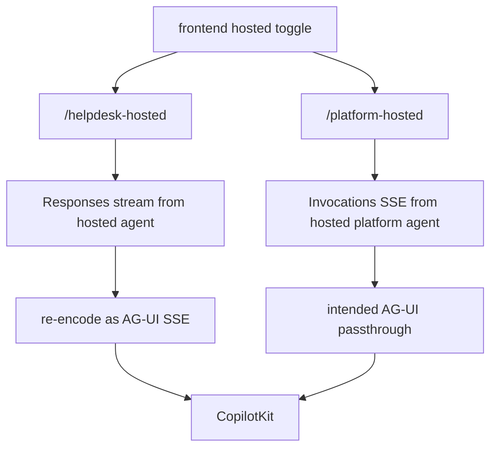

# Hosted bridges and evaluation APIs

The backend `hosted` module is the live app’s bridge to separately deployed hosted agents. Its router exposes `/helpdesk-hosted` and `/platform-hosted`, each returning a `StreamingResponse` that translates or relays hosted-agent protocols back into AG-UI so the frontend can use the same chat surface ([apps/backend/app/modules/hosted/api.py](https://github.com/ruinosus/foundry-assured/blob/08e078d7f2b6febbc5135f0b7928b5a204c667e3/apps/backend/app/modules/hosted/api.py#L12-L34)). The module is also lifecycle-aware: `app.main` closes cached hosted clients on shutdown through `hosted_aclose()` ([apps/backend/app/main.py](https://github.com/ruinosus/foundry-assured/blob/08e078d7f2b6febbc5135f0b7928b5a204c667e3/apps/backend/app/main.py#L44-L50)).

## Standard Responses-hosted bridge

`stream_agui(body, agent_name)` is the bridge for normal hosted agents. It extracts the last user text from AG-UI-style messages, opens a cached OpenAI client for the named hosted agent, calls `client.responses.create(input=user_text, stream=True)`, and re-encodes `response.output_text.delta` events as AG-UI text message events ([apps/backend/app/modules/hosted/internal/hosted.py](https://github.com/ruinosus/foundry-assured/blob/08e078d7f2b6febbc5135f0b7928b5a204c667e3/apps/backend/app/modules/hosted/internal/hosted.py#L59-L105)). This is a protocol translation, not a passthrough.

Client caching is process-global and keyed by hosted agent name. `_client()` builds and stores an `AIProjectClient`, its credential, and the resulting async OpenAI client on first use ([apps/backend/app/modules/hosted/internal/hosted.py](https://github.com/ruinosus/foundry-assured/blob/08e078d7f2b6febbc5135f0b7928b5a204c667e3/apps/backend/app/modules/hosted/internal/hosted.py#L18-L45)). The code comment flags an unresolved multitenant risk: the cache currently binds to the first tenant that warms each agent, so tenant scoping or busting will be needed when true multi-tenant hosted usage lands ([apps/backend/app/modules/hosted/internal/hosted.py](https://github.com/ruinosus/foundry-assured/blob/08e078d7f2b6febbc5135f0b7928b5a204c667e3/apps/backend/app/modules/hosted/internal/hosted.py#L35-L43)).

## Platform Invocations bridge

`stream_platform_agui(body)` is different. The platform hosted agent is expected to speak the Invocations protocol and already emit AG-UI SSE, so the bridge is meant to be a passthrough rather than a Responses-to-AG-UI translation ([apps/backend/app/modules/hosted/internal/hosted.py](https://github.com/ruinosus/foundry-assured/blob/08e078d7f2b6febbc5135f0b7928b5a204c667e3/apps/backend/app/modules/hosted/internal/hosted.py#L121-L131)).

However, the file is intentionally honest about what is verified and what is not. `_platform_invocations_url()` and the streaming path carry TODOs that the exact protocol contract, request-body shape, data-plane scope, and especially true byte-preserving SSE passthrough are not fully verified offline ([apps/backend/app/modules/hosted/internal/hosted.py](https://github.com/ruinosus/foundry-assured/blob/08e078d7f2b6febbc5135f0b7928b5a204c667e3/apps/backend/app/modules/hosted/internal/hosted.py#L107-L119), [apps/backend/app/modules/hosted/internal/hosted.py](https://github.com/ruinosus/foundry-assured/blob/08e078d7f2b6febbc5135f0b7928b5a204c667e3/apps/backend/app/modules/hosted/internal/hosted.py#L148-L177)). The current code uses `aiter_lines()`, and the comments warn that this likely corrupts true SSE event boundaries because it strips separators. Treat platform hosted bridging as infra-gated and under active caution.

This diagram shows the split between translated Responses-hosted paths and the platform Invocations path.

## Error handling and no-endpoint behavior

Both bridges surface failures as AG-UI `RunErrorEvent`s instead of crashing the request. `stream_agui()` catches exceptions and emits a clean run error after ending the message envelope ([apps/backend/app/modules/hosted/internal/hosted.py](https://github.com/ruinosus/foundry-assured/blob/08e078d7f2b6febbc5135f0b7928b5a204c667e3/apps/backend/app/modules/hosted/internal/hosted.py#L92-L105)). `stream_platform_agui()` similarly frames a minimal AG-UI run with `RUN_ERROR` if the endpoint is unconfigured or invocation fails ([apps/backend/app/modules/hosted/internal/hosted.py](https://github.com/ruinosus/foundry-assured/blob/08e078d7f2b6febbc5135f0b7928b5a204c667e3/apps/backend/app/modules/hosted/internal/hosted.py#L139-L182)).

`hosted_platform_smoke_test.py` is the narrowest scaffold-shape proof for the hosted platform runtime: it verifies the service is declared as an Invocations-hosted platform concierge rather than a Responses-hosted grounded twin, without needing deployed infrastructure ([apps/backend/tests/hosted/hosted_platform_smoke_test.py](https://github.com/ruinosus/foundry-assured/blob/08e078d7f2b6febbc5135f0b7928b5a204c667e3/apps/backend/tests/hosted/hosted_platform_smoke_test.py#L1-L8), [apps/backend/tests/hosted/hosted_platform_smoke_test.py](https://github.com/ruinosus/foundry-assured/blob/08e078d7f2b6febbc5135f0b7928b5a204c667e3/apps/backend/tests/hosted/hosted_platform_smoke_test.py#L20-L57)). `platform_hosted_bridge_test.py` then locks in the no-endpoint behavior by patching `tenant_config()` inside the hosted module namespace and asserting that a `RUN_STARTED` plus terminal `RUN_ERROR` envelope is emitted without network access ([apps/backend/tests/hosted/platform_hosted_bridge_test.py](https://github.com/ruinosus/foundry-assured/blob/08e078d7f2b6febbc5135f0b7928b5a204c667e3/apps/backend/tests/hosted/platform_hosted_bridge_test.py#L1-L6), [apps/backend/tests/hosted/platform_hosted_bridge_test.py](https://github.com/ruinosus/foundry-assured/blob/08e078d7f2b6febbc5135f0b7928b5a204c667e3/apps/backend/tests/hosted/platform_hosted_bridge_test.py#L32-L56)).

## Evaluation APIs

The `evaluation` module surfaces two read APIs:

- `/eval/runs`, a local mirror of offline harness runs stored in `apps/backend/eval/runs.jsonl` ([apps/backend/app/modules/evaluation/api.py](https://github.com/ruinosus/foundry-assured/blob/08e078d7f2b6febbc5135f0b7928b5a204c667e3/apps/backend/app/modules/evaluation/api.py#L12-L36));
- `/eval/foundry`, the canonical live view over Foundry project eval runs, which the frontend `/evals` page renders ([apps/backend/app/modules/evaluation/api.py](https://github.com/ruinosus/foundry-assured/blob/08e078d7f2b6febbc5135f0b7928b5a204c667e3/apps/backend/app/modules/evaluation/api.py#L39-L45)).

`foundry_evals.py` implements the live path. It caches an OpenAI client once per process, uses the app identity rather than OBO because eval results are project-wide, and returns recent eval runs with status, report URL, aggregate pass/fail counts, and per-criterion totals ([apps/backend/app/modules/evaluation/internal/foundry_evals.py](https://github.com/ruinosus/foundry-assured/blob/08e078d7f2b6febbc5135f0b7928b5a204c667e3/apps/backend/app/modules/evaluation/internal/foundry_evals.py#L1-L10), [apps/backend/app/modules/evaluation/internal/foundry_evals.py](https://github.com/ruinosus/foundry-assured/blob/08e078d7f2b6febbc5135f0b7928b5a204c667e3/apps/backend/app/modules/evaluation/internal/foundry_evals.py#L26-L33), [apps/backend/app/modules/evaluation/internal/foundry_evals.py](https://github.com/ruinosus/foundry-assured/blob/08e078d7f2b6febbc5135f0b7928b5a204c667e3/apps/backend/app/modules/evaluation/internal/foundry_evals.py#L36-L80)).

## Focused validation

- Standard hosted bridge: exercise `/helpdesk-hosted` or `/selfwiki` hosted mode from the UI and verify streamed text arrives.
- Platform hosted bridge: use the dedicated hosted tests and treat passing smoke as conditional on deployed infrastructure.
- Eval API changes: verify `/eval/foundry` against a real project and make sure empty or unreachable projects degrade to an empty list rather than a 500.
