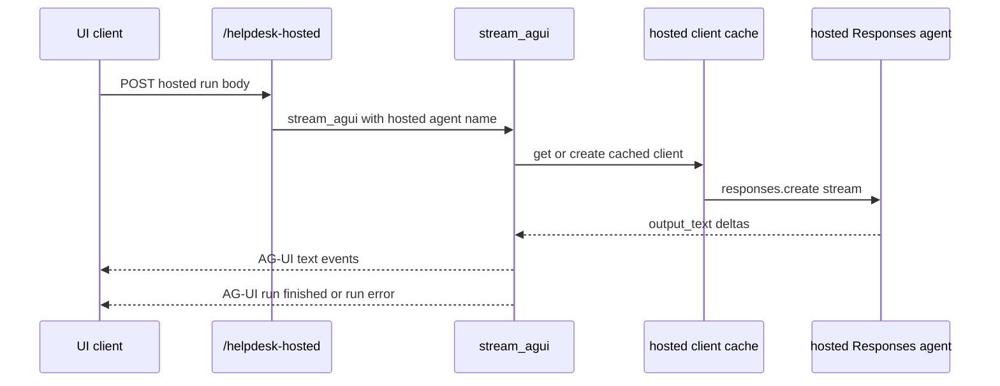

# Hosted bridges

The backend serves hosted-agent twins through `app/api/chat.py`, not through the live domain registry. `POST /helpdesk-hosted` proxies a hosted Responses-based agent through `stream_agui`, while `POST /platform-hosted` proxies the hosted platform agent through `stream_platform_agui`. Both endpoints stream `text/event-stream` and keep the frontend on the AG-UI transport even when the upstream hosted agent speaks a different protocol ([`apps/backend/app/api/chat.py`](https://github.com/ruinosus/foundry-assured/blob/7e41ad6f80befa024fae867b3fcdf763f8331a10/apps/backend/app/api/chat.py#L12-L34)).

## Why hosted bridges are a separate subsystem

The module docstring for `app/services/hosted.py` says the hosted agent speaks the Responses protocol while CopilotKit consumes AG-UI, so the backend must stream the hosted response and re-emit it as AG-UI events. The code also states that hosted agents do not expose live workflow steps or approval cards in the same way as the AG-UI workflow path, which is why they are separate from live domain mounts rather than hidden behind the same implementation ([`apps/backend/app/services/hosted.py`](https://github.com/ruinosus/foundry-assured/blob/7e41ad6f80befa024fae867b3fcdf763f8331a10/apps/backend/app/services/hosted.py#L1-L8)).

## Helpdesk hosted path: Responses to AG-UI re-encoding

`stream_agui(body, agent_name)` is the common Responses bridge. It extracts the last user message, synthesizes AG-UI run and message ids, emits `RunStartedEvent` and `TextMessageStartEvent`, then iterates the hosted client’s `responses.create(..., stream=True)` events. For every `response.output_text.delta`, it emits a matching AG-UI text delta, then closes with `TextMessageEndEvent` and `RunFinishedEvent`. If anything fails, it still emits `TextMessageEndEvent` followed by `RunErrorEvent` so the frontend sees a clean terminal envelope ([`apps/backend/app/services/hosted.py`](https://github.com/ruinosus/foundry-assured/blob/7e41ad6f80befa024fae867b3fcdf763f8331a10/apps/backend/app/services/hosted.py#L59-L105)).

That path is what `/helpdesk-hosted` uses by passing `tenant_config().hosted_agent_name`, which means the hosted agent name is tenant-configurable rather than hard-coded at the route layer ([`apps/backend/app/api/chat.py`](https://github.com/ruinosus/foundry-assured/blob/7e41ad6f80befa024fae867b3fcdf763f8331a10/apps/backend/app/api/chat.py#L12-L26), [`apps/backend/app/core/tenant.py`](https://github.com/ruinosus/foundry-assured/blob/7e41ad6f80befa024fae867b3fcdf763f8331a10/apps/backend/app/core/tenant.py#L92-L98)).

Caption: The helpdesk hosted bridge translates hosted Responses streaming into AG-UI events for the existing chat UI.

## Client caching and lifecycle

Hosted clients are cached in the process-global `_clients` map keyed by hosted-agent name. `_client(agent_name)` initializes an async `AIProjectClient`, an async credential, and the hosted OpenAI client the first time a given agent name is requested, then reuses them on later calls. The inline TODO warns that this cache currently binds to the first tenant that warms a given agent name, so multitenant-safe cache scoping is still an open operational concern ([`apps/backend/app/services/hosted.py`](https://github.com/ruinosus/foundry-assured/blob/7e41ad6f80befa024fae867b3fcdf763f8331a10/apps/backend/app/services/hosted.py#L18-L45)).

`aclose()` is the matching shutdown hook. It closes every cached client, project, and credential object, then clears the cache. `app/main.py` calls this from FastAPI lifespan shutdown, making cleanup part of normal app lifecycle instead of relying on process exit side effects ([`apps/backend/app/services/hosted.py`](https://github.com/ruinosus/foundry-assured/blob/7e41ad6f80befa024fae867b3fcdf763f8331a10/apps/backend/app/services/hosted.py#L47-L56), [`apps/backend/app/main.py`](https://github.com/ruinosus/foundry-assured/blob/7e41ad6f80befa024fae867b3fcdf763f8331a10/apps/backend/app/main.py#L26-L33)).

## Hosted domain naming surface

`TenantConfig` contains multiple hosted agent names: `hosted_agent_name` for helpdesk, `platform_hosted_agent_name`, `cockpit_hosted_agent_name`, and `selfwiki_hosted_agent_name`. Only helpdesk and platform are currently routed through HTTP endpoints, but the tenant model already treats hosted twins for cockpit and selfwiki as part of the data plane contract ([`apps/backend/app/core/tenant.py`](https://github.com/ruinosus/foundry-assured/blob/7e41ad6f80befa024fae867b3fcdf763f8331a10/apps/backend/app/core/tenant.py#L92-L98), [`apps/backend/app/api/chat.py`](https://github.com/ruinosus/foundry-assured/blob/7e41ad6f80befa024fae867b3fcdf763f8331a10/apps/backend/app/api/chat.py#L12-L34)).

That means future hosted endpoints for cockpit or selfwiki should reuse the same bridge layer instead of inventing separate client management logic.

## Platform hosted path: Invocations passthrough

The platform hosted bridge differs because it targets the agent’s Invocations endpoint rather than the Responses API. `_platform_invocations_url()` derives `.../agents/{name}/endpoint/protocols/invocations` from the current tenant config and returns an empty string when the platform hosted agent is not configured ([`apps/backend/app/services/hosted.py`](https://github.com/ruinosus/foundry-assured/blob/7e41ad6f80befa024fae867b3fcdf763f8331a10/apps/backend/app/services/hosted.py#L107-L119)).

`stream_platform_agui(body)` is intended as a passthrough bridge because the comments say the Invocations endpoint already serves AG-UI SSE. It still wraps failure paths in a clean AG-UI error envelope, but on success it opens an `httpx` stream and relays the response lines back to the caller ([`apps/backend/app/services/hosted.py`](https://github.com/ruinosus/foundry-assured/blob/7e41ad6f80befa024fae867b3fcdf763f8331a10/apps/backend/app/services/hosted.py#L121-L182)).

## Auth and token behavior on hosted paths

`/helpdesk-hosted` uses `auth_dependencies()`, matching the live helpdesk route’s coarse auth requirement. `stream_agui` itself currently acquires its hosted client under `DefaultAzureCredential`, so helpdesk hosted runs are project-scoped rather than per-user OBO at bridge construction time ([`apps/backend/app/api/chat.py`](https://github.com/ruinosus/foundry-assured/blob/7e41ad6f80befa024fae867b3fcdf763f8331a10/apps/backend/app/api/chat.py#L12-L18), [`apps/backend/app/services/hosted.py`](https://github.com/ruinosus/foundry-assured/blob/7e41ad6f80befa024fae867b3fcdf763f8331a10/apps/backend/app/services/hosted.py#L23-L44)).

`/platform-hosted` is stricter. It uses `_domain_deps("platform")`, so in shared mode it preserves per-tenant domain entitlement. `stream_platform_agui` then acquires a bearer token from `credential_for_request()` for `https://ai.azure.com/.default`, which means the bridge tries to use the current caller’s credential on the hosted platform path ([`apps/backend/app/api/chat.py`](https://github.com/ruinosus/foundry-assured/blob/7e41ad6f80befa024fae867b3fcdf763f8331a10/apps/backend/app/api/chat.py#L29-L34), [`apps/backend/app/services/hosted.py`](https://github.com/ruinosus/foundry-assured/blob/7e41ad6f80befa024fae867b3fcdf763f8331a10/apps/backend/app/services/hosted.py#L146-L151)).

## Known contract uncertainties

The platform hosted bridge intentionally documents several unverified assumptions in code comments, and ADR-011 is the design record for the intended hosted per-tenant Foundry toolbox passthrough and identity model behind this bridge ([`docs/adr/ADR-011-hosted-per-tenant-foundry-toolbox-passthrough.md`](https://github.com/ruinosus/foundry-assured/blob/7e41ad6f80befa024fae867b3fcdf763f8331a10/docs/adr/ADR-011-hosted-per-tenant-foundry-toolbox-passthrough.md#L1-L118)).

The platform hosted bridge intentionally documents several unverified assumptions in code comments:

- the exact Foundry data-plane scope for the deployed agent is best-evidence rather than SDK-pinned,
- the precise AG-UI request body expected by the Invocations endpoint is not yet verified offline,
- using `aiter_lines()` likely corrupts true byte-identical SSE passthrough because blank-line separators are stripped.

Those TODOs mean changes around hosted platform transport must be treated as contract work, not cleanup work ([`apps/backend/app/services/hosted.py`](https://github.com/ruinosus/foundry-assured/blob/7e41ad6f80befa024fae867b3fcdf763f8331a10/apps/backend/app/services/hosted.py#L148-L176)).

## Failure handling guarantees

Both bridge paths guarantee a well-formed AG-UI error envelope rather than crashing the stream outright:

- `stream_agui` emits `RunErrorEvent` after ending the assistant message when hosted Responses fail ([`apps/backend/app/services/hosted.py`](https://github.com/ruinosus/foundry-assured/blob/7e41ad6f80befa024fae867b3fcdf763f8331a10/apps/backend/app/services/hosted.py#L92-L105)).
- `stream_platform_agui` synthesizes `RunStartedEvent`, `TextMessageStartEvent`, `TextMessageEndEvent`, and `RunErrorEvent` when the passthrough path raises before any valid hosted stream arrives ([`apps/backend/app/services/hosted.py`](https://github.com/ruinosus/foundry-assured/blob/7e41ad6f80befa024fae867b3fcdf763f8331a10/apps/backend/app/services/hosted.py#L178-L182)).

`platform_hosted_bridge_test.py` exists specifically to prove the no-endpoint error path still emits a clean AG-UI envelope rather than blowing up ([`apps/backend/eval/platform_hosted_bridge_test.py`](https://github.com/ruinosus/foundry-assured/blob/7e41ad6f80befa024fae867b3fcdf763f8331a10/apps/backend/eval/platform_hosted_bridge_test.py#L1-L60)).

## Safe extension points

- Add new hosted HTTP endpoints by reusing `stream_agui` when the upstream protocol is Responses, or by extending the bridge layer for other protocols. Do not duplicate client cache and cleanup logic.
- Scope the client cache per tenant before relying on hosted twins heavily in shared mode.
- Preserve shutdown cleanup through `aclose()` if you alter client initialization or cache shape.

## Focused validation

- `uv run python -m eval.hosted_build_test` for hosted build assumptions ([`apps/backend/eval/hosted_build_test.py`](https://github.com/ruinosus/foundry-assured/blob/7e41ad6f80befa024fae867b3fcdf763f8331a10/apps/backend/eval/hosted_build_test.py#L1-L48)).
- `uv run python -m eval.platform_hosted_bridge_test` for AG-UI envelope behavior on platform hosted failures ([`apps/backend/eval/platform_hosted_bridge_test.py`](https://github.com/ruinosus/foundry-assured/blob/7e41ad6f80befa024fae867b3fcdf763f8331a10/apps/backend/eval/platform_hosted_bridge_test.py#L1-L60)).
- `uv run python -m eval.platform_hosted_e2e_test` and `uv run python -m eval.hosted_platform_smoke_test` for infra-backed platform hosted behavior ([`apps/backend/eval/platform_hosted_e2e_test.py`](https://github.com/ruinosus/foundry-assured/blob/7e41ad6f80befa024fae867b3fcdf763f8331a10/apps/backend/eval/platform_hosted_e2e_test.py#L1-L70), [`apps/backend/eval/hosted_platform_smoke_test.py`](https://github.com/ruinosus/foundry-assured/blob/7e41ad6f80befa024fae867b3fcdf763f8331a10/apps/backend/eval/hosted_platform_smoke_test.py#L1-L36)).
