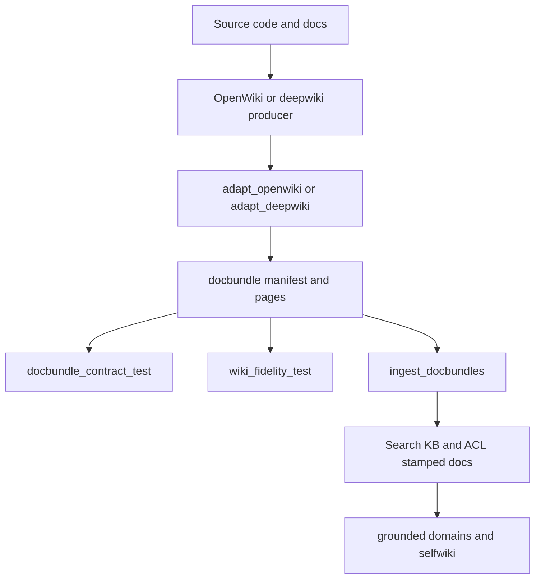

This subsystem is where the repository stops being only an application and becomes an assurance mechanism. The backend owns knowledge ingestion, docbundle validation, ACL stamping, generated wiki adaptation, and the gates that decide whether a knowledge artifact is trustworthy enough to ingest.[`README.md`](https://github.com/ruinosus/foundry-assured/blob/4b749e7bac56789f0b1097cd4a8212b5c5c65d05/README.md#L155-L168) [`apps/backend/app/knowledge/ingest_docbundles.py`](https://github.com/ruinosus/foundry-assured/blob/4b749e7bac56789f0b1097cd4a8212b5c5c65d05/apps/backend/app/knowledge/ingest_docbundles.py#L1-L18) [`apps/backend/eval/assurance.yaml`](https://github.com/ruinosus/foundry-assured/blob/4b749e7bac56789f0b1097cd4a8212b5c5c65d05/apps/backend/eval/assurance.yaml#L6-L25)

## Core artifact model

The backend vendors a docbundle schema and treats it as a cross-repo contract. `docbundle_contract_test.py` exists specifically because a silent drift between producer and consumer already happened once, and the repository does not want separate local dialects of the format.[`apps/backend/app/knowledge/docbundle.schema.json`](https://github.com/ruinosus/foundry-assured/blob/4b749e7bac56789f0b1097cd4a8212b5c5c65d05/apps/backend/app/knowledge/docbundle.schema.json#L1-L64) [`apps/backend/eval/docbundle_contract_test.py`](https://github.com/ruinosus/foundry-assured/blob/4b749e7bac56789f0b1097cd4a8212b5c5c65d05/apps/backend/eval/docbundle_contract_test.py#L1-L20)

That contract is enforced in four directions:

- fields read by this repo must exist in the schema
- fields written by local producers must exist in the schema
- committed bundles under `docs/wiki/` must validate
- absent ACL declaration must remain distinguishable from explicit empty-group declaration

[`apps/backend/eval/docbundle_contract_test.py`](https://github.com/ruinosus/foundry-assured/blob/4b749e7bac56789f0b1097cd4a8212b5c5c65d05/apps/backend/eval/docbundle_contract_test.py#L9-L27) [`apps/backend/eval/docbundle_contract_test.py`](https://github.com/ruinosus/foundry-assured/blob/4b749e7bac56789f0b1097cd4a8212b5c5c65d05/apps/backend/eval/docbundle_contract_test.py#L124-L155) [`apps/backend/eval/docbundle_contract_test.py`](https://github.com/ruinosus/foundry-assured/blob/4b749e7bac56789f0b1097cd4a8212b5c5c65d05/apps/backend/eval/docbundle_contract_test.py#L187-L217)

## OpenWiki and deepwiki adaptation

The repo does not ingest raw OpenWiki OKF output directly. ADR-016 defines an adapter strategy: OpenWiki owns freshness generation, but the repository preserves its own bundle format and fidelity gate.[`docs/adr/ADR-016-openwiki-closes-the-freshness-loop.md`](https://github.com/ruinosus/foundry-assured/blob/4b749e7bac56789f0b1097cd4a8212b5c5c65d05/docs/adr/ADR-016-openwiki-closes-the-freshness-loop.md#L52-L83)

That is implemented by backend adapters:

- `adapt_deepwiki.py` for the older deepwiki producer
- `adapt_openwiki.py` for OpenWiki output

[`apps/backend/app/knowledge/adapt_deepwiki.py`](https://github.com/ruinosus/foundry-assured/blob/4b749e7bac56789f0b1097cd4a8212b5c5c65d05/apps/backend/app/knowledge/adapt_deepwiki.py#L1-L18) [`apps/backend/app/knowledge/adapt_openwiki.py`](https://github.com/ruinosus/foundry-assured/blob/4b749e7bac56789f0b1097cd4a8212b5c5c65d05/apps/backend/app/knowledge/adapt_openwiki.py#L1-L16)

The architectural point is that producer-specific formats are blast-radiused into adapters, while ingest and assurance continue to reason about one bundle contract.

## Ingest and ACL stamping

`ingest_docbundles.py` is the heavy-lift ingestion pipeline. It reads manifests and pages, validates docbundle structure, uploads content, and handles per-document access information that later feeds retrieval control.[`apps/backend/app/knowledge/ingest_docbundles.py`](https://github.com/ruinosus/foundry-assured/blob/4b749e7bac56789f0b1097cd4a8212b5c5c65d05/apps/backend/app/knowledge/ingest_docbundles.py#L1-L18)

ACL ownership is explicit in the docs and evals: access should follow the source rather than be reclassified in app code. The assurance config encodes access control as a hard-zero violation budget.[`README.md`](https://github.com/ruinosus/foundry-assured/blob/4b749e7bac56789f0b1097cd4a8212b5c5c65d05/README.md#L164-L168) [`apps/backend/eval/assurance.yaml`](https://github.com/ruinosus/foundry-assured/blob/4b749e7bac56789f0b1097cd4a8212b5c5c65d05/apps/backend/eval/assurance.yaml#L22-L25)

## Wiki fidelity and freshness gates

The repository’s wiki ingest path has two distinct gates:

- **fidelity**: generated citations must resolve to real source files and avoid worktree paths
- **freshness**: wiki bundles must reflect current code rather than stale snapshots

`wiki_fidelity_test.py` reuses the same `_fidelity_report` logic as the builder path so external producers cannot quietly pass through a weaker checker.[`apps/backend/eval/wiki_fidelity_test.py`](https://github.com/ruinosus/foundry-assured/blob/4b749e7bac56789f0b1097cd4a8212b5c5c65d05/apps/backend/eval/wiki_fidelity_test.py#L1-L20) [`apps/backend/eval/wiki_fidelity_test.py`](https://github.com/ruinosus/foundry-assured/blob/4b749e7bac56789f0b1097cd4a8212b5c5c65d05/apps/backend/eval/wiki_fidelity_test.py#L59-L97)

ADR-016 makes freshness a trigger for regeneration rather than a permanently red PR gate, but the assurance layer itself stays owned by the repo.[`docs/adr/ADR-016-openwiki-closes-the-freshness-loop.md`](https://github.com/ruinosus/foundry-assured/blob/4b749e7bac56789f0b1097cd4a8212b5c5c65d05/docs/adr/ADR-016-openwiki-closes-the-freshness-loop.md#L57-L72)

## Assurance thresholds

`assurance.yaml` is the canonical threshold file. It defines:

- quality thresholds such as groundedness and answer completeness
- build threshold `fidelity_min`
- security thresholds including zero access-control violations and red-team ASR ceiling
- retrieval configuration such as reasoning effort

[`apps/backend/eval/assurance.yaml`](https://github.com/ruinosus/foundry-assured/blob/4b749e7bac56789f0b1097cd4a8212b5c5c65d05/apps/backend/eval/assurance.yaml#L6-L32)

This diagram shows how generated wiki content becomes a validated knowledge artifact before runtime retrieval.

## Major test families

This subsystem’s most important backend proof suites are:

- `docbundle_contract_test.py` for producer-consumer contract fidelity.[`apps/backend/eval/docbundle_contract_test.py`](https://github.com/ruinosus/foundry-assured/blob/4b749e7bac56789f0b1097cd4a8212b5c5c65d05/apps/backend/eval/docbundle_contract_test.py#L1-L27)
- `wiki_fidelity_test.py` and `wiki_freshness_test.py` for generated wiki gating.[`apps/backend/eval/wiki_fidelity_test.py`](https://github.com/ruinosus/foundry-assured/blob/4b749e7bac56789f0b1097cd4a8212b5c5c65d05/apps/backend/eval/wiki_fidelity_test.py#L1-L20) [`apps/backend/eval/wiki_freshness_test.py`](https://github.com/ruinosus/foundry-assured/blob/4b749e7bac56789f0b1097cd4a8212b5c5c65d05/apps/backend/eval/wiki_freshness_test.py#L1-L58)
- `access_control_test.py`, `retrieval_acl_parity_test.py`, and `red_team_test.py` for runtime trust boundaries fed by ingested content.[`apps/backend/eval/access_control_test.py`](https://github.com/ruinosus/foundry-assured/blob/4b749e7bac56789f0b1097cd4a8212b5c5c65d05/apps/backend/eval/access_control_test.py#L1-L15) [`apps/backend/eval/retrieval_acl_parity_test.py`](https://github.com/ruinosus/foundry-assured/blob/4b749e7bac56789f0b1097cd4a8212b5c5c65d05/apps/backend/eval/retrieval_acl_parity_test.py#L1-L64) [`apps/backend/eval/red_team_test.py`](https://github.com/ruinosus/foundry-assured/blob/4b749e7bac56789f0b1097cd4a8212b5c5c65d05/apps/backend/eval/red_team_test.py#L1-L61)

## Minimal validation

- `cd apps/backend && uv run python -m eval.docbundle_contract_test`
- `cd apps/backend && uv run python -m eval.wiki_fidelity_test --component foundry-helpdesk-backend`
- `cd apps/backend && uv run python -m eval.wiki_freshness_test`

Those are the narrowest checks for artifact validity, source citation fidelity, and regeneration freshness.