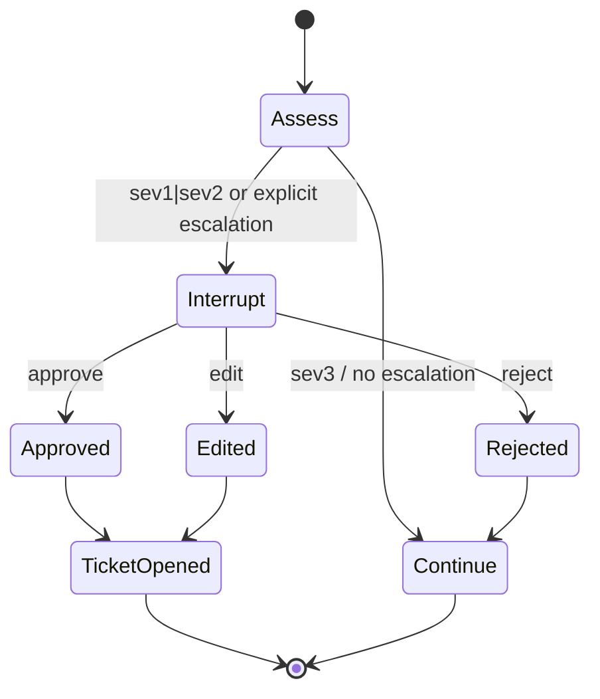

# Oncall LangGraph domain

`oncall` is a first-class backend runtime, not a helpdesk variation. The backend registry declares it as `kind: "graph"`, and the frontend domain registry exposes it as a distinct domain with different user promises: incident triage, LangGraph semantics, and approval that can edit an action instead of only accepting or rejecting it. [Source](https://github.com/ruinosus/foundry-assured/blob/b0a07a129bc3557f4a4d324dc1b7d050cf7bc1ad/apps/backend/app/registry.py#L71-L80) [Source](https://github.com/ruinosus/foundry-assured/blob/b0a07a129bc3557f4a4d324dc1b7d050cf7bc1ad/apps/backend/app/registry.py#L198-L221) [Source](https://github.com/ruinosus/foundry-assured/blob/b0a07a129bc3557f4a4d324dc1b7d050cf7bc1ad/apps/frontend/lib/domains.ts#L80-L94)

## Why a second runtime exists

The oncall module header states the reason plainly: ADR-020 chose to use each framework the canonical way its own ecosystem documents, and LangGraph is used here because it provides approval decisions the Agent Framework path cannot express. In particular, `edit` lets the human correct tool arguments before execution. That distinction is also the point of the `tests/hitl/edit_roundtrip_test.py` proof: if `edit` does not round-trip into real tool arguments, the reason for carrying a second runtime disappears. [Source](https://github.com/ruinosus/foundry-assured/blob/b0a07a129bc3557f4a4d324dc1b7d050cf7bc1ad/apps/backend/app/modules/oncall/internal/graph.py#L1-L19) [Source](https://github.com/ruinosus/foundry-assured/blob/b0a07a129bc3557f4a4d324dc1b7d050cf7bc1ad/apps/backend/tests/hitl/edit_roundtrip_test.py#L1-L19) [Source](https://github.com/ruinosus/foundry-assured/blob/b0a07a129bc3557f4a4d324dc1b7d050cf7bc1ad/apps/backend/tests/hitl/edit_roundtrip_test.py#L102-L123)

## Runtime shape

`build_oncall_graph()` creates a LangGraph agent with:

- `AzureChatOpenAI` authenticated through `DefaultAzureCredential` bearer token provider.
- Two tools: `assess_severity` and `escalate_incident`.
- `HumanInTheLoopMiddleware(interrupt_on=INTERRUPT_ON)`.
- `InMemorySaver()` checkpointer. [Source](https://github.com/ruinosus/foundry-assured/blob/b0a07a129bc3557f4a4d324dc1b7d050cf7bc1ad/apps/backend/app/modules/oncall/internal/graph.py#L39-L45) [Source](https://github.com/ruinosus/foundry-assured/blob/b0a07a129bc3557f4a4d324dc1b7d050cf7bc1ad/apps/backend/app/modules/oncall/internal/graph.py#L88-L115)

The approval contract is encoded in `INTERRUPT_ON`: only `escalate_incident` interrupts, and its allowed decisions are `approve`, `edit`, and `reject`. `assess_severity` is read-only and never stops for approval. [Source](https://github.com/ruinosus/foundry-assured/blob/b0a07a129bc3557f4a4d324dc1b7d050cf7bc1ad/apps/backend/app/modules/oncall/internal/graph.py#L39-L45) [Source](https://github.com/ruinosus/foundry-assured/blob/b0a07a129bc3557f4a4d324dc1b7d050cf7bc1ad/apps/backend/app/modules/oncall/internal/graph.py#L58-L85)

## Checkpointer and durability constraints

The oncall implementation treats a checkpointer as required, not optional: the docstring says interrupt/resume only works if state can be resumed. The current checkpointer is `InMemorySaver`, which is valid for one process but unsafe for shared deployment mode because an interrupt may resume on another replica. `oncall_configured()` therefore fails closed when `deployment_mode == "shared"`. [Source](https://github.com/ruinosus/foundry-assured/blob/b0a07a129bc3557f4a4d324dc1b7d050cf7bc1ad/apps/backend/app/modules/oncall/internal/graph.py#L13-L24) [Source](https://github.com/ruinosus/foundry-assured/blob/b0a07a129bc3557f4a4d324dc1b7d050cf7bc1ad/apps/backend/app/modules/oncall/internal/graph.py#L88-L93) [Source](https://github.com/ruinosus/foundry-assured/blob/b0a07a129bc3557f4a4d324dc1b7d050cf7bc1ad/apps/backend/app/modules/oncall/public.py#L1-L14) [Source](https://github.com/ruinosus/foundry-assured/blob/b0a07a129bc3557f4a4d324dc1b7d050cf7bc1ad/apps/backend/app/modules/oncall/public.py#L26-L33)

This is a hard lifecycle invariant: do not enable oncall in shared mode until the checkpointer is durable.

## Tool behavior

The tool layer is intentionally simple and product-shaped:

- `assess_severity` classifies symptoms using both Portuguese and English keywords so the classifier matches the UI language the product expects.
- `escalate_incident` writes by calling `create_ticket` and returns the created ticket summary.
- `ONCALL_INSTRUCTIONS` tells the model not to ask for confirmation in chat before escalation, because approval already happens in middleware. [Source](https://github.com/ruinosus/foundry-assured/blob/b0a07a129bc3557f4a4d324dc1b7d050cf7bc1ad/apps/backend/app/modules/oncall/internal/graph.py#L46-L55) [Source](https://github.com/ruinosus/foundry-assured/blob/b0a07a129bc3557f4a4d324dc1b7d050cf7bc1ad/apps/backend/app/modules/oncall/internal/graph.py#L58-L75) [Source](https://github.com/ruinosus/foundry-assured/blob/b0a07a129bc3557f4a4d324dc1b7d050cf7bc1ad/apps/backend/app/modules/oncall/internal/graph.py#L78-L85)

That last point is especially important: asking for confirmation in the chat would duplicate approval and deadlock the intended flow.

## Frontend coupling

The frontend Assurance Console treats graph interrupts differently from Agent Framework workflow/tool interrupts. `AF_HITL_KINDS` includes only `workflow` and `tool`, while `graph` renders `GraphApproval`. This is why `oncall` needs its own canonical page: the UI component and interrupt protocol are distinct. `GraphApproval` reads LangGraph action requests either from the hook’s standard interrupt metadata or legacy custom-event payload, then resumes with LangGraph’s own shape `{ decisions: [{ type, edited_action? }] }`; the source comments note that a hand-rolled `runAgent` replay caused a second interrupt instead of execution, which is why `useInterrupt` is treated as the supported path. By contrast, Agent Framework approval uses `request_info` events and AG-UI resume entries, not LangGraph `decisions`. [Source](https://github.com/ruinosus/foundry-assured/blob/b0a07a129bc3557f4a4d324dc1b7d050cf7bc1ad/apps/frontend/components/console/AssuranceConsole.tsx#L33-L50) [Source](https://github.com/ruinosus/foundry-assured/blob/b0a07a129bc3557f4a4d324dc1b7d050cf7bc1ad/apps/frontend/components/console/AssuranceConsole.tsx#L81-L86) [Source](https://github.com/ruinosus/foundry-assured/blob/b0a07a129bc3557f4a4d324dc1b7d050cf7bc1ad/apps/frontend/components/chat/GraphApproval.tsx#L3-L24) [Source](https://github.com/ruinosus/foundry-assured/blob/b0a07a129bc3557f4a4d324dc1b7d050cf7bc1ad/apps/frontend/components/chat/GraphApproval.tsx#L58-L86) [Source](https://github.com/ruinosus/foundry-assured/blob/b0a07a129bc3557f4a4d324dc1b7d050cf7bc1ad/apps/frontend/components/chat/GraphApproval.tsx#L108-L118) [Source](https://github.com/ruinosus/foundry-assured/blob/b0a07a129bc3557f4a4d324dc1b7d050cf7bc1ad/apps/frontend/components/chat/TicketApproval.tsx#L7-L21) [Source](https://github.com/ruinosus/foundry-assured/blob/b0a07a129bc3557f4a4d324dc1b7d050cf7bc1ad/apps/frontend/components/chat/TicketApproval.tsx#L72-L121)

## Mount gating and scope boundary

The registry only mounts oncall when `oncall_configured()` returns true. That means the domain is present in frontend navigation but backend availability still depends on Azure OpenAI settings and a safe deployment mode. [Source](https://github.com/ruinosus/foundry-assured/blob/b0a07a129bc3557f4a4d324dc1b7d050cf7bc1ad/apps/backend/app/registry.py#L208-L221) [Source](https://github.com/ruinosus/foundry-assured/blob/b0a07a129bc3557f4a4d324dc1b7d050cf7bc1ad/apps/backend/app/modules/oncall/public.py#L26-L33)

Boundary-wise, oncall does not redefine repo-wide auth, telemetry, or ticket persistence. It consumes those contracts through shared auth, settings, and the tickets module. [Source](https://github.com/ruinosus/foundry-assured/blob/b0a07a129bc3557f4a4d324dc1b7d050cf7bc1ad/apps/backend/app/modules/oncall/internal/graph.py#L17-L19) [Source](https://github.com/ruinosus/foundry-assured/blob/b0a07a129bc3557f4a4d324dc1b7d050cf7bc1ad/apps/backend/app/modules/oncall/internal/graph.py#L36-L38)

## Focused tests

The key tests are:

- `tests/hitl/edit_roundtrip_test.py` — proves `edit` changes executed tool args.
- `tests/hitl/decision_test.py` — covers approval decision behavior more generally.
- Route and registry tests — ensure the graph endpoint mounts only when allowed.

For any change to oncall approval semantics or state persistence, `tests/hitl/edit_roundtrip_test.py` is the narrowest must-run check.
