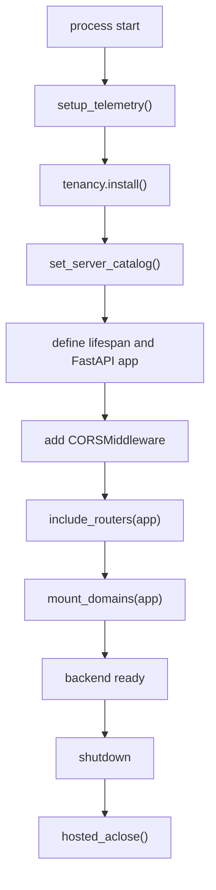

# Backend overview

The backend is a Python 3.12 FastAPI application packaged as `foundry-helpdesk-backend`, with dependencies for Agent Framework, AG-UI, Foundry/Search/identity integrations, telemetry, and declarative agent loading ([apps/backend/pyproject.toml](https://github.com/ruinosus/foundry-assured/blob/08e078d7f2b6febbc5135f0b7928b5a204c667e3/apps/backend/pyproject.toml#L1-L18), [apps/backend/pyproject.toml](https://github.com/ruinosus/foundry-assured/blob/08e078d7f2b6febbc5135f0b7928b5a204c667e3/apps/backend/pyproject.toml#L19-L42)). ADR-017 is the governing architectural decision: the backend is a modular monolith organized by business domain with a shared kernel and one composition root, and CI is expected to enforce those boundaries rather than rely on team discipline ([docs/adr/ADR-017-module-boundaries.md](https://github.com/ruinosus/foundry-assured/blob/08e078d7f2b6febbc5135f0b7928b5a204c667e3/docs/adr/ADR-017-module-boundaries.md#L53-L75), [docs/adr/ADR-017-module-boundaries.md](https://github.com/ruinosus/foundry-assured/blob/08e078d7f2b6febbc5135f0b7928b5a204c667e3/docs/adr/ADR-017-module-boundaries.md#L125-L134)).

## Composition root and lifecycle order

`app.main` is intentionally thin and heavily commented because order matters. It sets up telemetry first, installs tenancy into auth flow second, injects the platform server catalog into tenancy third, then defines lifespan, app object, CORS, router inclusion, and domain mounting ([apps/backend/app/main.py](https://github.com/ruinosus/foundry-assured/blob/08e078d7f2b6febbc5135f0b7928b5a204c667e3/apps/backend/app/main.py#L27-L67)). Two of those steps are load-bearing invariants:

- `tenancy.install()` must run before `mount_domains()` so lazy `tenant_config()` reads see the shared-mode provider instead of the single-tenant default ([apps/backend/app/main.py](https://github.com/ruinosus/foundry-assured/blob/08e078d7f2b6febbc5135f0b7928b5a204c667e3/apps/backend/app/main.py#L31-L35)).
- `tenancy.set_server_catalog(server.id for server in SERVERS)` is what breaks the tenancy↔platform cycle by handing tenancy a catalog rather than letting it import platform registry data directly ([apps/backend/app/main.py](https://github.com/ruinosus/foundry-assured/blob/08e078d7f2b6febbc5135f0b7928b5a204c667e3/apps/backend/app/main.py#L37-L41)).

The lifespan function preloads OpenID configuration when auth is enabled and always closes hosted clients on shutdown, which means hosted bridge cleanup is part of normal app lifecycle rather than an edge-case utility ([apps/backend/app/main.py](https://github.com/ruinosus/foundry-assured/blob/08e078d7f2b6febbc5135f0b7928b5a204c667e3/apps/backend/app/main.py#L44-L50)).

This diagram shows backend boot and shutdown order as encoded in `app.main`.

## Module map

The `app/modules` package contains the business modules ADR-017 named explicitly: `admin`, `agentdefs`, `evaluation`, `grounded`, `helpdesk`, `hosted`, `knowledge`, `platform_ops`, `tenancy`, and `tickets` ([apps/backend/app/modules](https://github.com/ruinosus/foundry-assured/blob/08e078d7f2b6febbc5135f0b7928b5a204c667e3/apps/backend/app/modules)). The shared kernel lives under `app/shared` and holds settings, auth, and telemetry ([apps/backend/app/shared/auth.py](https://github.com/ruinosus/foundry-assured/blob/08e078d7f2b6febbc5135f0b7928b5a204c667e3/apps/backend/app/shared/auth.py#L19-L25)).

The fastest trustworthy inventory of boundary expectations is `module_graph_test.py`. It encodes the module list, maps every Python file under `app/` to a module, and fails if a file is unmapped or if a new cross-module edge appears without being recorded and justified ([apps/backend/tests/architecture/module_graph_test.py](https://github.com/ruinosus/foundry-assured/blob/08e078d7f2b6febbc5135f0b7928b5a204c667e3/apps/backend/tests/architecture/module_graph_test.py#L1-L18), [apps/backend/tests/architecture/module_graph_test.py](https://github.com/ruinosus/foundry-assured/blob/08e078d7f2b6febbc5135f0b7928b5a204c667e3/apps/backend/tests/architecture/module_graph_test.py#L33-L58), [apps/backend/tests/architecture/module_graph_test.py](https://github.com/ruinosus/foundry-assured/blob/08e078d7f2b6febbc5135f0b7928b5a204c667e3/apps/backend/tests/architecture/module_graph_test.py#L105-L152)). That test is the canonical answer to “is this import structurally allowed?”

## Router inclusion versus direct domain mounting

The backend has two integration styles:

1. **Traditional routers.** `include_routers(app)` imports health, tickets, evaluation, hosted proxy, admin, and profile modules, and includes the tenant router only in shared mode ([apps/backend/app/registry.py](https://github.com/ruinosus/foundry-assured/blob/08e078d7f2b6febbc5135f0b7928b5a204c667e3/apps/backend/app/registry.py#L170-L188)).
2. **Direct domain mounting.** `mount_domains(app)` walks the registry and wires AG-UI or grounded domain endpoints directly instead of via APIRouter modules ([apps/backend/app/registry.py](https://github.com/ruinosus/foundry-assured/blob/08e078d7f2b6febbc5135f0b7928b5a204c667e3/apps/backend/app/registry.py#L158-L167)).

That split is deliberate. Router-style modules surface secondary APIs like admin and eval listing, while domain mounting keeps the live assistant endpoints in one canonical loop. If you add a new domain endpoint through a standalone router, you are bypassing the repository’s main domain contract.

## Public surfaces by module

Each business module exposes a `public.py` surface so composition and peer modules do not import internals directly. Examples:

- `helpdesk.public` exports workflow builder, escalation executor, memory provider, and stream-order fix ([apps/backend/app/modules/helpdesk/public.py](https://github.com/ruinosus/foundry-assured/blob/08e078d7f2b6febbc5135f0b7928b5a204c667e3/apps/backend/app/modules/helpdesk/public.py#L1-L19)).
- `grounded.public` exports `stream_grounded`, the synthesis directive, `PerRequestAgent`, and concierge fallbacks ([apps/backend/app/modules/grounded/public.py](https://github.com/ruinosus/foundry-assured/blob/08e078d7f2b6febbc5135f0b7928b5a204c667e3/apps/backend/app/modules/grounded/public.py#L1-L33)).
- `knowledge.public` exports retrieval and ACL trimming surfaces and intentionally promotes formerly-underscore helpers that were actually public seams ([apps/backend/app/modules/knowledge/public.py](https://github.com/ruinosus/foundry-assured/blob/08e078d7f2b6febbc5135f0b7928b5a204c667e3/apps/backend/app/modules/knowledge/public.py#L1-L26)).
- `tenancy.public` exports tenant store/config types, install hooks, domain dependencies, and memory scope ([apps/backend/app/modules/tenancy/public.py](https://github.com/ruinosus/foundry-assured/blob/08e078d7f2b6febbc5135f0b7928b5a204c667e3/apps/backend/app/modules/tenancy/public.py#L1-L10), [apps/backend/app/modules/tenancy/public.py](https://github.com/ruinosus/foundry-assured/blob/08e078d7f2b6febbc5135f0b7928b5a204c667e3/apps/backend/app/modules/tenancy/public.py#L37-L73)).

A safe internal refactor preserves these public surfaces or updates all consumers plus boundary tests.

## Ownership boundaries

| Concern | Owning module | Why |
| --- | --- | --- |
| Request identity, roles, telemetry, settings | `app/shared` | Shared kernel only. |
| Tenant resolution, connection store, enabled domains | `modules/tenancy` | Deployment-mode seam and per-request data-plane selection. |
| Knowledge lifecycle, retrieval, ACL | `modules/knowledge` | Retrieval and corpus contracts live here, not in domain modules. |
| Helpdesk orchestration and approval | `modules/helpdesk` | Workflow-specific business logic. |
| Grounded domain serving archetype | `modules/grounded` | Shared cited-Q&A runtime for cockpit and selfwiki. |
| MCP tool assembly and brokering | `modules/platform_ops` | Tool-driven domain only. |
| Hosted proxy routes and client cache | `modules/hosted` | Backend twin of hosted services. |

## Focused tests

The architecture test family is the quickest way to validate structural changes before running expensive integration flows. `module_graph_test.py` protects module edges; the rest of `tests/architecture` covers file anchors and invocation boundaries, and the test tree itself mirrors module ownership with directories for `grounded`, `knowledge`, `platform_ops`, `hosted`, `tenancy`, and others ([apps/backend/tests](https://github.com/ruinosus/foundry-assured/blob/08e078d7f2b6febbc5135f0b7928b5a204c667e3/apps/backend/tests)).

Minimal validation after backend wiring changes:

- `cd apps/backend && uv run python -m tests.architecture.module_graph_test`
- Start the app and hit one route from each changed surface.
- Re-run the narrow module tests listed on each module page below.
