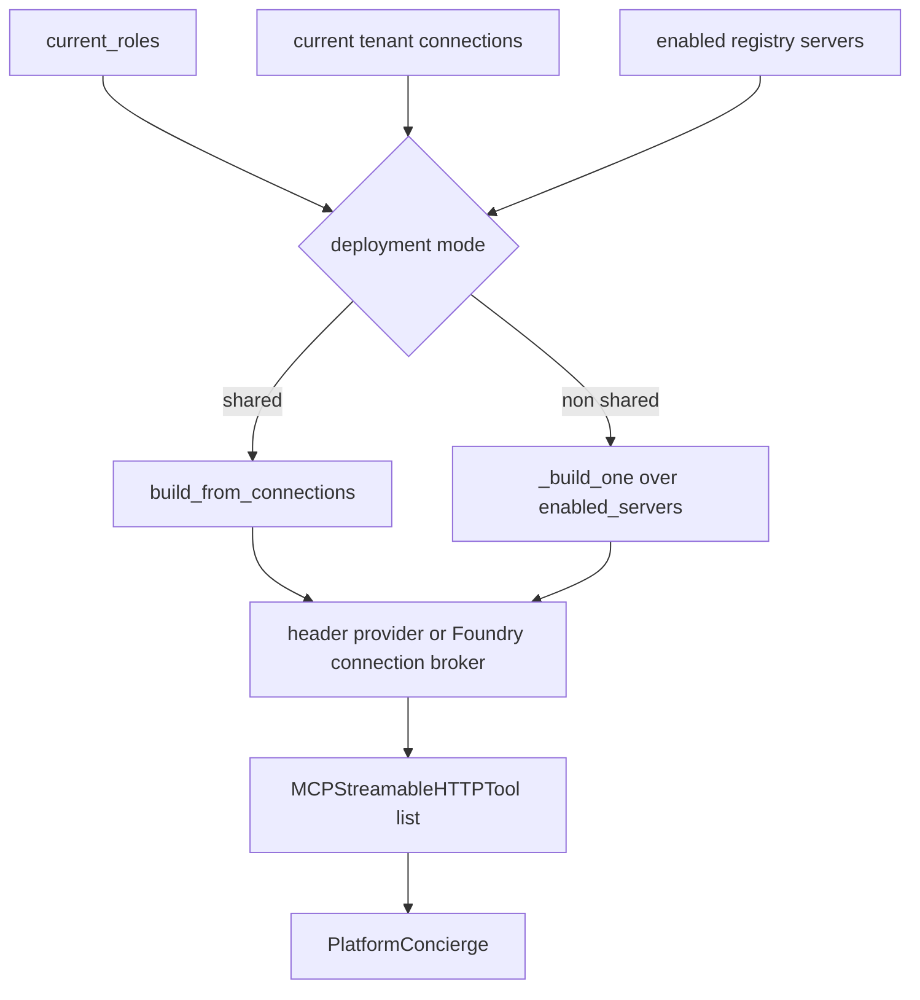

# Platform domain and MCP brokering

The `platform` domain is the backend's tool-driven concierge. Unlike `cockpit` and `selfwiki`, it is not grounded in a knowledge base. Its capability comes from MCP tools assembled per request from the registry in `app.agents.mcp.registry` and the builders in `app.agents.mcp.tools`. [agents/platform.py](https://github.com/ruinosus/foundry-assured/blob/4d10c9a42e5d5c2a2b7f60d26a3e694620a9bcaa/apps/backend/app/agents/platform.py#L1-L9) [agents/platform.py](https://github.com/ruinosus/foundry-assured/blob/4d10c9a42e5d5c2a2b7f60d26a3e694620a9bcaa/apps/backend/app/agents/platform.py#L31-L44)

## Why the domain is per request

The mounted runtime object is `platform_agent_proxy = PerRequestAgent(...)`. `PerRequestAgent` exists because `add_agent_framework_fastapi_endpoint(agent=...)` wants a `SupportsAgentRun` instance, but in shared mode the tenant is not resolved at boot and MCP tool visibility depends on the current caller's roles. The proxy rebuilds the inner agent on every `.run()` call so the resulting agent reads the current `tenant_config()`, `current_roles()`, and `credential_for_request()` state. [agents/per_request.py](https://github.com/ruinosus/foundry-assured/blob/4d10c9a42e5d5c2a2b7f60d26a3e694620a9bcaa/apps/backend/app/agents/per_request.py#L1-L16) [agents/per_request.py](https://github.com/ruinosus/foundry-assured/blob/4d10c9a42e5d5c2a2b7f60d26a3e694620a9bcaa/apps/backend/app/agents/per_request.py#L25-L48) [per_request_override_test.py](https://github.com/ruinosus/foundry-assured/blob/4d10c9a42e5d5c2a2b7f60d26a3e694620a9bcaa/apps/backend/eval/per_request_override_test.py#L1-L39)

`platform_configured()` is also mode-aware. In shared mode it only checks `settings.mcp_enabled`; in self-hosted mode it additionally requires a Foundry project endpoint. That short-circuit lets shared mode boot before a tenant exists. [agents/platform.py](https://github.com/ruinosus/foundry-assured/blob/4d10c9a42e5d5c2a2b7f60d26a3e694620a9bcaa/apps/backend/app/agents/platform.py#L25-L29) [configured_mode_test.py](https://github.com/ruinosus/foundry-assured/blob/4d10c9a42e5d5c2a2b7f60d26a3e694620a9bcaa/apps/backend/eval/configured_mode_test.py#L52-L72)

## MCP server registry as governance data

The MCP registry is intentionally pure and framework-free. `McpServer` rows define server id, label, URL, auth mode, optional OBO scope, read tools, write tools, minimum read role, minimum write role, and enabled flag. The module docstring states the main governance rule: any tool not explicitly listed as a read is treated as a write, so unclassified tools fail closed. [agents/mcp/registry.py](https://github.com/ruinosus/foundry-assured/blob/4d10c9a42e5d5c2a2b7f60d26a3e694620a9bcaa/apps/backend/app/agents/mcp/registry.py#L1-L12) [agents/mcp/registry.py](https://github.com/ruinosus/foundry-assured/blob/4d10c9a42e5d5c2a2b7f60d26a3e694620a9bcaa/apps/backend/app/agents/mcp/registry.py#L24-L35) [agents/mcp/registry.py](https://github.com/ruinosus/foundry-assured/blob/4d10c9a42e5d5c2a2b7f60d26a3e694620a9bcaa/apps/backend/app/agents/mcp/registry.py#L130-L147)

Current registry rows are:

- `learn`: public, enabled, read-only [agents/mcp/registry.py](https://github.com/ruinosus/foundry-assured/blob/4d10c9a42e5d5c2a2b7f60d26a3e694620a9bcaa/apps/backend/app/agents/mcp/registry.py#L42-L49)
- `azure`: OBO, disabled until a self-hosted remote endpoint exists [agents/mcp/registry.py](https://github.com/ruinosus/foundry-assured/blob/4d10c9a42e5d5c2a2b7f60d26a3e694620a9bcaa/apps/backend/app/agents/mcp/registry.py#L50-L64)
- `entra`: OBO, disabled because no confirmed first-party remote endpoint exists [agents/mcp/registry.py](https://github.com/ruinosus/foundry-assured/blob/4d10c9a42e5d5c2a2b7f60d26a3e694620a9bcaa/apps/backend/app/agents/mcp/registry.py#L65-L77)
- `azdo`: OBO with templated org URL [agents/mcp/registry.py](https://github.com/ruinosus/foundry-assured/blob/4d10c9a42e5d5c2a2b7f60d26a3e694620a9bcaa/apps/backend/app/agents/mcp/registry.py#L78-L90)
- `github`: `github_pat`, enabled, because GitHub does not accept Microsoft-audience OBO tokens [agents/mcp/registry.py](https://github.com/ruinosus/foundry-assured/blob/4d10c9a42e5d5c2a2b7f60d26a3e694620a9bcaa/apps/backend/app/agents/mcp/registry.py#L91-L105)
- `m365`: OAuth passthrough placeholder, disabled [agents/mcp/registry.py](https://github.com/ruinosus/foundry-assured/blob/4d10c9a42e5d5c2a2b7f60d26a3e694620a9bcaa/apps/backend/app/agents/mcp/registry.py#L106-L115)

The pure role helper `visible_tools(server, roles)` grants reads to `Reader`, `Author`, `Approver`, or `Admin`, and writes only to `Author` or `Admin`. [agents/mcp/registry.py](https://github.com/ruinosus/foundry-assured/blob/4d10c9a42e5d5c2a2b7f60d26a3e694620a9bcaa/apps/backend/app/agents/mcp/registry.py#L18-L22) [agents/mcp/registry.py](https://github.com/ruinosus/foundry-assured/blob/4d10c9a42e5d5c2a2b7f60d26a3e694620a9bcaa/apps/backend/app/agents/mcp/registry.py#L142-L147)

## Tool-build paths

This diagram shows the mode split in tool assembly: shared mode is connection-driven, while self-hosted mode uses the registry path directly.

`build_mcp_tools()` embodies that rule. In shared mode it builds from the tenant's persisted connection records. In all other modes it keeps the legacy behavior of iterating `enabled_servers()` and calling `_build_one()`. When auth is off, it treats the caller as `Admin` so local development can still see tools. [agents/mcp/tools.py](https://github.com/ruinosus/foundry-assured/blob/4d10c9a42e5d5c2a2b7f60d26a3e694620a9bcaa/apps/backend/app/agents/mcp/tools.py#L223-L240)

### Self-hosted and dedicated path

`_build_one(server, roles)` resolves the server URL, applies role filtering, and creates an `MCPStreamableHTTPTool` with:

- `allowed_tools = visible read and write tools`
- `approval_mode = "never_require"` on the internal path because native MCP approval does not execute correctly over AG-UI
- a server-specific header provider for `public`, `obo`, or `github_pat` auth [agents/mcp/tools.py](https://github.com/ruinosus/foundry-assured/blob/4d10c9a42e5d5c2a2b7f60d26a3e694620a9bcaa/apps/backend/app/agents/mcp/tools.py#L1-L18) [agents/mcp/tools.py](https://github.com/ruinosus/foundry-assured/blob/4d10c9a42e5d5c2a2b7f60d26a3e694620a9bcaa/apps/backend/app/agents/mcp/tools.py#L82-L109)

### Shared-mode connection path

The shared-mode builders use persisted `Connection` records from the tenant store. `_connection_build_params(conn, roles)` is the central logic: it skips disabled or unknown connections, applies the stricter-of-both RBAC rule between registry and tenant connection thresholds, resolves the connection URL, and computes an approval-mode dict with `always_require_approval` for writes and `never_require_approval` for reads. [agents/mcp/tools.py](https://github.com/ruinosus/foundry-assured/blob/4d10c9a42e5d5c2a2b7f60d26a3e694620a9bcaa/apps/backend/app/agents/mcp/tools.py#L124-L147)

`_build_from_connection()` then chooses the credential path:

- OBO header provider for `auth == "obo"`
- Foundry connection broker if `conn.foundry_connection_id` is present for a non-OBO server
- otherwise skip the tool on the internal path [agents/mcp/tools.py](https://github.com/ruinosus/foundry-assured/blob/4d10c9a42e5d5c2a2b7f60d26a3e694620a9bcaa/apps/backend/app/agents/mcp/tools.py#L150-L181)

The Foundry connection broker is `_foundry_connection_header_provider(connection_id)`, which fetches the referenced Foundry project connection with credentials at call time and extracts its API key without persisting the secret in the tenant record. [agents/mcp/tools.py](https://github.com/ruinosus/foundry-assured/blob/4d10c9a42e5d5c2a2b7f60d26a3e694620a9bcaa/apps/backend/app/agents/mcp/tools.py#L51-L68)

## Hosted tool-build path

`build_hosted_from_connections(conns, roles, get_tool)` reuses `_connection_build_params()` but does not build `header_provider`s. In hosted mode, Foundry resolves credentials from `project_connection_id`, so the builder passes that value to the injected `get_tool` callable and lets the hosted side own authentication. [agents/mcp/tools.py](https://github.com/ruinosus/foundry-assured/blob/4d10c9a42e5d5c2a2b7f60d26a3e694620a9bcaa/apps/backend/app/agents/mcp/tools.py#L184-L210)

This is why the `Connection` record is reference-based rather than secret-bearing: the same connection model can drive either an internal brokered header or a hosted project-connection binding. [tenant_store.py](https://github.com/ruinosus/foundry-assured/blob/4d10c9a42e5d5c2a2b7f60d26a3e694620a9bcaa/apps/backend/app/core/tenant_store.py#L16-L27)

## Approval and RBAC invariants

There are two complementary approval models in the platform subsystem:

- In the legacy registry/internal path, internal MCP tools use `approval_mode="never_require"` and rely on external workflow/HITL handling for writes. [agents/mcp/tools.py](https://github.com/ruinosus/foundry-assured/blob/4d10c9a42e5d5c2a2b7f60d26a3e694620a9bcaa/apps/backend/app/agents/mcp/tools.py#L92-L97)
- In the connection-based shared/hosted path, the builder emits a per-tool approval dict that explicitly marks writes as `always_require_approval` and reads as `never_require_approval`. [agents/mcp/tools.py](https://github.com/ruinosus/foundry-assured/blob/4d10c9a42e5d5c2a2b7f60d26a3e694620a9bcaa/apps/backend/app/agents/mcp/tools.py#L143-L147)

The test suite encodes both expectations. `eval.approval_mode_test` checks the dict form for connection-built tools, while `eval.rbac_per_tool_test` and `eval.mcp_registry_test` cover the role-to-tool visibility model. [approval_mode_test.py](https://github.com/ruinosus/foundry-assured/blob/4d10c9a42e5d5c2a2b7f60d26a3e694620a9bcaa/apps/backend/eval/approval_mode_test.py#L1-L39) [mcp_registry_test.py](https://github.com/ruinosus/foundry-assured/blob/4d10c9a42e5d5c2a2b7f60d26a3e694620a9bcaa/apps/backend/eval/mcp_registry_test.py#L1-L77)

## Representative tests

- Registry data and fail-closed classification: `uv run python -m eval.mcp_registry_test` [mcp_registry_test.py](https://github.com/ruinosus/foundry-assured/blob/4d10c9a42e5d5c2a2b7f60d26a3e694620a9bcaa/apps/backend/eval/mcp_registry_test.py#L30-L77)
- Connection-driven internal build: `uv run python -m eval.connection_tools_build_test` [connection_tools_build_test.py](https://github.com/ruinosus/foundry-assured/blob/4d10c9a42e5d5c2a2b7f60d26a3e694620a9bcaa/apps/backend/eval/connection_tools_build_test.py#L1-L41)
- Credential-path wiring: `uv run python -m eval.credential_wiring_test` [credential_wiring_test.py](https://github.com/ruinosus/foundry-assured/blob/4d10c9a42e5d5c2a2b7f60d26a3e694620a9bcaa/apps/backend/eval/credential_wiring_test.py#L1-L46)
- Hosted build contract: `uv run python -m eval.hosted_build_test` [hosted_build_test.py](https://github.com/ruinosus/foundry-assured/blob/4d10c9a42e5d5c2a2b7f60d26a3e694620a9bcaa/apps/backend/eval/hosted_build_test.py#L1-L50)
- Infra-gated real brokering proof: `uv run python -m eval.mcp_brokering_e2e_test` [mcp_brokering_e2e_test.py](https://github.com/ruinosus/foundry-assured/blob/4d10c9a42e5d5c2a2b7f60d26a3e694620a9bcaa/apps/backend/eval/mcp_brokering_e2e_test.py#L1-L21)
