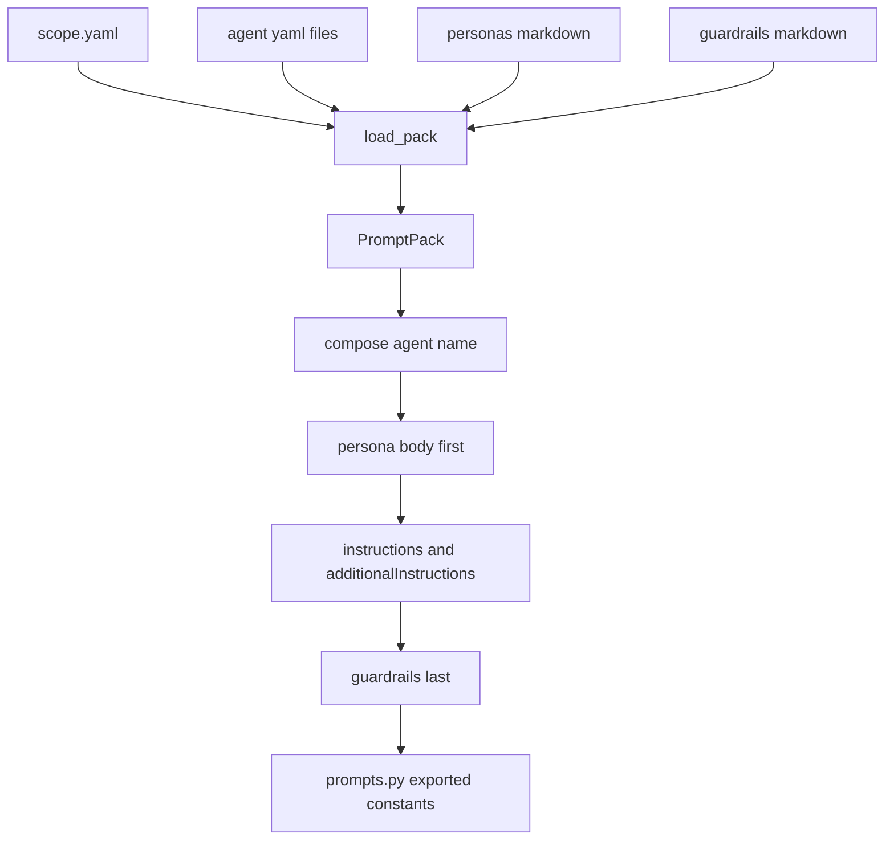

# Prompt and agent-definition system

The backend's prompt source of truth is the `apps/backend/agents/` tree, not Python string constants. `app.agents.prompts` exists mainly as a compatibility shim: it loads the declarative scope once at import time, composes the resulting instructions into constants such as `TRIAGE_INSTRUCTIONS` and `COCKPIT_INSTRUCTIONS`, and exposes those constants to the rest of the runtime so consumers do not have to change. The README makes the operational rule explicit: to change a prompt, edit the YAML, not the Python. [README.md](https://github.com/ruinosus/foundry-assured/blob/4d10c9a42e5d5c2a2b7f60d26a3e694620a9bcaa/apps/backend/README.md#L21-L46) [agents/prompts.py](https://github.com/ruinosus/foundry-assured/blob/4d10c9a42e5d5c2a2b7f60d26a3e694620a9bcaa/apps/backend/app/agents/prompts.py#L1-L22) [agents/prompts.py](https://github.com/ruinosus/foundry-assured/blob/4d10c9a42e5d5c2a2b7f60d26a3e694620a9bcaa/apps/backend/app/agents/prompts.py#L82-L148)

## Source layout and what belongs where

`app.agents.definitions` documents a strong division of responsibility around AgentSchema. AgentSchema documents one agent, so repository-owned data that does not fit that model stays adjacent to it instead of being shoehorned into schema fields:

- scope catalog in `agents/<scope>/scope.yaml`
- shared personas in `agents/<scope>/personas/*.md`
- cross-cutting guardrails in `agents/<scope>/guardrails/*.md` [agents/definitions.py](https://github.com/ruinosus/foundry-assured/blob/4d10c9a42e5d5c2a2b7f60d26a3e694620a9bcaa/apps/backend/app/agents/definitions.py#L12-L36)

The repository-specific vendor extension key is `x-foundry-assured` inside AgentSchema `metadata`, and only `persona` and `guardrails` are accepted under that key. Any unknown extension key is treated as a typo and raises instead of being ignored. [agents/definitions.py](https://github.com/ruinosus/foundry-assured/blob/4d10c9a42e5d5c2a2b7f60d26a3e694620a9bcaa/apps/backend/app/agents/definitions.py#L71-L78) [agents/definitions.py](https://github.com/ruinosus/foundry-assured/blob/4d10c9a42e5d5c2a2b7f60d26a3e694620a9bcaa/apps/backend/app/agents/definitions.py#L210-L219)

## Loader and composition pipeline

This diagram shows the repository-owned composition contract: prompt text is assembled from several source types in a fixed order before the runtime sees it.

`load_pack(scope, base_dir)` reads the scope catalog, parses each `*.yaml` agent document with Microsoft's official `agent_framework_declarative._models` reader, loads persona and guardrail markdown front matter, builds a `PromptPack`, and then proactively composes every agent once so dangling persona or guardrail references fail at load time rather than on the first affected request. [agents/definitions.py](https://github.com/ruinosus/foundry-assured/blob/4d10c9a42e5d5c2a2b7f60d26a3e694620a9bcaa/apps/backend/app/agents/definitions.py#L228-L306)

The fixed composition order is one of the most important invariants in this subsystem:

1. persona body first
2. `instructions`
3. `additionalInstructions`
4. one rendered `## Guardrail:` section per referenced guardrail [agents/definitions.py](https://github.com/ruinosus/foundry-assured/blob/4d10c9a42e5d5c2a2b7f60d26a3e694620a9bcaa/apps/backend/app/agents/definitions.py#L140-L161) [agents/definitions.py](https://github.com/ruinosus/foundry-assured/blob/4d10c9a42e5d5c2a2b7f60d26a3e694620a9bcaa/apps/backend/app/agents/definitions.py#L222-L225)

That order replaces the older pattern of handwritten template overrides. It is why the workflow and domain agents can all share the same declarative source system while still having common persona and guardrail behavior. [README.md](https://github.com/ruinosus/foundry-assured/blob/4d10c9a42e5d5c2a2b7f60d26a3e694620a9bcaa/apps/backend/README.md#L38-L46)

## Boot-fail behavior is deliberate

The loader is designed to fail loudly rather than degrade silently:

- unknown agent names raise `AgentNotFound` [agents/definitions.py](https://github.com/ruinosus/foundry-assured/blob/4d10c9a42e5d5c2a2b7f60d26a3e694620a9bcaa/apps/backend/app/agents/definitions.py#L126-L138)
- unknown personas or guardrails also raise [agents/definitions.py](https://github.com/ruinosus/foundry-assured/blob/4d10c9a42e5d5c2a2b7f60d26a3e694620a9bcaa/apps/backend/app/agents/definitions.py#L163-L181)
- empty composed prompts raise [agents/definitions.py](https://github.com/ruinosus/foundry-assured/blob/4d10c9a42e5d5c2a2b7f60d26a3e694620a9bcaa/apps/backend/app/agents/definitions.py#L155-L160)
- malformed agent scopes cause `prompts._load_pack()` to raise `RuntimeError` and fail the backend boot [agents/prompts.py](https://github.com/ruinosus/foundry-assured/blob/4d10c9a42e5d5c2a2b7f60d26a3e694620a9bcaa/apps/backend/app/agents/prompts.py#L95-L108)
- unknown agent constants in `_compose()` also fail boot rather than becoming placeholder instruction text [agents/prompts.py](https://github.com/ruinosus/foundry-assured/blob/4d10c9a42e5d5c2a2b7f60d26a3e694620a9bcaa/apps/backend/app/agents/prompts.py#L111-L126)

This subsystem is intentionally stricter than a typical configuration loader because a backend that boots with a missing or placeholder prompt is considered worse than one that fails to boot. [agents/prompts.py](https://github.com/ruinosus/foundry-assured/blob/4d10c9a42e5d5c2a2b7f60d26a3e694620a9bcaa/apps/backend/app/agents/prompts.py#L95-L103)

## PowerFx refusal

`refuse_powerfx_indirection` recursively rejects any string starting with `=`. The reason is documented in the code: the official declarative reader routes such values through PowerFx, and without the required .NET runtime it can silently return the literal string instead of a resolved value. In this backend that is treated as an unacceptable failure mode, so environment resolution must happen in the host rather than inside declarative prompt files. [agents/definitions.py](https://github.com/ruinosus/foundry-assured/blob/4d10c9a42e5d5c2a2b7f60d26a3e694620a9bcaa/apps/backend/app/agents/definitions.py#L184-L208)

## `AGENTS_DIR` override semantics

`prompts._resolve_base_dir()` chooses where prompt definitions are loaded from. The baked-in default is `apps/backend/agents`, which is copied into the image next to `app/`. If `AGENTS_DIR` is unset, the backend always uses that baked copy. If `AGENTS_DIR` is set and contains the `helpdesk` scope, the backend logs that it is composing from the external directory and uses it. If `AGENTS_DIR` is set but the scope is absent there, the backend logs a warning and falls back to the baked copy. [agents/prompts.py](https://github.com/ruinosus/foundry-assured/blob/4d10c9a42e5d5c2a2b7f60d26a3e694620a9bcaa/apps/backend/app/agents/prompts.py#L34-L80)

That behavior is intentionally asymmetric:

- absent external scope means the external directory has not been adopted yet, so fallback is safe
- present but broken external scope means an operator published definitions and expects them to be live, so fallback would hide stale prompts and is forbidden [agents/prompts.py](https://github.com/ruinosus/foundry-assured/blob/4d10c9a42e5d5c2a2b7f60d26a3e694620a9bcaa/apps/backend/app/agents/prompts.py#L41-L57)

The operational story in `compose.yaml` and the backend README depends on that contract: prompt edits require restart, not image rebuild, because prompts are composed at import and agents are built at boot. [compose.yaml](https://github.com/ruinosus/foundry-assured/blob/4d10c9a42e5d5c2a2b7f60d26a3e694620a9bcaa/apps/backend/compose.yaml#L1-L25) [README.md](https://github.com/ruinosus/foundry-assured/blob/4d10c9a42e5d5c2a2b7f60d26a3e694620a9bcaa/apps/backend/README.md#L48-L78)

## Where the exported constants are consumed

The constants from `app.agents.prompts` feed the runtime in three main areas:

- helpdesk workflow agents consume `TRIAGE_INSTRUCTIONS`, `RETRIEVE_INSTRUCTIONS`, and `RESOLVE_INSTRUCTIONS` [workflow/agents.py](https://github.com/ruinosus/foundry-assured/blob/4d10c9a42e5d5c2a2b7f60d26a3e694620a9bcaa/apps/backend/app/workflow/agents.py#L17-L21) [workflow/agents.py](https://github.com/ruinosus/foundry-assured/blob/4d10c9a42e5d5c2a2b7f60d26a3e694620a9bcaa/apps/backend/app/workflow/agents.py#L34-L70)
- helpdesk concierge uses grounded and ungrounded concierge variants [agents/concierge.py](https://github.com/ruinosus/foundry-assured/blob/4d10c9a42e5d5c2a2b7f60d26a3e694620a9bcaa/apps/backend/app/agents/concierge.py#L19-L22) [agents/concierge.py](https://github.com/ruinosus/foundry-assured/blob/4d10c9a42e5d5c2a2b7f60d26a3e694620a9bcaa/apps/backend/app/agents/concierge.py#L44-L62)
- grounded and platform domains consume `COCKPIT_INSTRUCTIONS`, `SELFWIKI_INSTRUCTIONS`, and `PLATFORM_INSTRUCTIONS` [domains.py](https://github.com/ruinosus/foundry-assured/blob/4d10c9a42e5d5c2a2b7f60d26a3e694620a9bcaa/apps/backend/app/domains.py#L66-L98) [agents/platform.py](https://github.com/ruinosus/foundry-assured/blob/4d10c9a42e5d5c2a2b7f60d26a3e694620a9bcaa/apps/backend/app/agents/platform.py#L17-L19)

## Prompt-contract assurance

`eval.prompt_contract_test` is the main guard for this subsystem. It treats the YAML cases under `agents/helpdesk/eval-cases/` and `eval-suites/` as repository-owned contracts and checks for the runtime semantics that other systems branch on, such as the resolve `TICKET:` sentinel, retrieval `NO_MATCH` behavior, grounded citation duty, ungrounded exceptions, and platform write-approval discipline. [prompt_contract_test.py](https://github.com/ruinosus/foundry-assured/blob/4d10c9a42e5d5c2a2b7f60d26a3e694620a9bcaa/apps/backend/eval/prompt_contract_test.py#L1-L30) [prompt_contract_test.py](https://github.com/ruinosus/foundry-assured/blob/4d10c9a42e5d5c2a2b7f60d26a3e694620a9bcaa/apps/backend/eval/prompt_contract_test.py#L79-L166)

The test also guards the guard itself before running suite cases:

- unknown agent names must raise
- a deliberately failing check must fail
- PowerFx indirection must be refused
- unknown AgentSchema fields must raise rather than being silently dropped [prompt_contract_test.py](https://github.com/ruinosus/foundry-assured/blob/4d10c9a42e5d5c2a2b7f60d26a3e694620a9bcaa/apps/backend/eval/prompt_contract_test.py#L109-L142)

## Focused validation

- Prompt contracts and loader-failure rules: `uv run python -m eval.prompt_contract_test`
- Containerized prompt reload loop: `docker compose restart backend` after editing `agents/helpdesk/*.yaml` [compose.yaml](https://github.com/ruinosus/foundry-assured/blob/4d10c9a42e5d5c2a2b7f60d26a3e694620a9bcaa/apps/backend/compose.yaml#L1-L15)
