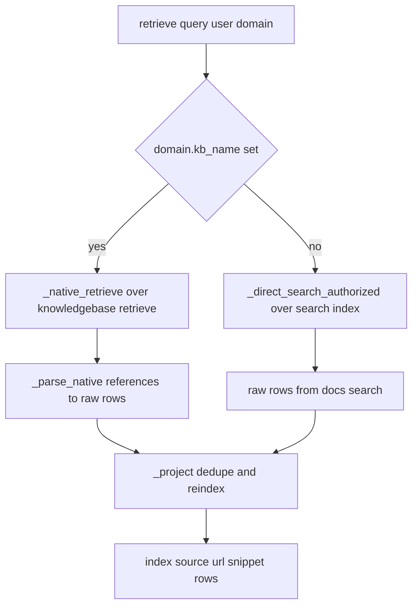

# Retrieval and ACL enforcement

[`apps/backend/app/services/retrieval.py`](../../apps/backend/app/services/retrieval.py) is one of the repository's most important safety modules. It is the single retrieval seam used by grounded domains and therefore owns both:

- **relevance plumbing** for grounding documents,
- **security plumbing** for per-user document access.

The module documentation is unusually detailed because it records live-verified behavior of Azure Search and Foundry KB retrieval.

## Public seam

The public function is:

- `retrieve(query: str, user, domain, *, top: int = 8) -> list[dict]`

It returns documents shaped as:

- `index`
- `source`
- `url`
- `snippet`

These are exactly the rows consumed by grounded synthesis.

## Two retrieval engines

The seam hides two engines behind one interface.

### Primary path: native KB retrieve

Used when `domain.kb_name` is set.

- Function: `_native_retrieve(domain, query, primary, user_token)`
- Endpoint shape: `POST {search}/knowledgebases/{kb}/retrieve?api-version=2026-05-01-preview`
- Auth on the HTTP request: app identity token in `Authorization`
- End-user ACL context: raw end-user search token in `x-ms-query-source-authorization`

The request body is modeled after the verified probe in `apps/backend/eval/step0_searchindex_filter_probe.py` and uses `knowledgeSourceParams.kind = "searchIndex"` with `includeReferenceSourceData = True`.

### Fallback path: direct Search query

Used when `domain.kb_name` is absent.

- Function: `_direct_search_authorized(domain, query, primary_token, user_token, *, top=8)`
- Endpoint shape: `POST {search}/indexes/{index}/docs/search?api-version=2026-05-01-preview`
- Auth on the HTTP request: app identity token in `Authorization`
- End-user ACL context: raw end-user search token in `x-ms-query-source-authorization`

When no user token is available in dev or auth-off mode, the fallback adds `x-ms-enable-elevated-read: true` as a best-effort local-development path.



This diagram shows how both retrieval engines converge into one normalized output format.

## Identity model

The module distinguishes two identities:

1. **service identity** for the retrieve call itself, acquired from `DefaultAzureCredential()` and scoped to `https://search.azure.com/.default`,
2. **end-user identity** for ACL trimming, acquired by `_user_search_token(user)` through OBO and carried in `x-ms-query-source-authorization`.

This distinction matters because end users do not necessarily have Search RBAC, but Search can still use their token for document permission trimming.

### Fail-closed behavior

If a domain is ACL-sensitive and no user token is available, the code omits the ACL header. On a permission-filter-enabled index, that means retrieval resolves to no authorized groups and returns zero documents. The module explicitly treats that as the correct fail-closed posture.

## ACL trigger condition

`retrieve()` only requests an end-user token when `getattr(domain, "acl_group_map", None)` is truthy. That means:

- truly public grounded domains run without the end-user ACL header,
- ACL-aware domains like cockpit and configured selfwiki include it.

This follows the repository-wide rule that access behavior is driven by data on the domain row, not by hard-coded domain-name branching.

## Native snippet extraction

One of the most important verified findings in this module is that native references can carry usable snippet text directly when `includeReferenceSourceData=true` is set.

- `_sourcedata_snippet(ref)` reads `references[].sourceData.snippet` or `content`
- `_parse_native(body)` uses this for each row's `snippet`

The file documents that this replaced an older `references.id` to response `ref_id` join that never fired for `answerSynthesis` KBs. The tests treat this as a critical invariant because it affects both grounding quality and what the frontend evidence panel can display.

## `docKey` decoding

Native references return `docKey`, not always a plain blob URL. `_decode_dockey(dockey)` decodes this into a usable blob URL using a live-verified algorithm:

- strip a 12-hex prefix,
- strip `_pages_<M>` suffix,
- decode the remaining segment as standard base64,
- tolerate a glued tail byte by trying trims 0 through 3,
- return the first `https://...md` URL found,
- fall back to the raw `docKey` only if no plausible URL can be recovered.

The code comments explain that this behavior was investigated against real `cockpit-si-kb` keys and fixed a naïve split-based decode that returned broken citations for about half the keys.

## Projection and dedupe

Both retrieval engines eventually feed `_project(rows)`.

Responsibilities:

- dedupe documents by URL with first-wins semantics,
- drop rows with missing URLs,
- assign 1-based `index` values in output order,
- normalize `source` to either the explicit field or the trailing filename from the URL.

This centralization is important. If a future change wants different dedupe or indexing semantics, it should happen here so both engines stay aligned.

## Security invariants

The retrieval module encodes several hard repository guarantees:

1. **ACL domains use the end-user token for trimming**.
2. **No user token on an ACL domain should leak data**; it should reduce to zero docs.
3. **Grounded synthesis only sees authorized retrieved snippets**, never raw unrestricted search results.
4. **Deduping is by URL**, so the same underlying source is not cited multiple times under different rows.
5. **`docKey` decoding and sourceData snippet extraction are measured contracts**, not guessed conveniences.

## Tests that protect retrieval

This is one of the best-tested areas in `apps/backend/eval`:

- `retrieval_acl_parity_test.py`: parity between retrieval paths under ACL constraints through the production retrieval seam, proving user A sees the confidential citation while user B does not.
- `access_control_test.py`: no cross-group content leak.
- `red_team_test.py`: prompt-injection and exfiltration resistance through the same trim path.
- `native_snippet_test.py`: snippet extraction from `sourceData`.
- `dockey_decode_test.py`: `docKey` decoding behavior.
- `retrieval_shape_test.py`: output shape guarantee.
- `cockpit_acl_stamp_test.py`: ACL stamping assumptions for cockpit corpora.
- `step0_searchindex_filter_probe.py` and related probes: empirical investigation artifacts that informed the implementation.

Browser-path parity is covered separately by Playwright `e2e/cockpit-acl.spec.ts`, which drives the deployed UI as two users and confirms the same confidential document appears only for the cleared user.

## Validation

Focused validation from `apps/backend/`:

```bash
uv run pytest eval/retrieval_acl_parity_test.py eval/access_control_test.py eval/native_snippet_test.py eval/dockey_decode_test.py eval/retrieval_shape_test.py
```

For the red-team path:

```bash
uv run pytest eval/red_team_test.py
```

## Related pages

- [Grounded domains](grounded-domains.md)
- [Knowledge pipeline](knowledge-pipeline.md)
- [Security and fidelity gates](../assurance/security-and-fidelity-gates.md)
