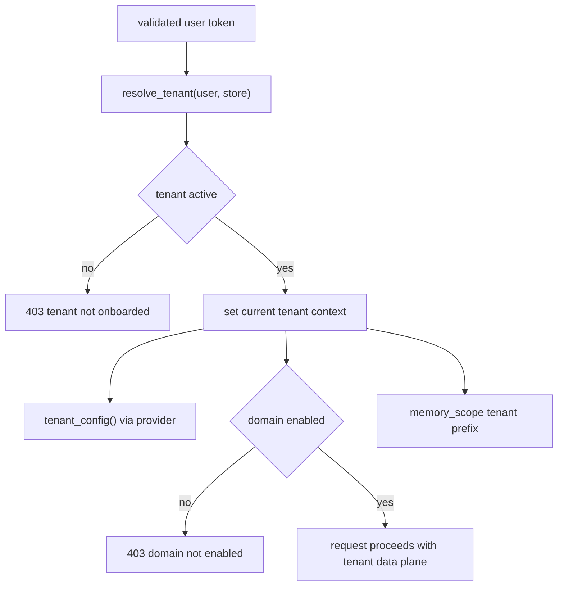

# Tenancy and deployment-mode seam

The tenancy module owns the backend’s one explicit variation point for deployment mode. `internal/tenant.py` opens with the core rule: single-tenant modes build `TenantConfig` from `.env`, shared mode resolves config from the request’s tenant record, and all business code should call `tenant_config()` without needing to know which mode it is in ([apps/backend/app/modules/tenancy/internal/tenant.py](https://github.com/ruinosus/foundry-assured/blob/08e078d7f2b6febbc5135f0b7928b5a204c667e3/apps/backend/app/modules/tenancy/internal/tenant.py#L1-L6)). The public surface re-exports that seam plus onboarding, tenant store types, memory scope, and `domain_deps()` so the rest of the backend can stay mode-agnostic ([apps/backend/app/modules/tenancy/public.py](https://github.com/ruinosus/foundry-assured/blob/08e078d7f2b6febbc5135f0b7928b5a204c667e3/apps/backend/app/modules/tenancy/public.py#L1-L10), [apps/backend/app/modules/tenancy/public.py](https://github.com/ruinosus/foundry-assured/blob/08e078d7f2b6febbc5135f0b7928b5a204c667e3/apps/backend/app/modules/tenancy/public.py#L37-L73)).

## TenantConfig is data-plane only

`TenantConfig` is deliberately broad and deliberately secret-free. It contains Foundry project and model pointers, Search and storage locations, per-domain KB names, ACL group mapping, memory store name, hosted agent names, and some compatibility-era MCP fields, but its docstring says “ZERO secrets” ([apps/backend/app/modules/tenancy/internal/tenant.py](https://github.com/ruinosus/foundry-assured/blob/08e078d7f2b6febbc5135f0b7928b5a204c667e3/apps/backend/app/modules/tenancy/internal/tenant.py#L18-L24), [apps/backend/app/modules/tenancy/internal/tenant.py](https://github.com/ruinosus/foundry-assured/blob/08e078d7f2b6febbc5135f0b7928b5a204c667e3/apps/backend/app/modules/tenancy/internal/tenant.py#L25-L106)). This mirrors the repository-wide rule from README and ADRs: customer data and secrets stay in the customer’s cloud, while the control plane stores references and configuration only ([README.md](https://github.com/ruinosus/foundry-assured/blob/08e078d7f2b6febbc5135f0b7928b5a204c667e3/README.md#L41-L58)).

The `acl_group_map` property deserves special attention. It synthesizes named groups plus arbitrary extra pairs into one lookup used during ACL stamping and retrieval ([apps/backend/app/modules/tenancy/internal/tenant.py](https://github.com/ruinosus/foundry-assured/blob/08e078d7f2b6febbc5135f0b7928b5a204c667e3/apps/backend/app/modules/tenancy/internal/tenant.py#L107-L122)). If you change ACL env naming or semantics, this property is one of the canonical seams to update.

## Provider model: single versus multi

`SingleTenantConfigProvider` parses env-backed config once at construction and returns it on every call, preserving today’s static behavior for `self_hosted` and `dedicated` ([apps/backend/app/modules/tenancy/internal/tenant.py](https://github.com/ruinosus/foundry-assured/blob/08e078d7f2b6febbc5135f0b7928b5a204c667e3/apps/backend/app/modules/tenancy/internal/tenant.py#L125-L186)). `MultiTenantConfigProvider` instead reads the request-scoped `_current_tenant` and returns its `data_plane` field, failing if no tenant has been resolved for the current request ([apps/backend/app/modules/tenancy/internal/tenant.py](https://github.com/ruinosus/foundry-assured/blob/08e078d7f2b6febbc5135f0b7928b5a204c667e3/apps/backend/app/modules/tenancy/internal/tenant.py#L189-L204)). The active provider is selected through `_provider`, `set_provider()`, and `tenant_config()` ([apps/backend/app/modules/tenancy/internal/tenant.py](https://github.com/ruinosus/foundry-assured/blob/08e078d7f2b6febbc5135f0b7928b5a204c667e3/apps/backend/app/modules/tenancy/internal/tenant.py#L255-L266)).

That design is why backend business code can be mostly oblivious to shared mode: it asks for `tenant_config()` and gets the right shape either way.

## Request-time tenant resolution

`tenant_resolution.py` is the other half of the seam. It was split out of auth specifically so the shared kernel would stop importing tenancy, and its `install()` function registers tenant resolution as a post-authenticate hook only when auth is enabled and deployment mode is `shared` ([apps/backend/app/modules/tenancy/internal/tenant_resolution.py](https://github.com/ruinosus/foundry-assured/blob/08e078d7f2b6febbc5135f0b7928b5a204c667e3/apps/backend/app/modules/tenancy/internal/tenant_resolution.py#L1-L18), [apps/backend/app/modules/tenancy/internal/tenant_resolution.py](https://github.com/ruinosus/foundry-assured/blob/08e078d7f2b6febbc5135f0b7928b5a204c667e3/apps/backend/app/modules/tenancy/internal/tenant_resolution.py#L85-L106)). The composition root calls `tenancy.install()` during boot, so by the time authenticated routes run, `require_user` can resolve the tenant record ([apps/backend/app/main.py](https://github.com/ruinosus/foundry-assured/blob/08e078d7f2b6febbc5135f0b7928b5a204c667e3/apps/backend/app/main.py#L31-L35)).

`resolve_tenant(user, store)` is the choke point: it looks up the current `tid`, rejects unknown or non-active tenants with HTTP 403, and otherwise stores the tenant record in context ([apps/backend/app/modules/tenancy/internal/tenant_resolution.py](https://github.com/ruinosus/foundry-assured/blob/08e078d7f2b6febbc5135f0b7928b5a204c667e3/apps/backend/app/modules/tenancy/internal/tenant_resolution.py#L61-L69)). `tenant_resolution_test.py` is the narrowest proof of that behavior, asserting successful resolution for active tenants and denial for unknown or suspended tenants ([apps/backend/tests/tenancy/tenant_resolution_test.py](https://github.com/ruinosus/foundry-assured/blob/08e078d7f2b6febbc5135f0b7928b5a204c667e3/apps/backend/tests/tenancy/tenant_resolution_test.py#L1-L6), [apps/backend/tests/tenancy/tenant_resolution_test.py](https://github.com/ruinosus/foundry-assured/blob/08e078d7f2b6febbc5135f0b7928b5a204c667e3/apps/backend/tests/tenancy/tenant_resolution_test.py#L28-L54)).

## Memory scoping

`memory_scope()` belongs to tenancy, not auth, because it combines user identity with tenant identity. It uses `current_user().oid` when available, falls back to `dev-local`, and prefixes the tenant ID only in multi-tenant mode so single-tenant persisted memories are not orphaned by a new naming scheme ([apps/backend/app/modules/tenancy/internal/tenant_resolution.py](https://github.com/ruinosus/foundry-assured/blob/08e078d7f2b6febbc5135f0b7928b5a204c667e3/apps/backend/app/modules/tenancy/internal/tenant_resolution.py#L71-L83)). This is one of the clearest examples of a lifecycle/data invariant the module protects.

## Enabled domains and entitlement gating

The module owns per-tenant domain entitlement. `DOMAIN_IDS` enumerates all registered domains, `TIER_DOMAINS` defines tier-based defaults, and `domains_for_tier()` maps a tier to its enabled set ([apps/backend/app/modules/tenancy/internal/tenant.py](https://github.com/ruinosus/foundry-assured/blob/08e078d7f2b6febbc5135f0b7928b5a204c667e3/apps/backend/app/modules/tenancy/internal/tenant.py#L216-L231)). `require_domain(domain_id)` is the request-time gate: it depends on `require_user`, reads the resolved tenant’s `enabled_domains`, and fails closed with HTTP 403 unless the domain is enabled ([apps/backend/app/modules/tenancy/internal/tenant.py](https://github.com/ruinosus/foundry-assured/blob/08e078d7f2b6febbc5135f0b7928b5a204c667e3/apps/backend/app/modules/tenancy/internal/tenant.py#L234-L252)). `domain_deps()` then appends this gate only in shared mode ([apps/backend/app/modules/tenancy/public.py](https://github.com/ruinosus/foundry-assured/blob/08e078d7f2b6febbc5135f0b7928b5a204c667e3/apps/backend/app/modules/tenancy/public.py#L62-L73)).

`enabled_domains_roundtrip_test.py` proves that enabled-domain data survives Table-style serialization and defaults to `()` on legacy records without the field ([apps/backend/tests/tenancy/enabled_domains_roundtrip_test.py](https://github.com/ruinosus/foundry-assured/blob/08e078d7f2b6febbc5135f0b7928b5a204c667e3/apps/backend/tests/tenancy/enabled_domains_roundtrip_test.py#L1-L7), [apps/backend/tests/tenancy/enabled_domains_roundtrip_test.py](https://github.com/ruinosus/foundry-assured/blob/08e078d7f2b6febbc5135f0b7928b5a204c667e3/apps/backend/tests/tenancy/enabled_domains_roundtrip_test.py#L37-L53)).

This diagram shows how authenticated shared-mode requests become tenant-scoped backend runs.

## Connection store and zero-secret control plane

`tenant_store.py` defines the persistent tenant record model. `Connection` stores connection kind, label, endpoint, Foundry connection reference, minimum roles, and enabled state, and the comment is explicit that no secret or auth method is stored there ([apps/backend/app/modules/tenancy/internal/tenant_store.py](https://github.com/ruinosus/foundry-assured/blob/08e078d7f2b6febbc5135f0b7928b5a204c667e3/apps/backend/app/modules/tenancy/internal/tenant_store.py#L15-L27)). `TenantRecord` stores `tid`, tier, status, `data_plane`, `connections`, and `enabled_domains` ([apps/backend/app/modules/tenancy/internal/tenant_store.py](https://github.com/ruinosus/foundry-assured/blob/08e078d7f2b6febbc5135f0b7928b5a204c667e3/apps/backend/app/modules/tenancy/internal/tenant_store.py#L29-L38)).

There are two implementations:

- `InMemoryTenantStore` for tests and local/offline use ([apps/backend/app/modules/tenancy/internal/tenant_store.py](https://github.com/ruinosus/foundry-assured/blob/08e078d7f2b6febbc5135f0b7928b5a204c667e3/apps/backend/app/modules/tenancy/internal/tenant_store.py#L85-L99));
- `TableStorageTenantStore` for shared-mode control-plane persistence using Azure Table Storage with JSON-encoded `data_plane`, `connections`, and `enabled_domains` ([apps/backend/app/modules/tenancy/internal/tenant_store.py](https://github.com/ruinosus/foundry-assured/blob/08e078d7f2b6febbc5135f0b7928b5a204c667e3/apps/backend/app/modules/tenancy/internal/tenant_store.py#L111-L145)).

`connection_store_test.py` verifies round-trip behavior and asserts that `Connection` has no secret-bearing fields, directly pinning the zero-secret invariant ([apps/backend/tests/tenancy/connection_store_test.py](https://github.com/ruinosus/foundry-assured/blob/08e078d7f2b6febbc5135f0b7928b5a204c667e3/apps/backend/tests/tenancy/connection_store_test.py#L1-L4), [apps/backend/tests/tenancy/connection_store_test.py](https://github.com/ruinosus/foundry-assured/blob/08e078d7f2b6febbc5135f0b7928b5a204c667e3/apps/backend/tests/tenancy/connection_store_test.py#L22-L43)).

## Server catalog injection

The tenancy store validates connection kinds against a catalog injected by the composition root. `_known_kinds` starts unset, `set_server_catalog()` stores the valid IDs, and `validate_kind()` raises if the catalog was never injected rather than treating every connection as invalid ([apps/backend/app/modules/tenancy/internal/tenant_store.py](https://github.com/ruinosus/foundry-assured/blob/08e078d7f2b6febbc5135f0b7928b5a204c667e3/apps/backend/app/modules/tenancy/internal/tenant_store.py#L40-L66)). `app.main` performs this injection from `platform_ops.public.SERVERS` during boot ([apps/backend/app/main.py](https://github.com/ruinosus/foundry-assured/blob/08e078d7f2b6febbc5135f0b7928b5a204c667e3/apps/backend/app/main.py#L19-L24), [apps/backend/app/main.py](https://github.com/ruinosus/foundry-assured/blob/08e078d7f2b6febbc5135f0b7928b5a204c667e3/apps/backend/app/main.py#L37-L41)). This is the ADR-017 cycle break in practice.

## Focused validation

- `tenant_resolution_test.py` for request-time authorization behavior.
- `enabled_domains_roundtrip_test.py` for entitlement persistence.
- `connection_store_test.py` and related tenant-store tests for control-plane serialization.
- Shared mode smoke: verify one enabled and one disabled domain request.

Minimal runtime validation after tenancy changes:

- boot in shared mode and confirm `install()` selects `MultiTenantConfigProvider`,
- hit a tenant-gated route with active and suspended tenants,
- confirm memory scope prefixes in shared mode only.
