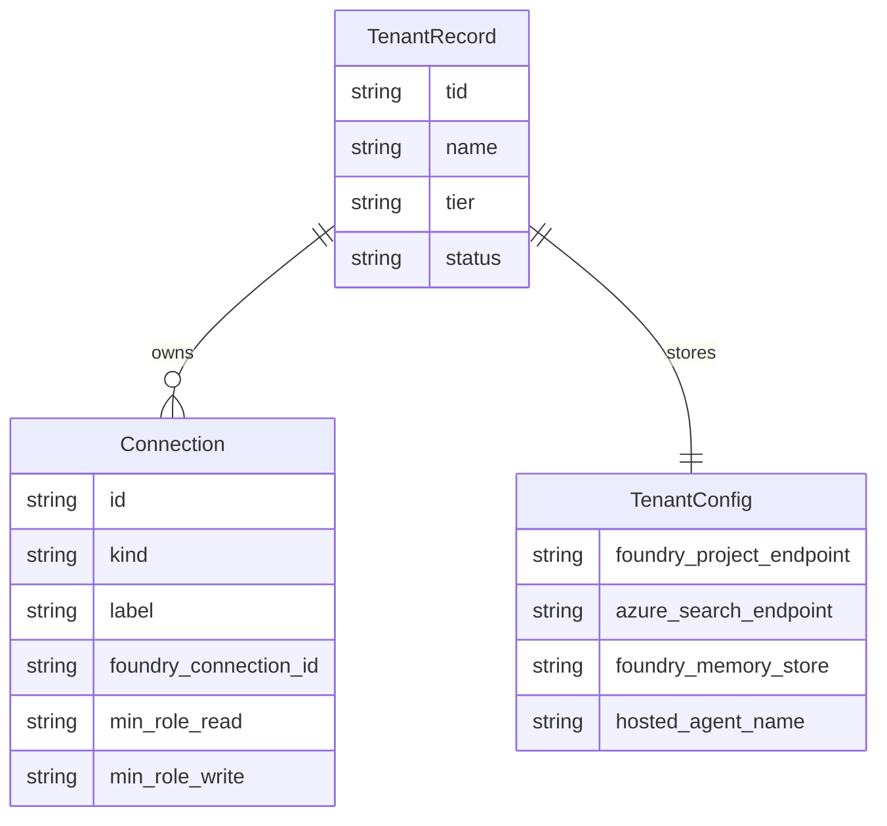

The tenant control plane is the backend subsystem that exists only because the repository supports `shared` deployment mode. It owns tenant onboarding, persisted tenant records, per-tenant data-plane pointers, per-tenant external connections, and the domain entitlement list that gates live and hosted domain access.[`apps/backend/app/api/tenant.py`](https://github.com/ruinosus/foundry-assured/blob/4b749e7bac56789f0b1097cd4a8212b5c5c65d05/apps/backend/app/api/tenant.py#L1-L7) [`apps/backend/app/core/tenant_store.py`](https://github.com/ruinosus/foundry-assured/blob/4b749e7bac56789f0b1097cd4a8212b5c5c65d05/apps/backend/app/core/tenant_store.py#L1-L4)

## Record model

The persisted model has two main dataclasses:

- `Connection`: one external integration reference, including registry `kind`, label, endpoint, Foundry connection id, and minimum read/write roles.[`apps/backend/app/core/tenant_store.py`](https://github.com/ruinosus/foundry-assured/blob/4b749e7bac56789f0b1097cd4a8212b5c5c65d05/apps/backend/app/core/tenant_store.py#L16-L28)
- `TenantRecord`: tenant id, tenant name, tier, status, one `TenantConfig` data-plane payload, a tuple of connections, and enabled domain ids.[`apps/backend/app/core/tenant_store.py`](https://github.com/ruinosus/foundry-assured/blob/4b749e7bac56789f0b1097cd4a8212b5c5c65d05/apps/backend/app/core/tenant_store.py#L30-L38)

This separation matters: platform-global settings stay in process configuration, while customer-specific data-plane pointers and connection references live in the tenant record.

## Store implementations

`TenantStore` is a protocol with `get`, `put`, and `list`. Two implementations exist:

- `InMemoryTenantStore` for tests and dev/CI
- `TableStorageTenantStore` for production shared mode

[`apps/backend/app/core/tenant_store.py`](https://github.com/ruinosus/foundry-assured/blob/4b749e7bac56789f0b1097cd4a8212b5c5c65d05/apps/backend/app/core/tenant_store.py#L57-L76) [`apps/backend/app/core/tenant_store.py`](https://github.com/ruinosus/foundry-assured/blob/4b749e7bac56789f0b1097cd4a8212b5c5c65d05/apps/backend/app/core/tenant_store.py#L89-L123)

The backend selects the implementation in `_make_tenant_store()`:

- `memory` backend is explicitly for dev/CI and is documented as never suitable for production because it is ephemeral and not shared across instances.
- `table` backend is the default and requires `TENANT_STORE_ACCOUNT_URL`; the app fails fast if shared mode is selected without it.

[`apps/backend/app/core/auth.py`](https://github.com/ruinosus/foundry-assured/blob/4b749e7bac56789f0b1097cd4a8212b5c5c65d05/apps/backend/app/core/auth.py#L77-L94)

## Onboarding lifecycle

The onboarding API is intentionally different from ordinary tenant mutation APIs:

- `GET /tenant` is Admin-gated but tolerates a tenant with no existing record, because it needs to answer “can this tenant onboard?” without requiring onboarding to already exist.[`apps/backend/app/api/tenant.py`](https://github.com/ruinosus/foundry-assured/blob/4b749e7bac56789f0b1097cd4a8212b5c5c65d05/apps/backend/app/api/tenant.py#L3-L7) [`apps/backend/app/api/tenant.py`](https://github.com/ruinosus/foundry-assured/blob/4b749e7bac56789f0b1097cd4a8212b5c5c65d05/apps/backend/app/api/tenant.py#L72-L79)
- `POST /tenant/onboard` is gated by `onboarding_guard`, which requires both `Admin` role and an allow-listed tenant id.[`apps/backend/app/api/tenant.py`](https://github.com/ruinosus/foundry-assured/blob/4b749e7bac56789f0b1097cd4a8212b5c5c65d05/apps/backend/app/api/tenant.py#L86-L100) [`apps/backend/app/core/onboarding.py`](https://github.com/ruinosus/foundry-assured/blob/4b749e7bac56789f0b1097cd4a8212b5c5c65d05/apps/backend/app/core/onboarding.py#L1-L26)
- Onboard creates the first tenant record idempotently and seeds `enabled_domains` from tier defaults via `domains_for_tier()`.[`apps/backend/app/api/tenant.py`](https://github.com/ruinosus/foundry-assured/blob/4b749e7bac56789f0b1097cd4a8212b5c5c65d05/apps/backend/app/api/tenant.py#L88-L100) [`apps/backend/app/core/tenant.py`](https://github.com/ruinosus/foundry-assured/blob/4b749e7bac56789f0b1097cd4a8212b5c5c65d05/apps/backend/app/core/tenant.py#L220-L231)

## Config mutation boundaries

`PUT /tenant/config` updates only the `data_plane` portion of the current tenant’s record. The tenant id never comes from the path; writes are always read-modify-write against `current_tenant_id()` and `_my_record()`. That keeps callers scoped to their own tenant record.[`apps/backend/app/api/tenant.py`](https://github.com/ruinosus/foundry-assured/blob/4b749e7bac56789f0b1097cd4a8212b5c5c65d05/apps/backend/app/api/tenant.py#L31-L41) [`apps/backend/app/api/tenant.py`](https://github.com/ruinosus/foundry-assured/blob/4b749e7bac56789f0b1097cd4a8212b5c5c65d05/apps/backend/app/api/tenant.py#L103-L107)

Secrets are not echoed back. `_redacted()` blanks secret-bearing fields before returning a record, and the comments explicitly tie this to ADR-005/008.[`apps/backend/app/api/tenant.py`](https://github.com/ruinosus/foundry-assured/blob/4b749e7bac56789f0b1097cd4a8212b5c5c65d05/apps/backend/app/api/tenant.py#L62-L70) [`apps/backend/app/api/tenant.py`](https://github.com/ruinosus/foundry-assured/blob/4b749e7bac56789f0b1097cd4a8212b5c5c65d05/apps/backend/app/api/tenant.py#L72-L79)

## Connection lifecycle

Connections are tenant-owned references, not global shared objects. The API supports:

- list: `GET /tenant/connections`
- add/upsert: `POST /tenant/connections`
- delete: `DELETE /tenant/connections/{conn_id}`

Adds are validated in two ways:

- `kind` must be a known registry server id via `validate_kind()`
- at least one of `foundry_connection_id` or `keyvault_ref` must be present

[`apps/backend/app/api/tenant.py`](https://github.com/ruinosus/foundry-assured/blob/4b749e7bac56789f0b1097cd4a8212b5c5c65d05/apps/backend/app/api/tenant.py#L110-L129) [`apps/backend/app/core/tenant_store.py`](https://github.com/ruinosus/foundry-assured/blob/4b749e7bac56789f0b1097cd4a8212b5c5c65d05/apps/backend/app/core/tenant_store.py#L41-L54)

## Domain entitlement management

The tenant control plane also owns licensing or entitlement state through `enabled_domains`:

- `GET /tenant/domains` returns the full domain catalog and the current tenant’s enabled subset.[`apps/backend/app/api/tenant.py`](https://github.com/ruinosus/foundry-assured/blob/4b749e7bac56789f0b1097cd4a8212b5c5c65d05/apps/backend/app/api/tenant.py#L136-L139)
- `PUT /tenant/domains` validates ids against `DOMAIN_IDS`, preserves catalog order, and deduplicates the submitted list.[`apps/backend/app/api/tenant.py`](https://github.com/ruinosus/foundry-assured/blob/4b749e7bac56789f0b1097cd4a8212b5c5c65d05/apps/backend/app/api/tenant.py#L142-L151) [`apps/backend/app/core/tenant.py`](https://github.com/ruinosus/foundry-assured/blob/4b749e7bac56789f0b1097cd4a8212b5c5c65d05/apps/backend/app/core/tenant.py#L216-L231)

That list is what `require_domain()` later uses at request time, so this API is the write side of a runtime authorization decision. Persistence also preserves backward compatibility for legacy rows: when `enabled_domains` is absent in a stored entity, `_record_from_entity()` defaults it to `()`, so older records remain readable and still fail closed until explicitly updated.[`apps/backend/app/core/tenant_store.py`](https://github.com/ruinosus/foundry-assured/blob/4b749e7bac56789f0b1097cd4a8212b5c5c65d05/apps/backend/app/core/tenant_store.py#L79-L86)

This diagram shows the persisted tenant control-plane entities and their relationships.

## Fail-closed behavior

This subsystem is designed to fail closed in three ways:

1. unresolved or inactive tenant records produce `403 tenant not onboarded` during auth resolution.[`apps/backend/app/core/auth.py`](https://github.com/ruinosus/foundry-assured/blob/4b749e7bac56789f0b1097cd4a8212b5c5c65d05/apps/backend/app/core/auth.py#L97-L104)
2. domain access is denied unless `enabled_domains` explicitly contains the requested id.[`apps/backend/app/core/tenant.py`](https://github.com/ruinosus/foundry-assured/blob/4b749e7bac56789f0b1097cd4a8212b5c5c65d05/apps/backend/app/core/tenant.py#L234-L252)
3. unknown connection kinds or missing connection references are rejected up front.[`apps/backend/app/api/tenant.py`](https://github.com/ruinosus/foundry-assured/blob/4b749e7bac56789f0b1097cd4a8212b5c5c65d05/apps/backend/app/api/tenant.py#L115-L123)

## Focused tests

The best evidence for this subsystem comes from:

- `eval/tenant_store_test.py` for store round-tripping.[`apps/backend/eval/tenant_store_test.py`](https://github.com/ruinosus/foundry-assured/blob/4b749e7bac56789f0b1097cd4a8212b5c5c65d05/apps/backend/eval/tenant_store_test.py#L1-L63)
- `eval/tenant_admin_e2e_test.py` for real Table Storage persistence and onboarding/config/connection lifecycle.[`apps/backend/eval/tenant_admin_e2e_test.py`](https://github.com/ruinosus/foundry-assured/blob/4b749e7bac56789f0b1097cd4a8212b5c5c65d05/apps/backend/eval/tenant_admin_e2e_test.py#L1-L24) [`apps/backend/eval/tenant_admin_e2e_test.py`](https://github.com/ruinosus/foundry-assured/blob/4b749e7bac56789f0b1097cd4a8212b5c5c65d05/apps/backend/eval/tenant_admin_e2e_test.py#L153-L177)
- `eval/enabled_domains_roundtrip_test.py`, `eval/domain_gate_test.py`, and `eval/onboarding_guard_test.py` for entitlement and allow-list correctness.[`apps/backend/eval/enabled_domains_roundtrip_test.py`](https://github.com/ruinosus/foundry-assured/blob/4b749e7bac56789f0b1097cd4a8212b5c5c65d05/apps/backend/eval/enabled_domains_roundtrip_test.py#L1-L61) [`apps/backend/eval/domain_gate_test.py`](https://github.com/ruinosus/foundry-assured/blob/4b749e7bac56789f0b1097cd4a8212b5c5c65d05/apps/backend/eval/domain_gate_test.py#L1-L54) [`apps/backend/eval/onboarding_guard_test.py`](https://github.com/ruinosus/foundry-assured/blob/4b749e7bac56789f0b1097cd4a8212b5c5c65d05/apps/backend/eval/onboarding_guard_test.py#L1-L51)

## Minimal validation

- `cd apps/backend && uv run python -m eval.tenant_store_test`
- `cd apps/backend && uv run python -m eval.onboarding_guard_test`
- `cd apps/backend && uv run python -m eval.enabled_domains_roundtrip_test`

These checks cover storage, onboarding authorization, and entitlement persistence..tenant_store_test`
- `cd apps/backend && uv run python -m eval.onboarding_guard_test`
- `cd apps/backend && uv run python -m eval.enabled_domains_roundtrip_test`

These checks cover storage, onboarding authorization, and entitlement persistence.