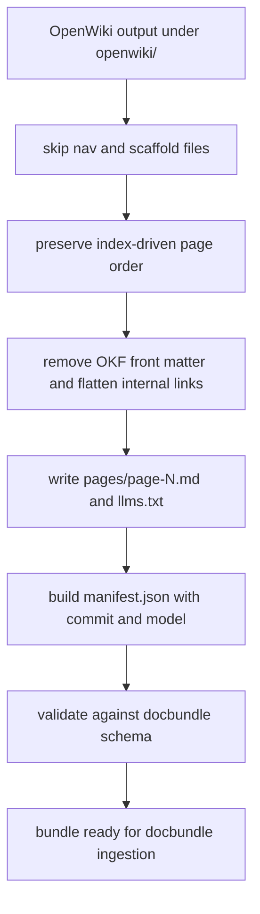

# Wiki adaptation and docbundle contracts

The repository treats generated wikis as structured ingestion artifacts, not free-form docs. ADR-016 defines the target loop: OpenWiki owns freshness automation, but this repository keeps ownership of the adapter, bundle format, fidelity gate, and ingest decision ([docs/adr/ADR-016-openwiki-closes-the-freshness-loop.md](https://github.com/ruinosus/foundry-assured/blob/08e078d7f2b6febbc5135f0b7928b5a204c667e3/docs/adr/ADR-016-openwiki-closes-the-freshness-loop.md#L54-L83), [docs/adr/ADR-016-openwiki-closes-the-freshness-loop.md](https://github.com/ruinosus/foundry-assured/blob/08e078d7f2b6febbc5135f0b7928b5a204c667e3/docs/adr/ADR-016-openwiki-closes-the-freshness-loop.md#L88-L99)). The code that makes that decision concrete lives in the knowledge module, because generated wiki bundles are just another knowledge corpus.

## Why adapters exist

The adapter layer exists because the backend ingest format is not the same as any upstream wiki generator’s output. `adapt_openwiki.py` says this explicitly: OpenWiki becomes a third producer behind the same seam already used by `adapt_deepwiki.py`, mapping OKF Markdown pages into the ingest bundle shape `manifest.json + pages/page-N.md + llms.txt` ([apps/backend/app/modules/knowledge/internal/adapt_openwiki.py](https://github.com/ruinosus/foundry-assured/blob/08e078d7f2b6febbc5135f0b7928b5a204c667e3/apps/backend/app/modules/knowledge/internal/adapt_openwiki.py#L1-L28)). The module also records two repository-specific facts that must survive adaptation: the commit OpenWiki documented and the model that produced the run, both read from `.last-update.json` ([apps/backend/app/modules/knowledge/internal/adapt_openwiki.py](https://github.com/ruinosus/foundry-assured/blob/08e078d7f2b6febbc5135f0b7928b5a204c667e3/apps/backend/app/modules/knowledge/internal/adapt_openwiki.py#L17-L20), [apps/backend/app/modules/knowledge/internal/adapt_openwiki.py](https://github.com/ruinosus/foundry-assured/blob/08e078d7f2b6febbc5135f0b7928b5a204c667e3/apps/backend/app/modules/knowledge/internal/adapt_openwiki.py#L147-L155)).

The output bundle is validated before it is written, so a bad adapter run fails locally rather than generating a quietly malformed corpus ([apps/backend/app/modules/knowledge/internal/adapt_openwiki.py](https://github.com/ruinosus/foundry-assured/blob/08e078d7f2b6febbc5135f0b7928b5a204c667e3/apps/backend/app/modules/knowledge/internal/adapt_openwiki.py#L183-L211)).

## OpenWiki adaptation specifics

OpenWiki emits more than content pages. `_SKIP_NAMES` excludes `index.md`, `_skeleton.md`, `_plan.md`, `INSTRUCTIONS.md`, `log.md`, and `README.md`, because those are navigation, scaffolding, user-authored instructions, or reserved documents rather than corpus content ([apps/backend/app/modules/knowledge/internal/adapt_openwiki.py](https://github.com/ruinosus/foundry-assured/blob/08e078d7f2b6febbc5135f0b7928b5a204c667e3/apps/backend/app/modules/knowledge/internal/adapt_openwiki.py#L46-L50)). `_ordered_pages()` then preserves navigation order by reading directory `index.md` links first and appending any orphaned pages afterward so no content is silently dropped ([apps/backend/app/modules/knowledge/internal/adapt_openwiki.py](https://github.com/ruinosus/foundry-assured/blob/08e078d7f2b6febbc5135f0b7928b5a204c667e3/apps/backend/app/modules/knowledge/internal/adapt_openwiki.py#L93-L122)).

Front matter is treated as transport metadata, not knowledge content. `_split_front_matter()` removes OKF YAML; `_title_of()` lifts title from front matter or H1 for bundle metadata; and `_flatten_internal_links()` strips wiki-to-wiki links down to plain text ([apps/backend/app/modules/knowledge/internal/adapt_openwiki.py](https://github.com/ruinosus/foundry-assured/blob/08e078d7f2b6febbc5135f0b7928b5a204c667e3/apps/backend/app/modules/knowledge/internal/adapt_openwiki.py#L74-L90), [apps/backend/app/modules/knowledge/internal/adapt_openwiki.py](https://github.com/ruinosus/foundry-assured/blob/08e078d7f2b6febbc5135f0b7928b5a204c667e3/apps/backend/app/modules/knowledge/internal/adapt_openwiki.py#L124-L145)). That link-flattening behavior is unusual but important: the comments explain that internal page links artificially inflate the fidelity score because the gate interprets any `something.md` token as a file citation. Flattening keeps prose while avoiding fake citations.

## Bundle manifest semantics

The generated manifest records `key`, `title`, source repo ref and commit, language, producing model, timestamps, component/version, `groups`, and page metadata ([apps/backend/app/modules/knowledge/internal/adapt_openwiki.py](https://github.com/ruinosus/foundry-assured/blob/08e078d7f2b6febbc5135f0b7928b5a204c667e3/apps/backend/app/modules/knowledge/internal/adapt_openwiki.py#L183-L203)). The adapter intentionally writes `groups: null`, not `[]`, because generated wiki producers do not know the repository’s access-control policy and an empty list would mean “nobody may read” rather than “no access policy declared” ([apps/backend/app/modules/knowledge/internal/adapt_openwiki.py](https://github.com/ruinosus/foundry-assured/blob/08e078d7f2b6febbc5135f0b7928b5a204c667e3/apps/backend/app/modules/knowledge/internal/adapt_openwiki.py#L197-L201)). That distinction is also embedded in `docbundle_schema.py` and enforced across all bundle writers ([apps/backend/app/modules/knowledge/internal/docbundle_schema.py](https://github.com/ruinosus/foundry-assured/blob/08e078d7f2b6febbc5135f0b7928b5a204c667e3/apps/backend/app/modules/knowledge/internal/docbundle_schema.py#L17-L25), [apps/backend/app/modules/knowledge/internal/docbundle_schema.py](https://github.com/ruinosus/foundry-assured/blob/08e078d7f2b6febbc5135f0b7928b5a204c667e3/apps/backend/app/modules/knowledge/internal/docbundle_schema.py#L70-L85)).

This diagram shows the adaptation path from OpenWiki output to ingestable bundle.

## Freshness and fidelity loop

ADR-016 makes a sharp division of responsibility: freshness detection and update orchestration can be outsourced, but correctness stays repository-owned via fidelity verification and bundle ingest rules ([docs/adr/ADR-016-openwiki-closes-the-freshness-loop.md](https://github.com/ruinosus/foundry-assured/blob/08e078d7f2b6febbc5135f0b7928b5a204c667e3/docs/adr/ADR-016-openwiki-closes-the-freshness-loop.md#L68-L79)). The adapter comments reinforce this by preserving the documented commit from OpenWiki’s receipt rather than substituting “current HEAD now,” because the freshness gate compares against the documented tree, not whatever happens to exist when adaptation runs ([apps/backend/app/modules/knowledge/internal/adapt_openwiki.py](https://github.com/ruinosus/foundry-assured/blob/08e078d7f2b6febbc5135f0b7928b5a204c667e3/apps/backend/app/modules/knowledge/internal/adapt_openwiki.py#L186-L193)).

This is also why the repository’s `openwiki/INSTRUCTIONS.md` is so strict about GitHub blob citations with commit SHA and line ranges: the adapter can preserve content shape, but it cannot invent verifiable citations after the fact.

## Relationship to ingestion

Once adapted, wiki bundles become just another docbundle corpus for `ingest_docbundles.py`. That script’s `collect_pages()` expects versioned bundle directories with `manifest.json` and `pages/*.md`, exactly what the adapter writes ([apps/backend/app/modules/knowledge/internal/ingest_docbundles.py](https://github.com/ruinosus/foundry-assured/blob/08e078d7f2b6febbc5135f0b7928b5a204c667e3/apps/backend/app/modules/knowledge/internal/ingest_docbundles.py#L168-L218)). This separation is useful when debugging: if a page is missing from retrieval, first ask whether adaptation emitted it, then whether docbundle ingestion uploaded and indexed it.

## Focused validation

The narrowest checks for adapter changes are:

- generate an adapted bundle and inspect manifest validation,
- verify page count and ordering against source OpenWiki pages,
- run downstream docbundle ingestion on the adapted bundle,
- confirm fidelity scoring still uses real source citations rather than internal-page links.

Source anchors for the policy rationale live in ADR-016 and the adapter comments, so update both if adapter semantics change.
