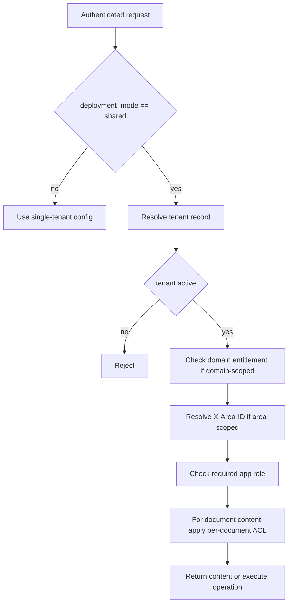

The repository uses one access-control model across backend HTTP routes, authoring and publication workflows, knowledge retrieval, and the standalone MCP server. The model is intentionally layered:

1. authenticate the caller,
2. resolve the tenant when the deployment mode is `shared`,
3. resolve the authoring area when a route is area-scoped,
4. require one of the app roles for the operation,
5. in shared mode, require that the tenant is entitled to the requested domain,
6. for document-backed knowledge, apply per-document ACL before returning content or giving it to a model.

The important design choice is that the *same business decisions* are reused across surfaces, while each surface translates failures into its own protocol vocabulary. FastAPI routes return `HTTPException` or structured JSON errors; MCP tools and resources return protocol-specific errors; knowledge ACL is still decided by the `knowledge` module, not by UI or protocol adapters. [`apps/backend/app/shared/auth.py`](https://github.com/ruinosus/foundry-assured/blob/18595cf77fa56dad04a5e646bc5dae9bcae7f6fa/apps/backend/app/shared/auth.py#L57-L85) [`apps/backend/app/modules/tenancy/internal/tenant_resolution.py`](https://github.com/ruinosus/foundry-assured/blob/18595cf77fa56dad04a5e646bc5dae9bcae7f6fa/apps/backend/app/modules/tenancy/internal/tenant_resolution.py#L65-L85) [`apps/mcp/mcp_app/tenant_gate.py`](https://github.com/ruinosus/foundry-assured/blob/18595cf77fa56dad04a5e646bc5dae9bcae7f6fa/apps/mcp/mcp_app/tenant_gate.py#L60-L78) [`apps/backend/app/modules/knowledge/public.py`](https://github.com/ruinosus/foundry-assured/blob/18595cf77fa56dad04a5e646bc5dae9bcae7f6fa/apps/backend/app/modules/knowledge/public.py#L1-L37)

## Deployment modes: what changes and what does not

The main seam is `tenant_config()`. Core code reads tenant-specific settings through that accessor without knowing whether the process is running single-tenant or multi-tenant. In `self_hosted` and `dedicated`, the active provider is `SingleTenantConfigProvider`, which reads one static `.env`-derived `TenantConfig` for the whole process. In `shared`, `install()` switches to `MultiTenantConfigProvider`, builds the control-plane tenant store, and registers a post-authentication hook so every authenticated request resolves its tenant record before business logic runs. [`apps/backend/app/modules/tenancy/internal/tenant.py`](https://github.com/ruinosus/foundry-assured/blob/18595cf77fa56dad04a5e646bc5dae9bcae7f6fa/apps/backend/app/modules/tenancy/internal/tenant.py#L185-L218) [`apps/backend/app/modules/tenancy/internal/tenant.py`](https://github.com/ruinosus/foundry-assured/blob/18595cf77fa56dad04a5e646bc5dae9bcae7f6fa/apps/backend/app/modules/tenancy/internal/tenant.py#L281-L292) [`apps/backend/app/modules/tenancy/internal/tenant_resolution.py`](https://github.com/ruinosus/foundry-assured/blob/18595cf77fa56dad04a5e646bc5dae9bcae7f6fa/apps/backend/app/modules/tenancy/internal/tenant_resolution.py#L101-L125)

Authentication also changes by deployment mode. When auth is enabled, `self_hosted` and `dedicated` validate JWTs with `SingleTenantAzureAuthorizationCodeBearer`, while `shared` uses `MultiTenantAzureAuthorizationCodeBearer` with per-tenant issuer validation. The application roles themselves do not change; the same `roles` claim drives authorization in every mode. [`apps/backend/app/shared/auth.py`](https://github.com/ruinosus/foundry-assured/blob/18595cf77fa56dad04a5e646bc5dae9bcae7f6fa/apps/backend/app/shared/auth.py#L43-L79)

`domain_deps(domain_id)` captures the behavioral difference most backend domain routes care about: in `self_hosted` and `dedicated` it is exactly `auth_dependencies()`, while in `shared` it appends `require_domain(domain_id)` so the request must also pass the per-tenant domain entitlement gate. [`apps/backend/app/modules/tenancy/public.py`](https://github.com/ruinosus/foundry-assured/blob/18595cf77fa56dad04a5e646bc5dae9bcae7f6fa/apps/backend/app/modules/tenancy/public.py#L113-L124)

## Request flow and enforcement order

This shows the effective gate order across the backend and MCP surfaces.

The ordering is not identical in syntax everywhere, but the same choke points appear repeatedly:

- `require_user` validates identity and stores the current user in a context variable.
- In `shared`, the post-auth hook resolves the tenant and sets the current tenant record.
- Domain-scoped routes and MCP surfaces check tenant entitlement with `domain_enabled` or wrappers around it.
- Authoring and publication routes require `X-Area-ID` and resolve that into an `AreaAccess`.
- Roles are checked either with FastAPI `require_role(...)` or MCP `require_any_role(...)`.
- Knowledge document reads and retrieval then apply ACL based on document metadata or search-side trimming. [`apps/backend/app/shared/auth.py`](https://github.com/ruinosus/foundry-assured/blob/18595cf77fa56dad04a5e646bc5dae9bcae7f6fa/apps/backend/app/shared/auth.py#L101-L144) [`apps/backend/app/modules/tenancy/internal/tenant.py`](https://github.com/ruinosus/foundry-assured/blob/18595cf77fa56dad04a5e646bc5dae9bcae7f6fa/apps/backend/app/modules/tenancy/internal/tenant.py#L248-L278) [`apps/backend/app/modules/tenancy/internal/areas.py`](https://github.com/ruinosus/foundry-assured/blob/18595cf77fa56dad04a5e646bc5dae9bcae7f6fa/apps/backend/app/modules/tenancy/internal/areas.py#L33-L79)

## Tenant resolution and tenant-scoped configuration

A `TenantRecord` is the shared state object used in `shared` mode. It includes:

- `tid`, `name`, `tier`, and `status`,
- a per-tenant `TenantConfig` data-plane pointer set,
- per-tenant `connections`,
- `enabled_domains` for licensing/entitlement,
- `areas` for authoring access partitioning. [`apps/backend/app/modules/tenancy/internal/tenant_store.py`](https://github.com/ruinosus/foundry-assured/blob/18595cf77fa56dad04a5e646bc5dae9bcae7f6fa/apps/backend/app/modules/tenancy/internal/tenant_store.py#L15-L49)

The tenant store is only constructed in `shared` mode. Production uses `TableStorageTenantStore`; dev and CI can use `InMemoryTenantStore` when `tenant_store_backend == "memory"`. If shared mode is misconfigured without `TENANT_STORE_ACCOUNT_URL`, boot fails fast instead of degrading into ambiguous authorization behavior. [`apps/backend/app/modules/tenancy/internal/tenant_resolution.py`](https://github.com/ruinosus/foundry-assured/blob/18595cf77fa56dad04a5e646bc5dae9bcae7f6fa/apps/backend/app/modules/tenancy/internal/tenant_resolution.py#L34-L57)

Per-request resolution is fail-closed. `resolve_tenant_record(user, store)` returns `None` unless the store contains the caller's `tid` and the tenant is `active`; `resolve_tenant(...)` turns that into a `403 tenant not onboarded` on the web path. The MCP path calls `resolve_tenant_record` through its own adapter and translates rejection into tool or resource errors instead of HTTP status codes. [`apps/backend/app/modules/tenancy/internal/tenant_resolution.py`](https://github.com/ruinosus/foundry-assured/blob/18595cf77fa56dad04a5e646bc5dae9bcae7f6fa/apps/backend/app/modules/tenancy/internal/tenant_resolution.py#L65-L85) [`apps/mcp/mcp_app/tenant_gate.py`](https://github.com/ruinosus/foundry-assured/blob/18595cf77fa56dad04a5e646bc5dae9bcae7f6fa/apps/mcp/mcp_app/tenant_gate.py#L60-L78)

A second tenant-scoped concept is the memory namespace. `memory_scope()` prefixes the user identity with `tid` only when a tenant is actually resolved; single-tenant modes keep the historical bare `oid` so existing stored memories are not orphaned. [`apps/backend/app/modules/tenancy/internal/tenant_resolution.py`](https://github.com/ruinosus/foundry-assured/blob/18595cf77fa56dad04a5e646bc5dae9bcae7f6fa/apps/backend/app/modules/tenancy/internal/tenant_resolution.py#L87-L99)

## Roles: application-wide coarse authorization

The app has four owned roles: `Admin`, `Author`, `Approver`, and `Reader`. FastAPI routes use `require_role(*roles)` to require any of those roles from the caller token; `Admin` is not implicit and must be listed where it should pass. With auth disabled, role checks become no-ops to keep local development usable. [`apps/backend/app/shared/auth.py`](https://github.com/ruinosus/foundry-assured/blob/18595cf77fa56dad04a5e646bc5dae9bcae7f6fa/apps/backend/app/shared/auth.py#L43-L45) [`apps/backend/app/shared/auth.py`](https://github.com/ruinosus/foundry-assured/blob/18595cf77fa56dad04a5e646bc5dae9bcae7f6fa/apps/backend/app/shared/auth.py#L120-L144)

Two area-scoped APIs show the role model clearly:

- the authoring catalog router requires authentication, one of `Reader|Author|Approver|Admin`, and an area, then tightens some endpoints further with `Author` or `Author|Admin`; [`apps/backend/app/modules/authoring/api.py`](https://github.com/ruinosus/foundry-assured/blob/18595cf77fa56dad04a5e646bc5dae9bcae7f6fa/apps/backend/app/modules/authoring/api.py#L45-L52) [`apps/backend/app/modules/authoring/api.py`](https://github.com/ruinosus/foundry-assured/blob/18595cf77fa56dad04a5e646bc5dae9bcae7f6fa/apps/backend/app/modules/authoring/api.py#L198-L201) [`apps/backend/app/modules/authoring/api.py`](https://github.com/ruinosus/foundry-assured/blob/18595cf77fa56dad04a5e646bc5dae9bcae7f6fa/apps/backend/app/modules/authoring/api.py#L277-L280)
- the publication router also requires authentication, one of `Reader|Author|Approver|Admin`, and an area, then restricts creation, approval, and reconciliation to `Approver`, while compensations require `Admin`. [`apps/backend/app/modules/publication/api.py`](https://github.com/ruinosus/foundry-assured/blob/18595cf77fa56dad04a5e646bc5dae9bcae7f6fa/apps/backend/app/modules/publication/api.py#L32-L39) [`apps/backend/app/modules/publication/api.py`](https://github.com/ruinosus/foundry-assured/blob/18595cf77fa56dad04a5e646bc5dae9bcae7f6fa/apps/backend/app/modules/publication/api.py#L151-L157) [`apps/backend/app/modules/publication/api.py`](https://github.com/ruinosus/foundry-assured/blob/18595cf77fa56dad04a5e646bc5dae9bcae7f6fa/apps/backend/app/modules/publication/api.py#L194-L203) [`apps/backend/app/modules/publication/api.py`](https://github.com/ruinosus/foundry-assured/blob/18595cf77fa56dad04a5e646bc5dae9bcae7f6fa/apps/backend/app/modules/publication/api.py#L251-L261)

## Areas: authoring scope inside a tenant

Areas are the extra scoping layer used by authoring and publication. `authorized_areas(user, tenant)` computes accessible areas from two conditions:

- the caller's `tid` must match the tenant,
- the caller must have at least one app role,
- the caller must belong to at least one Entra group listed on the area,
- the area itself must be `active`. [`apps/backend/app/modules/tenancy/internal/areas.py`](https://github.com/ruinosus/foundry-assured/blob/18595cf77fa56dad04a5e646bc5dae9bcae7f6fa/apps/backend/app/modules/tenancy/internal/areas.py#L33-L52)

`require_area` reads `X-Area-ID`, fetches the current tenant from the store, resolves an `AreaAccess`, stores it in a context variable, and returns `404 AREA_NOT_FOUND` when the area is not accessible. It returns `503 AREA_STORE_UNAVAILABLE` if no store exists, which means area-scoped APIs depend on tenancy infrastructure being installed. [`apps/backend/app/modules/tenancy/internal/areas.py`](https://github.com/ruinosus/foundry-assured/blob/18595cf77fa56dad04a5e646bc5dae9bcae7f6fa/apps/backend/app/modules/tenancy/internal/areas.py#L65-L79)

Authoring and publication derive their `ChangeSetScope` from that resolved area and the current user. Both `_scope()` helpers use `current_tenant_id() or "self-hosted"`, `area.id`, and the caller OID with a local fallback. That means the storage and workflow scope key always includes an area for these APIs, even in self-hosted mode. [`apps/backend/app/modules/authoring/api.py`](https://github.com/ruinosus/foundry-assured/blob/18595cf77fa56dad04a5e646bc5dae9bcae7f6fa/apps/backend/app/modules/authoring/api.py#L105-L115) [`apps/backend/app/modules/publication/api.py`](https://github.com/ruinosus/foundry-assured/blob/18595cf77fa56dad04a5e646bc5dae9bcae7f6fa/apps/backend/app/modules/publication/api.py#L89-L99)

The tenancy public API also exposes `current_authoring_scope_key()`, which returns `tenant_id__area__<area.id>` when an area has been resolved and just the tenant id otherwise. That is the canonical key for authoring state that must be isolated per area. [`apps/backend/app/modules/tenancy/public.py`](https://github.com/ruinosus/foundry-assured/blob/18595cf77fa56dad04a5e646bc5dae9bcae7f6fa/apps/backend/app/modules/tenancy/public.py#L86-L91)

Area scoping also constrains connection lookup. `current_connection(connection_id)` resolves only within the current tenant and, when an area is active, only returns a connection whose `area_id` matches the current area. This prevents authoring code from silently reaching tenant-wide connections from another area. [`apps/backend/app/modules/tenancy/public.py`](https://github.com/ruinosus/foundry-assured/blob/18595cf77fa56dad04a5e646bc5dae9bcae7f6fa/apps/backend/app/modules/tenancy/public.py#L93-L110)

## Tenant-domain entitlement in shared mode

Per-tenant licensing and entitlement is represented by `TenantRecord.enabled_domains`. `domain_enabled(domain_id)` is the shared business rule: it returns false when no tenant is resolved and otherwise requires the requested domain to be in `enabled_domains`. `require_domain(domain_id)` wraps that rule for FastAPI and produces a `403` unless the tenant has the entitlement. [`apps/backend/app/modules/tenancy/internal/tenant.py`](https://github.com/ruinosus/foundry-assured/blob/18595cf77fa56dad04a5e646bc5dae9bcae7f6fa/apps/backend/app/modules/tenancy/internal/tenant.py#L248-L278)

This rule is reused across HTTP and MCP rather than duplicated:

- backend domain routers can use `domain_deps(domain_id)` to add the shared-only entitlement dependency; [`apps/backend/app/modules/tenancy/public.py`](https://github.com/ruinosus/foundry-assured/blob/18595cf77fa56dad04a5e646bc5dae9bcae7f6fa/apps/backend/app/modules/tenancy/public.py#L113-L124)
- the `/source/{domain_id}/{name}` handler cannot declare a static dependency because `domain_id` is a path parameter, so it explicitly calls `require_domain(domain_id)()` in shared mode before touching the document; [`apps/backend/app/modules/knowledge/api.py`](https://github.com/ruinosus/foundry-assured/blob/18595cf77fa56dad04a5e646bc5dae9bcae7f6fa/apps/backend/app/modules/knowledge/api.py#L69-L88)
- the MCP server centralizes the same logic in `tenant_gate.recusa_de_tenant`, which first resolves the tenant and then checks `domain_enabled(domain)` when a domain is known. [`apps/mcp/mcp_app/tenant_gate.py`](https://github.com/ruinosus/foundry-assured/blob/18595cf77fa56dad04a5e646bc5dae9bcae7f6fa/apps/mcp/mcp_app/tenant_gate.py#L60-L78)

The important operational difference is mode-specific:

- in `self_hosted` and `dedicated`, there is no resolved tenant and no entitlement gate;
- in `shared`, missing tenant store wiring, an unknown tenant, a suspended tenant, or a missing domain entitlement all reject the request before the business operation runs.

## Document-level ACL: enforcement before model or caller sees content

The knowledge module explicitly treats ACL as data declared on document sources, not as classification logic. Its public API exports `authorized_document`, `authorized_components`, and `trim_agentic_content` as the relevant enforcement points. [`apps/backend/app/modules/knowledge/public.py`](https://github.com/ruinosus/foundry-assured/blob/18595cf77fa56dad04a5e646bc5dae9bcae7f6fa/apps/backend/app/modules/knowledge/public.py#L1-L37)

Two complementary enforcement paths matter:

### Whole-document reads

`authorized_document(domain, name, user)` serves the full document only after reauthorizing each read. For `document_access == "acl"` domains, it obtains a user search token, fails closed if auth is enabled but no user token is available, asks Azure Search how many chunks of that document the user may read using `x-ms-query-source-authorization`, and rejects access unless the count is positive. Only then does it download the blob. [`apps/backend/app/modules/knowledge/internal/document.py`](https://github.com/ruinosus/foundry-assured/blob/18595cf77fa56dad04a5e646bc5dae9bcae7f6fa/apps/backend/app/modules/knowledge/internal/document.py#L115-L166)

For domains that declare `document_access == "session"`, that ACL trim is intentionally skipped; the valid authenticated session is the whole rule for those domains. The decision is based on the declared domain property, not on whether ACL configuration happens to be empty at runtime, so missing ACL config cannot silently downgrade an ACL domain into open access. [`apps/backend/app/modules/knowledge/internal/document.py`](https://github.com/ruinosus/foundry-assured/blob/18595cf77fa56dad04a5e646bc5dae9bcae7f6fa/apps/backend/app/modules/knowledge/internal/document.py#L131-L151)

### Retrieval-fed model context

`authorized_components(caller_token)` asks the search index, as the caller, which components are readable; `trim_agentic_content(text, allowed)` then drops any retrieved chunks whose component key is not in that allowed set. This is the app-side ACL trim used because the agentic retrieval path itself does not yet enforce per-user ACL. The trim is explicitly positioned before the model sees the content. On error, the authorized set becomes empty, which fails closed by dropping all chunks rather than leaking data. [`apps/backend/app/modules/knowledge/internal/secure_search.py`](https://github.com/ruinosus/foundry-assured/blob/18595cf77fa56dad04a5e646bc5dae9bcae7f6fa/apps/backend/app/modules/knowledge/internal/secure_search.py#L1-L18) [`apps/backend/app/modules/knowledge/internal/secure_search.py`](https://github.com/ruinosus/foundry-assured/blob/18595cf77fa56dad04a5e646bc5dae9bcae7f6fa/apps/backend/app/modules/knowledge/internal/secure_search.py#L36-L55) [`apps/backend/app/modules/knowledge/internal/secure_search.py`](https://github.com/ruinosus/foundry-assured/blob/18595cf77fa56dad04a5e646bc5dae9bcae7f6fa/apps/backend/app/modules/knowledge/internal/secure_search.py#L72-L88)

## MCP surface: same policy, different protocol

The standalone MCP app is intentionally thin: it imports the backend's knowledge ACL functions and tenancy logic instead of re-implementing authorization. `wire_registry()` installs shared-mode tenancy only when `deployment_mode == "shared"`; then it injects the tenant store getter into `mcp_app.tenant_gate`, so tools, resources, and completions all use the same tenant resolution and entitlement rule. Outside shared mode, MCP stays byte-identical to prior single-tenant behavior. [`apps/mcp/mcp_app/main.py`](https://github.com/ruinosus/foundry-assured/blob/18595cf77fa56dad04a5e646bc5dae9bcae7f6fa/apps/mcp/mcp_app/main.py#L121-L137)

`search_docs` shows the usual MCP pattern:

- enforce reader-class roles with `auth=require_any_role("Reader", "Author", "Approver", "Admin")`,
- translate the bearer token into the caller identity,
- call `recusa_de_tenant` for shared-mode tenant + entitlement rejection,
- delegate actual retrieval to `knowledge.public.retrieve`. [`apps/mcp/mcp_app/tools_knowledge.py`](https://github.com/ruinosus/foundry-assured/blob/18595cf77fa56dad04a5e646bc5dae9bcae7f6fa/apps/mcp/mcp_app/tools_knowledge.py#L56-L86) [`apps/mcp/mcp_app/tools_knowledge.py`](https://github.com/ruinosus/foundry-assured/blob/18595cf77fa56dad04a5e646bc5dae9bcae7f6fa/apps/mcp/mcp_app/tools_knowledge.py#L137-L152)

`document://{domain}/{name}` follows the same layered gates in resource form: it resolves caller identity, applies shared-mode tenant and entitlement checks before resolving the domain, then delegates whole-document authorization to `authorized_document`. It also records both allowed and denied document access through the same `record_document_access` function the HTTP route uses. [`apps/mcp/mcp_app/resources_knowledge.py`](https://github.com/ruinosus/foundry-assured/blob/18595cf77fa56dad04a5e646bc5dae9bcae7f6fa/apps/mcp/mcp_app/resources_knowledge.py#L171-L205)

A notable MCP-specific gap is completion auth: FastMCP does not enforce `auth=` on `completion/complete`, so this code manually runs the same read-role gate from `_pode_ler()` and also filters domain suggestions through the shared tenant entitlement predicate `licenciado(...)`. That keeps completion from becoming a side channel that enumerates domains or documents a caller should not see. [`apps/mcp/mcp_app/resources_knowledge.py`](https://github.com/ruinosus/foundry-assured/blob/18595cf77fa56dad04a5e646bc5dae9bcae7f6fa/apps/mcp/mcp_app/resources_knowledge.py#L11-L25) [`apps/mcp/mcp_app/resources_knowledge.py`](https://github.com/ruinosus/foundry-assured/blob/18595cf77fa56dad04a5e646bc5dae9bcae7f6fa/apps/mcp/mcp_app/resources_knowledge.py#L212-L242)

## Focused assurance: protocol filtering is tested end to end

`apps/mcp/tests/client_surface_test.py` verifies that the MCP protocol surface actually enforces the intended authorization, not just that helper functions exist. It builds the real ASGI app, substitutes a static token verifier and fake domain/document seams, then exercises two callers through a real `fastmcp.Client` over in-process HTTP:

- a `Reader` sees read tools, prompts, the document resource template, can read the document, and gets domain completion suggestions;
- a caller with no roles sees no tools, prompts, or templates, direct resource reads are refused, completion returns nothing, and authorized content does not leak in the rejection path. [`apps/mcp/tests/client_surface_test.py`](https://github.com/ruinosus/foundry-assured/blob/18595cf77fa56dad04a5e646bc5dae9bcae7f6fa/apps/mcp/tests/client_surface_test.py#L122-L143) [`apps/mcp/tests/client_surface_test.py`](https://github.com/ruinosus/foundry-assured/blob/18595cf77fa56dad04a5e646bc5dae9bcae7f6fa/apps/mcp/tests/client_surface_test.py#L197-L239)

This test matters because list filtering is part of the access-control model. For unauthorized callers, MCP surfaces often disappear from listings rather than returning explicit authorization errors, so proving only helper functions or registration metadata would miss the actual user-visible behavior.

## Practical invariants

When changing this area, these invariants are the ones to preserve:

- `shared` mode must resolve a tenant per authenticated request and fail closed when it cannot;
- `self_hosted` and `dedicated` must not accidentally pick up shared-mode tenant gating;
- authoring and publication state must stay scoped by both tenant and area;
- domain entitlement must be decided by shared tenancy code and reused by both HTTP and MCP surfaces;
- document ACL must be enforced in `knowledge` before content reaches models, HTTP responses, or MCP resources;
- completion/listing surfaces are part of the security boundary too, because metadata leakage is still leakage.
