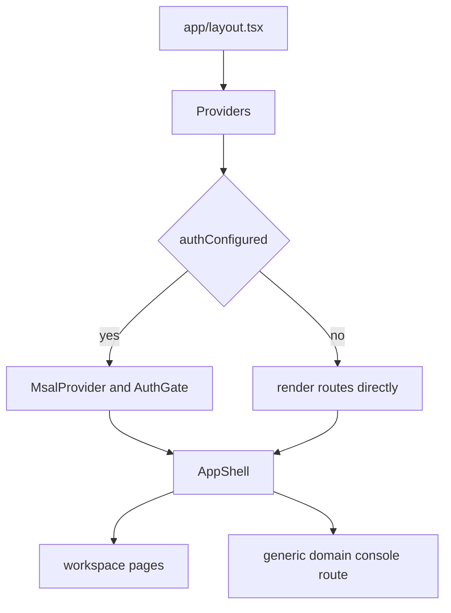

# Frontend application overview

The frontend in `apps/frontend` is a Next.js App Router application that wraps all repository capabilities in a single shell. It is intentionally generic: one console route can render multiple AI domains, while workspace pages expose evals, tickets, and admin operations.

## Runtime entrypoints

Primary entrypoints:

- [`apps/frontend/app/layout.tsx`](../../apps/frontend/app/layout.tsx)
- [`apps/frontend/components/shell/Providers.tsx`](../../apps/frontend/components/shell/Providers.tsx)
- [`apps/frontend/components/shell/AppShell.tsx`](../../apps/frontend/components/shell/AppShell.tsx)
- [`apps/frontend/app/page.tsx`](../../apps/frontend/app/page.tsx)
- [`apps/frontend/app/d/[domain]/page.tsx`](../../apps/frontend/app/d/[domain]/page.tsx)

## App-wide provider stack

`app/layout.tsx` is minimal. It:

- imports CopilotKit and global CSS,
- sets metadata from `branding`,
- wraps all children in `Providers`.

### `Providers`

`components/shell/Providers.tsx` is the actual runtime root.

Behavior:

- if `authConfigured` is false, it renders children directly,
- otherwise it initializes `msalInstance`, installs `MsalProvider`, and wraps the app in an `AuthGate` that shows only `LoginScreen` when unauthenticated.

That means auth is app-wide, not limited to the chat page. Even if a user lands on `/`, the provider stack can consume the redirect response and enforce sign-in.

## Shell

`components/shell/AppShell.tsx` creates the shared application frame:

- fixed left sidebar,
- workspace navigation,
- AI agent navigation derived from the domain registry,
- optional admin nav when `isAdmin(roles)` is true,
- topbar breadcrumbs,
- backend health probe,
- account chip with sign-in or sign-out.

This is the structural reason the frontend feels like one product instead of separate apps.



This diagram shows the top-level frontend composition from layout to route content.

## Route families

### Overview

- Route: `/`
- Owner: `app/page.tsx`
- Purpose: public landing narrative for the product, guarantees, and available domains.

The landing page pulls domain cards from `DOMAINS`, so registry changes flow into the overview automatically.

### Generic domain route

- Route: `/d/[domain]`
- Owner: `app/d/[domain]/page.tsx`
- Purpose: render the shared assurance console for any configured domain.

The page is client-only and dynamically imports `AssuranceConsole` with `ssr: false`, because MSAL and CopilotKit v2 are client-side concerns.

### Workspace pages

The frontend includes dedicated pages for:

- `/tickets`
- `/evals`
- `/admin/users`
- `/admin/connections`

These all render inside `AppShell` but call backend APIs rather than running CopilotKit chats.

### Legacy cockpit route

`apps/frontend/app/cockpit/page.tsx` currently redirects to `/`. The source comment explains that cockpit moved into the unified console, but is temporarily hidden because its KB is not provisioned in that environment.

## Domain registry

The single source of truth for visible frontend domains is [`apps/frontend/lib/domains.ts`](../../apps/frontend/lib/domains.ts).

Each row defines:

- `id`
- `icon`
- `label`
- `kind`
- `blurb`
- `suggested`
- `endpoint`
- optional `hostedAgentId`

The registry drives:

- sidebar agent navigation,
- landing-page role cards,
- `/d/[domain]` resolution,
- suggested prompts,
- live versus hosted toggle eligibility.

This is the frontend half of the repository-wide config-driven domain model. If a domain is restored incompletely, the failure mode depends on what is missing: a missing frontend row means no navigation or `/d/[domain]` lookup even if the backend is mounted, while a missing backend row or endpoint means the console can resolve the domain but CopilotKit requests will fail against a nonexistent live or hosted target.

## API proxy routes

The frontend uses App Router API routes to mediate browser-to-backend calls. The route inventory includes:

- `app/api/admin/[...path]/route.ts`
- `app/api/copilotkit/[[...slug]]/route.ts`
- `app/api/evals/route.ts`
- `app/api/health/route.ts`
- `app/api/me/route.ts`
- `app/api/tenant/[...path]/route.ts`
- `app/api/tickets/route.ts`

These routes keep browser code pointed at same-origin URLs while the proxy layer forwards to the Python backend with the right auth context. For example, `/api/me` forwards the caller's bearer token to backend `/me` and returns `{ roles: [], error: "backend unreachable" }` with status 502 on failure, which is what drives the frontend's empty-role fallback.

## Auth behavior in UI code

There are two layers of auth awareness:

1. the app-wide `Providers` gate that can require sign-in globally,
2. feature-level hooks and helpers such as `authedFetch`, `useMyRoles`, and domain-console token acquisition.

`useMyRoles()` is especially important: it does not read roles from the MSAL id token. It asks the backend `/api/me` route because the app-role `roles` claim lives in the access token for the backend API audience. If that fetch fails, the hook falls back to `[]`, which makes the UI render as non-admin rather than guessing elevated rights.

This layered design lets non-chat pages and chat pages share the same authentication substrate while keeping feature-specific token handling close to each feature.

## Focused tests and runtime checks

There is not a large dedicated frontend unit test suite in the repository; instead, important frontend behavior is validated through:

- backend route and contract tests,
- Playwright E2E tests in `e2e/`,
- manual and demo-mode validation through the live shell and domain console.

## Validation

From `apps/frontend/`:

```bash
npm run lint
npm run typecheck
```

For integrated validation, run the frontend and backend together or use the E2E suite documented in [End-to-end and validation](../testing/end-to-end-and-validation.md).

## Related pages

- [Frontend domain console](domain-console.md)
- [Frontend admin, evals, and tickets](admin-evals-and-tickets.md)
- [Frontend demo mode](demo-mode.md)
- [Backend domains and endpoints](../backend/domains-and-endpoints.md)
