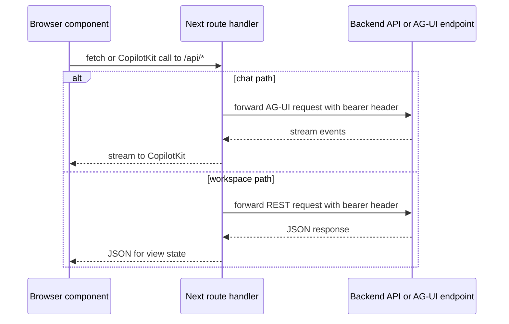

The frontend’s route handlers are an important architectural layer, not just convenience glue. They normalize browser traffic, attach bearer tokens when available, and keep browser components decoupled from backend URLs and protocol details.[`apps/frontend/components/console/AssuranceConsole.tsx`](https://github.com/ruinosus/foundry-assured/blob/4b749e7bac56789f0b1097cd4a8212b5c5c65d05/apps/frontend/components/console/AssuranceConsole.tsx#L41-L45) [`apps/frontend/lib/auth/api.ts`](https://github.com/ruinosus/foundry-assured/blob/4b749e7bac56789f0b1097cd4a8212b5c5c65d05/apps/frontend/lib/auth/api.ts#L3-L26)

## Generic domain request chain

The browser enters the agent experience through `/d/[domain]`. That page extracts the route param and passes it to `AssuranceConsole`, which looks the id up in `lib/domains.ts`, chooses an agent id, and points CopilotKit at `/api/copilotkit`.[`apps/frontend/app/d/[domain]/page.tsx`](https://github.com/ruinosus/foundry-assured/blob/4b749e7bac56789f0b1097cd4a8212b5c5c65d05/apps/frontend/app/d/[domain]/page.tsx#L16-L23) [`apps/frontend/lib/domains.ts`](https://github.com/ruinosus/foundry-assured/blob/4b749e7bac56789f0b1097cd4a8212b5c5c65d05/apps/frontend/lib/domains.ts#L97-L98) [`apps/frontend/components/console/AssuranceConsole.tsx`](https://github.com/ruinosus/foundry-assured/blob/4b749e7bac56789f0b1097cd4a8212b5c5c65d05/apps/frontend/components/console/AssuranceConsole.tsx#L32-L45)

## Bearer-token forwarding

There are two bearer-token patterns in the frontend:

- CopilotKit requests get an `Authorization` header through `CopilotKitProvider` when the console has acquired a token.[`apps/frontend/components/console/AssuranceConsole.tsx`](https://github.com/ruinosus/foundry-assured/blob/4b749e7bac56789f0b1097cd4a8212b5c5c65d05/apps/frontend/components/console/AssuranceConsole.tsx#L41-L45) [`apps/frontend/components/console/AssuranceConsole.tsx`](https://github.com/ruinosus/foundry-assured/blob/4b749e7bac56789f0b1097cd4a8212b5c5c65d05/apps/frontend/components/console/AssuranceConsole.tsx#L118-L148)
- ordinary fetch-based pages call `authedFetch()`, which silently acquires a token from the MSAL singleton and attaches it if possible.[`apps/frontend/lib/auth/api.ts`](https://github.com/ruinosus/foundry-assured/blob/4b749e7bac56789f0b1097cd4a8212b5c5c65d05/apps/frontend/lib/auth/api.ts#L11-L26)

The failure mode is deliberate: if silent token acquisition fails, `authedFetch` sends the request unauthenticated rather than forcing a redirect itself, so the caller can surface the resulting 401 or empty state.[`apps/frontend/lib/auth/api.ts`](https://github.com/ruinosus/foundry-assured/blob/4b749e7bac56789f0b1097cd4a8212b5c5c65d05/apps/frontend/lib/auth/api.ts#L16-L23)

## Proxy route families

The API route handlers under `app/api` mirror backend families. Their forwarding rule is simple but important: they preserve the browser’s inbound `authorization` header when present and omit the header entirely when absent, rather than manufacturing anonymous placeholders.[`apps/frontend/app/api/me/route.ts`](https://github.com/ruinosus/foundry-assured/blob/4b749e7bac56789f0b1097cd4a8212b5c5c65d05/apps/frontend/app/api/me/route.ts#L8-L18) [`apps/frontend/app/api/tickets/route.ts`](https://github.com/ruinosus/foundry-assured/blob/4b749e7bac56789f0b1097cd4a8212b5c5c65d05/apps/frontend/app/api/tickets/route.ts#L10-L23)

The API route handlers under `app/api` mirror backend families:

- `copilotkit/[[...slug]]` for the AG-UI domain runtime path
- `admin/[...path]` for admin management APIs
- `tenant/[...path]` for shared-mode control-plane APIs
- `tickets`, `evals`, and `me` for workspace views
- `health` for backend status

The route tree confirms those families exist under the frontend API layer.[`apps/frontend/app`](https://github.com/ruinosus/foundry-assured/blob/4b749e7bac56789f0b1097cd4a8212b5c5c65d05/apps/frontend/app)

## Workspace page dependencies

The client views show the proxy usage clearly:

- `TicketsView` fetches `/api/tickets`.[`apps/frontend/components/tickets/TicketsView.tsx`](https://github.com/ruinosus/foundry-assured/blob/4b749e7bac56789f0b1097cd4a8212b5c5c65d05/apps/frontend/components/tickets/TicketsView.tsx#L23-L38)
- `EvalsView` fetches `/api/evals`.[`apps/frontend/components/evals/EvalsView.tsx`](https://github.com/ruinosus/foundry-assured/blob/4b749e7bac56789f0b1097cd4a8212b5c5c65d05/apps/frontend/components/evals/EvalsView.tsx#L29-L44)
- `useMyRoles()` fetches `/api/me` to decide whether admin UI should render.[`apps/frontend/lib/auth/roles.ts`](https://github.com/ruinosus/foundry-assured/blob/4b749e7bac56789f0b1097cd4a8212b5c5c65d05/apps/frontend/lib/auth/roles.ts#L3-L23)

So a frontend page usually depends on a Next proxy first and a backend route second.

This diagram shows the frontend proxy layer as the boundary between browser code and backend runtime surfaces.

## Registry-to-backend chain

For chat, the route/registry chain is:

1. `lib/domains.ts` declares `id` and `hostedAgentId`.
2. `/d/[domain]` passes the path segment into `AssuranceConsole`.
3. `AssuranceConsole` decides the active `agentId`.
4. `CopilotKitProvider` sends requests to `/api/copilotkit`.
5. the backend ultimately routes to the domain endpoint or hosted bridge identified by that agent id.

[`apps/frontend/lib/domains.ts`](https://github.com/ruinosus/foundry-assured/blob/4b749e7bac56789f0b1097cd4a8212b5c5c65d05/apps/frontend/lib/domains.ts#L28-L95) [`apps/frontend/app/d/[domain]/page.tsx`](https://github.com/ruinosus/foundry-assured/blob/4b749e7bac56789f0b1097cd4a8212b5c5c65d05/apps/frontend/app/d/[domain]/page.tsx#L16-L23) [`apps/frontend/components/console/AssuranceConsole.tsx`](https://github.com/ruinosus/foundry-assured/blob/4b749e7bac56789f0b1097cd4a8212b5c5c65d05/apps/frontend/components/console/AssuranceConsole.tsx#L32-L45)

## Minimal validation

- `cd e2e && npm test`

The proxy layer is mostly validated end-to-end because its failures usually surface as broken chat, missing roles, or empty workspace data rather than isolated component regressions.test`

The proxy layer is mostly validated end-to-end because its failures usually surface as broken chat, missing roles, or empty workspace data rather than isolated component regressions.