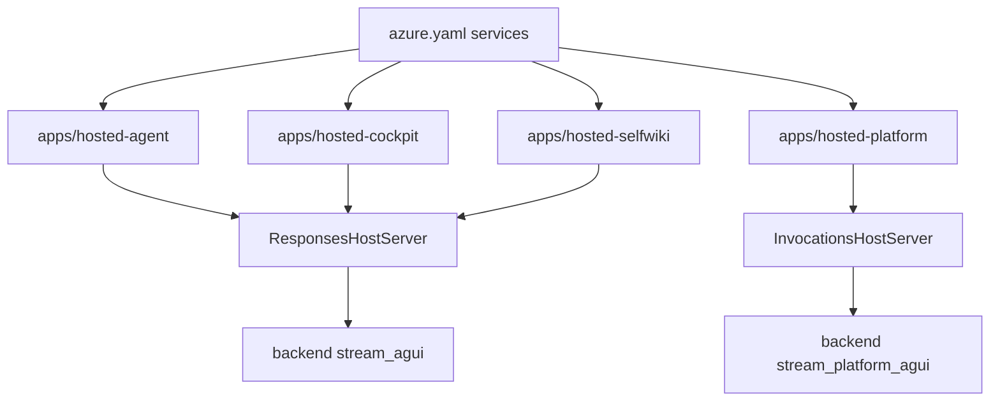

The repository contains four separate hosted-agent apps because “hosted” is not just a deployment flag on the backend. Each hosted app is its own Python entrypoint, Docker image, and `azure.yaml` service definition for Azure AI Agent Service deployment.[`azure.yaml`](https://github.com/ruinosus/foundry-assured/blob/4b749e7bac56789f0b1097cd4a8212b5c5c65d05/azure.yaml#L14-L23) [`azure.yaml`](https://github.com/ruinosus/foundry-assured/blob/4b749e7bac56789f0b1097cd4a8212b5c5c65d05/azure.yaml#L26-L61)

## Why separate apps exist

The hosted apps package domain-specific runtime shapes that do not map cleanly onto one generic binary:

- helpdesk packages a workflow over Responses
- cockpit and selfwiki package grounded single-agent Q&A over Responses
- platform packages an Invocations-based tool agent for interrupt-capable behavior

[`apps/hosted-agent/main.py`](https://github.com/ruinosus/foundry-assured/blob/4b749e7bac56789f0b1097cd4a8212b5c5c65d05/apps/hosted-agent/main.py#L1-L16) [`apps/hosted-cockpit/main.py`](https://github.com/ruinosus/foundry-assured/blob/4b749e7bac56789f0b1097cd4a8212b5c5c65d05/apps/hosted-cockpit/main.py#L1-L12) [`apps/hosted-selfwiki/main.py`](https://github.com/ruinosus/foundry-assured/blob/4b749e7bac56789f0b1097cd4a8212b5c5c65d05/apps/hosted-selfwiki/main.py#L1-L12) [`apps/hosted-platform/main.py`](https://github.com/ruinosus/foundry-assured/blob/4b749e7bac56789f0b1097cd4a8212b5c5c65d05/apps/hosted-platform/main.py#L1-L21)

## Protocol split

There are two hosted protocols in play:

- **Responses** for helpdesk, cockpit, and selfwiki
- **Invocations** for platform

That split is reflected twice: once in the hosted entrypoints themselves and again in the backend bridge code that forwards hosted execution back into the frontend.[`apps/hosted-agent/main.py`](https://github.com/ruinosus/foundry-assured/blob/4b749e7bac56789f0b1097cd4a8212b5c5c65d05/apps/hosted-agent/main.py#L21-L25) [`apps/hosted-platform/main.py`](https://github.com/ruinosus/foundry-assured/blob/4b749e7bac56789f0b1097cd4a8212b5c5c65d05/apps/hosted-platform/main.py#L26-L28) [`apps/backend/app/services/hosted.py`](https://github.com/ruinosus/foundry-assured/blob/4b749e7bac56789f0b1097cd4a8212b5c5c65d05/apps/backend/app/services/hosted.py#L72-L105) [`apps/backend/app/services/hosted.py`](https://github.com/ruinosus/foundry-assured/blob/4b749e7bac56789f0b1097cd4a8212b5c5c65d05/apps/backend/app/services/hosted.py#L121-L182)

## Backend hosted-client cache

The backend bridge keeps a process-global `_clients` cache keyed by hosted agent name. `_client()` stores the OpenAI client, project handle, and credential so repeated hosted requests do not re-warm everything, and `aclose()` closes all cached objects during backend shutdown.[`apps/backend/app/services/hosted.py`](https://github.com/ruinosus/foundry-assured/blob/4b749e7bac56789f0b1097cd4a8212b5c5c65d05/apps/backend/app/services/hosted.py#L18-L20) [`apps/backend/app/services/hosted.py`](https://github.com/ruinosus/foundry-assured/blob/4b749e7bac56789f0b1097cd4a8212b5c5c65d05/apps/backend/app/services/hosted.py#L23-L44) [`apps/backend/app/services/hosted.py`](https://github.com/ruinosus/foundry-assured/blob/4b749e7bac56789f0b1097cd4a8212b5c5c65d05/apps/backend/app/services/hosted.py#L47-L56)

Source also records a known multitenant risk: because the cache key is only the agent name, the first tenant to warm an agent can define the cached client for later tenants unless the cache is later scoped or busted per tenant. That limitation is currently documented, not solved.[`apps/backend/app/services/hosted.py`](https://github.com/ruinosus/foundry-assured/blob/4b749e7bac56789f0b1097cd4a8212b5c5c65d05/apps/backend/app/services/hosted.py#L35-L43)

## Deploy-time surfaces

Each hosted service is declared in `azure.yaml` with:

- project directory
- `host: azure.ai.agent`
- remote Docker build
- startup command `python main.py`
- container CPU and memory sizing

[`azure.yaml`](https://github.com/ruinosus/foundry-assured/blob/4b749e7bac56789f0b1097cd4a8212b5c5c65d05/azure.yaml#L14-L23) [`azure.yaml`](https://github.com/ruinosus/foundry-assured/blob/4b749e7bac56789f0b1097cd4a8212b5c5c65d05/azure.yaml#L24-L61)

This means hosted-agent deployment is controlled from repo-owned infra automation rather than a separate manual deployment tool.

## Live-versus-hosted parity limits

Hosted agents are not full mirrors of live backend behavior:

- live helpdesk includes OBO, per-user memory, and HITL escalation; hosted helpdesk explicitly drops those.[`apps/hosted-agent/main.py`](https://github.com/ruinosus/foundry-assured/blob/4b749e7bac56789f0b1097cd4a8212b5c5c65d05/apps/hosted-agent/main.py#L8-L16)
- live grounded domains use the current user identity for retrieval and synthesis; hosted grounded twins run under hosted agent identity with env-driven config.[`apps/hosted-cockpit/main.py`](https://github.com/ruinosus/foundry-assured/blob/4b749e7bac56789f0b1097cd4a8212b5c5c65d05/apps/hosted-cockpit/main.py#L7-L12) [`apps/hosted-selfwiki/main.py`](https://github.com/ruinosus/foundry-assured/blob/4b749e7bac56789f0b1097cd4a8212b5c5c65d05/apps/hosted-selfwiki/main.py#L5-L12)
- hosted platform keeps the tool/approval-oriented protocol shape but moves concrete tool binding to deploy-time Toolbox configuration.[`apps/hosted-platform/main.py`](https://github.com/ruinosus/foundry-assured/blob/4b749e7bac56789f0b1097cd4a8212b5c5c65d05/apps/hosted-platform/main.py#L16-L21) [`apps/hosted-platform/main.py`](https://github.com/ruinosus/foundry-assured/blob/4b749e7bac56789f0b1097cd4a8212b5c5c65d05/apps/hosted-platform/main.py#L54-L64)

This diagram shows the repository’s hosted-agent packaging split and the backend bridge protocols that consume it.

## Focused tests

Representative hosted-agent proof surfaces are:

- `eval/hosted_build_test.py` for packaging/build assumptions.[`apps/backend/eval/hosted_build_test.py`](https://github.com/ruinosus/foundry-assured/blob/4b749e7bac56789f0b1097cd4a8212b5c5c65d05/apps/backend/eval/hosted_build_test.py#L1-L62)
- `eval/platform_hosted_bridge_test.py` for platform bridge correctness in the backend.[`apps/backend/eval/platform_hosted_bridge_test.py`](https://github.com/ruinosus/foundry-assured/blob/4b749e7bac56789f0b1097cd4a8212b5c5c65d05/apps/backend/eval/platform_hosted_bridge_test.py#L1-L18)
- `eval/hosted_platform_smoke_test.py` and `eval/platform_hosted_e2e_test.py` for hosted platform scaffold and deploy-path checks.[`apps/backend/eval/hosted_platform_smoke_test.py`](https://github.com/ruinosus/foundry-assured/blob/4b749e7bac56789f0b1097cd4a8212b5c5c65d05/apps/backend/eval/hosted_platform_smoke_test.py#L1-L42) [`apps/backend/eval/platform_hosted_e2e_test.py`](https://github.com/ruinosus/foundry-assured/blob/4b749e7bac56789f0b1097cd4a8212b5c5c65d05/apps/backend/eval/platform_hosted_e2e_test.py#L1-L58)
- `scripts/hook-postdeploy.sh` for runtime RBAC reconciliation after deployment.[`scripts/hook-postdeploy.sh`](https://github.com/ruinosus/foundry-assured/blob/4b749e7bac56789f0b1097cd4a8212b5c5c65d05/scripts/hook-postdeploy.sh#L1-L18) [`scripts/hook-postdeploy.sh`](https://github.com/ruinosus/foundry-assured/blob/4b749e7bac56789f0b1097cd4a8212b5c5c65d05/scripts/hook-postdeploy.sh#L41-L58)

## Minimal validation

- `cd apps/backend && uv run python -m eval.hosted_build_test`
- `cd apps/backend && uv run python -m eval.platform_hosted_bridge_test`

These checks exercise a packaging assumption and one bridge boundary without requiring a full redeploy.