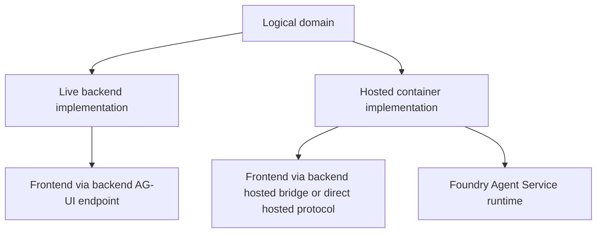

# Hosted agents overview

The repository ships four hosted-agent containers under `apps/`:

- `apps/hosted-agent` for helpdesk
- `apps/hosted-cockpit` for cockpit
- `apps/hosted-selfwiki` for selfwiki
- `apps/hosted-platform` for platform

These are deployed through `azure.yaml` as `host: azure.ai.agent` services.

## Why hosted agents exist

Hosted agents give the repository a second delivery model for the same logical domains:

- the **live backend path** runs inside FastAPI and can expose AG-UI step streams, OBO, request-scoped tools, and approval widgets,
- the **hosted path** packages a domain into a Foundry-managed container runtime.

This supports the repository's phase-6 and deployment-mode goals while keeping domain logic recognizable across both forms.

## Shared packaging pattern

Despite domain differences, the hosted containers follow a common pattern:

1. load env with `dotenv` when applicable,
2. acquire `DefaultAzureCredential()`,
3. create a `FoundryChatClient` using env-provided endpoint and model,
4. optionally build search context providers or rely on hosted toolbox configuration,
5. wrap the result in `ResponsesHostServer` or `InvocationsHostServer`,
6. run the server async.

`azure.yaml` provides the deployment inventory and startup commands.

| Service name in `azure.yaml` | Project directory | Protocol style |
| --- | --- | --- |
| `helpdesk-concierge` | `apps/hosted-agent` | Responses |
| `cockpit-expert` | `apps/hosted-cockpit` | Responses |
| `selfwiki-expert` | `apps/hosted-selfwiki` | Responses |
| `platform-concierge` | `apps/hosted-platform` | Invocations |

## Shared constraints

Hosted agents differ from the live backend in several consistent ways:

- they run under a platform-injected identity through `DefaultAzureCredential`, not OBO,
- they are configured through environment and deployment wiring rather than per-request tenant resolution,
- they do not inherit FastAPI route dependencies or contextvars,
- features that depend on AG-UI workflow interrupts or request-scoped tool construction must be explicitly reimplemented or dropped.

## Hosted versus live architecture

This diagram shows the dual-runtime model shared by hosted-capable domains.

## Environment contract source

Each hosted app has its own `agent.yaml` and `Dockerfile`, while `azure.yaml` declares the azd service-level deployment metadata. The environment contract is therefore split between:

- the container image project,
- the hosted agent manifest,
- azd deployment config,
- and sometimes post-deploy operational steps documented in repository runbooks.

## Validation surface

Hosted behavior is validated through a mix of:

- backend bridge tests like `platform_hosted_bridge_test.py`,
- hosted smoke tests such as `hosted_build_test.py` and `hosted_platform_smoke_test.py`,
- deployed round-trip tests like `grounded_deployed_roundtrip_test.py` and platform-hosted E2E tests,
- deployment automation in `azure.yaml` and GitHub workflows.

For the generic Responses-based path, backend `app/services/hosted.py` caches clients by hosted agent name and re-emits `response.output_text.delta` events as AG-UI text events. The file also documents a multi-tenant risk: a process-global cache keyed only by agent name can bind to the first tenant that warmed the client unless future work scopes or busts that cache per tenant.

## Related pages

- [Hosted helpdesk](helpdesk-hosted.md)
- [Hosted selfwiki and cockpit](selfwiki-and-cockpit.md)
- [Hosted platform](platform-hosted.md)
- [Infrastructure deployment](../infrastructure/deployment.md)
