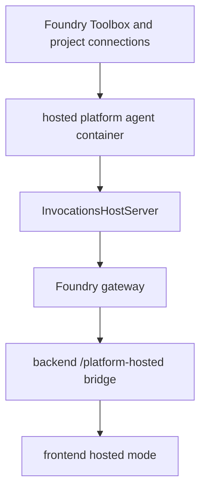

# Hosted platform agent over Invocations

`apps/hosted-platform/main.py` is intentionally not another Responses-hosted grounded agent. Its header explains the key design choice: the hosted platform concierge must preserve tool capability and write-approval interrupts, so it serves the Invocations protocol rather than Responses ([apps/hosted-platform/main.py](https://github.com/ruinosus/foundry-assured/blob/08e078d7f2b6febbc5135f0b7928b5a204c667e3/apps/hosted-platform/main.py#L1-L14)). This is the hosted runtime family that differs most from the live backend and has the most explicit infra-gated work left.

## Runtime shape

The service creates a `FoundryChatClient`, defines a hosted `PLATFORM_INSTRUCTIONS` string, and constructs an agent through `client.as_agent(...)` with `default_options={"store": False}` before passing it to `InvocationsHostServer` ([apps/hosted-platform/main.py](https://github.com/ruinosus/foundry-assured/blob/08e078d7f2b6febbc5135f0b7928b5a204c667e3/apps/hosted-platform/main.py#L33-L42), [apps/hosted-platform/main.py](https://github.com/ruinosus/foundry-assured/blob/08e078d7f2b6febbc5135f0b7928b5a204c667e3/apps/hosted-platform/main.py#L45-L77)). Unlike the live backend, it does **not** call `build_mcp_tools()`.

That omission is deliberate. The file says tools are configured on the Foundry Toolbox at deploy time and resolved through the toolbox referenced by `TOOLBOX_NAME`, so auth and tool binding stay data-driven in Foundry rather than being re-implemented in container code ([apps/hosted-platform/main.py](https://github.com/ruinosus/foundry-assured/blob/08e078d7f2b6febbc5135f0b7928b5a204c667e3/apps/hosted-platform/main.py#L16-L21), [apps/hosted-platform/main.py](https://github.com/ruinosus/foundry-assured/blob/08e078d7f2b6febbc5135f0b7928b5a204c667e3/apps/hosted-platform/main.py#L54-L63)).

## Toolbox contract

The hosted platform service assumes a deploy-time Toolbox binding. `toolbox_name = os.environ.get("TOOLBOX_NAME", "")` is currently only captured, and the code comments state that the actual Toolbox-to-agent binding and per-connection configuration are deployment facts from the runbook, not things to recreate in code ([apps/hosted-platform/main.py](https://github.com/ruinosus/foundry-assured/blob/08e078d7f2b6febbc5135f0b7928b5a204c667e3/apps/hosted-platform/main.py#L54-L63)). ADR-011 is the design rationale for that hosted per-tenant toolbox passthrough path, and this file is its runtime placeholder rather than a fully self-sufficient implementation.

## Infra-gated uncertainties

This service intentionally carries TODOs rather than pretending unresolved details are finished:

- whether `InvocationsHostServer(agent)` is the exact runtime constructor for the deployed image is noted as not offline-verified ([apps/hosted-platform/main.py](https://github.com/ruinosus/foundry-assured/blob/08e078d7f2b6febbc5135f0b7928b5a204c667e3/apps/hosted-platform/main.py#L72-L77));
- backend bridge code notes that the platform hosted Invocations URL shape, request body shape, data-plane scope, and true SSE passthrough framing all require deployed verification ([apps/backend/app/modules/hosted/internal/hosted.py](https://github.com/ruinosus/foundry-assured/blob/08e078d7f2b6febbc5135f0b7928b5a204c667e3/apps/backend/app/modules/hosted/internal/hosted.py#L107-L119), [apps/backend/app/modules/hosted/internal/hosted.py](https://github.com/ruinosus/foundry-assured/blob/08e078d7f2b6febbc5135f0b7928b5a204c667e3/apps/backend/app/modules/hosted/internal/hosted.py#L148-L177)).

Treat these comments as current truth, not stale debt you can ignore. Any documentation or code claiming the hosted platform path is fully protocol-verified would be inaccurate.

This diagram shows the intended deploy-time and runtime chain for the hosted platform path.

## Relationship to backend hosted bridge

The live frontend does not talk to this service directly. It uses `/platform-hosted`, whose backend bridge tries to pass AG-UI through from the hosted Invocations endpoint and emits a clean `RUN_ERROR` envelope when no endpoint is configured ([apps/backend/app/modules/hosted/api.py](https://github.com/ruinosus/foundry-assured/blob/08e078d7f2b6febbc5135f0b7928b5a204c667e3/apps/backend/app/modules/hosted/api.py#L29-L34), [apps/backend/app/modules/hosted/internal/hosted.py](https://github.com/ruinosus/foundry-assured/blob/08e078d7f2b6febbc5135f0b7928b5a204c667e3/apps/backend/app/modules/hosted/internal/hosted.py#L121-L182)). So hosted platform changes should always be reviewed with backend bridge code and frontend hosted-mode UX together.

## Focused tests and validation

`platform_hosted_bridge_test.py` is the narrowest infra-free backend test, but it only verifies no-endpoint error framing, not successful end-to-end hosted tool execution ([apps/backend/tests/hosted/platform_hosted_bridge_test.py](https://github.com/ruinosus/foundry-assured/blob/08e078d7f2b6febbc5135f0b7928b5a204c667e3/apps/backend/tests/hosted/platform_hosted_bridge_test.py#L1-L6), [apps/backend/tests/hosted/platform_hosted_bridge_test.py](https://github.com/ruinosus/foundry-assured/blob/08e078d7f2b6febbc5135f0b7928b5a204c667e3/apps/backend/tests/hosted/platform_hosted_bridge_test.py#L39-L56)). Deployed verification must cover:

- Toolbox binding,
- write-approval interrupt round-trip,
- SSE framing correctness through the backend bridge,
- post-deploy RBAC on the hosted instance identity.
