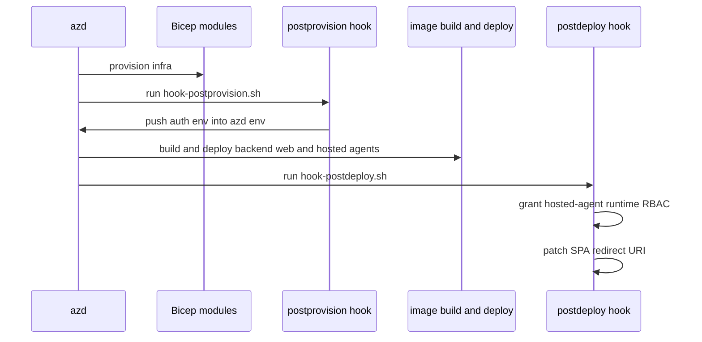

# azd service graph and deployment hooks

`azure.yaml` is the deployment composition file for this repository. It declares the backend and web Container App services plus four hosted-agent services, and it defines the postprovision and postdeploy hooks that complete work Bicep cannot do alone ([azure.yaml](https://github.com/ruinosus/foundry-assured/blob/08e078d7f2b6febbc5135f0b7928b5a204c667e3/azure.yaml#L3-L23), [azure.yaml](https://github.com/ruinosus/foundry-assured/blob/08e078d7f2b6febbc5135f0b7928b5a204c667e3/azure.yaml#L24-L68), [azure.yaml](https://github.com/ruinosus/foundry-assured/blob/08e078d7f2b6febbc5135f0b7928b5a204c667e3/azure.yaml#L73-L81)). If `infra/*.bicep` defines the resource graph, `azure.yaml` defines the deployment graph.

## Service inventory

The services are:

- `backend` → `apps/backend`, Container App, Docker remote build,
- `web` → `apps/frontend`, Container App, Docker remote build with build args for `NEXT_PUBLIC_ENTRA_*`,
- `cockpit-expert`, `helpdesk-concierge`, `platform-concierge`, `selfwiki-expert` → hosted agents under `apps/hosted-*`, each as `azure.ai.agent` with `python main.py` startup ([azure.yaml](https://github.com/ruinosus/foundry-assured/blob/08e078d7f2b6febbc5135f0b7928b5a204c667e3/azure.yaml#L6-L23), [azure.yaml](https://github.com/ruinosus/foundry-assured/blob/08e078d7f2b6febbc5135f0b7928b5a204c667e3/azure.yaml#L24-L68)).

The web build args are especially important. They bake public auth configuration into the frontend image, which is why those values must exist in the azd environment **before** deploy/build rather than only as runtime env vars ([azure.yaml](https://github.com/ruinosus/foundry-assured/blob/08e078d7f2b6febbc5135f0b7928b5a204c667e3/azure.yaml#L62-L72)).

## postprovision: build-time env reconciliation

`hook-postprovision.sh` runs after infra is created but before package/build/deploy. Its sole job is to push local `.env` values like `NEXT_PUBLIC_*` and `ENTRA_*` into the azd environment so the frontend image builds with correct auth configuration ([scripts/hook-postprovision.sh](https://github.com/ruinosus/foundry-assured/blob/08e078d7f2b6febbc5135f0b7928b5a204c667e3/scripts/hook-postprovision.sh#L2-L10), [scripts/hook-postprovision.sh](https://github.com/ruinosus/foundry-assured/blob/08e078d7f2b6febbc5135f0b7928b5a204c667e3/scripts/hook-postprovision.sh#L14-L17)). The script is careful **not** to run KB ingest there because ingestion is slow, data-plane fragile, and should remain a visible explicit step rather than being hidden inside a `continueOnError` hook ([scripts/hook-postprovision.sh](https://github.com/ruinosus/foundry-assured/blob/08e078d7f2b6febbc5135f0b7928b5a204c667e3/scripts/hook-postprovision.sh#L8-L10)).

## postdeploy: hosted-agent RBAC and SPA redirect repair

`hook-postdeploy.sh` exists because some runtime facts do not exist until after deploy. Hosted-agent instance identities are minted at deploy time, so they cannot be pre-assigned roles in Bicep. The hook reads Foundry account and Search IDs from the azd env, enumerates the four hosted agents, fetches each instance identity principal ID, and grants Azure AI User and Search Index Data Reader roles idempotently ([scripts/hook-postdeploy.sh](https://github.com/ruinosus/foundry-assured/blob/08e078d7f2b6febbc5135f0b7928b5a204c667e3/scripts/hook-postdeploy.sh#L2-L10), [scripts/hook-postdeploy.sh](https://github.com/ruinosus/foundry-assured/blob/08e078d7f2b6febbc5135f0b7928b5a204c667e3/scripts/hook-postdeploy.sh#L13-L39), [scripts/hook-postdeploy.sh](https://github.com/ruinosus/foundry-assured/blob/08e078d7f2b6febbc5135f0b7928b5a204c667e3/scripts/hook-postdeploy.sh#L41-L59)).

The same hook also patches the deployed web URL into the SPA app registration’s redirect URIs because the final public web FQDN is only known after deployment ([scripts/hook-postdeploy.sh](https://github.com/ruinosus/foundry-assured/blob/08e078d7f2b6febbc5135f0b7928b5a204c667e3/scripts/hook-postdeploy.sh#L61-L86)). This is how the repository avoids AADSTS50011 redirect mismatch without hardcoding cloud URLs ahead of time.

This sequence shows the deployment lifecycle azd orchestrates around Bicep.

## up-all.sh as operator wrapper

`up-all.sh` is the supported one-shot orchestrator around azd. Its comments explain the staged workflow: optional `setup-entra.sh` before provision, `azd up` with hooks, then explicit bootstrap of the data plane after deploy ([scripts/up-all.sh](https://github.com/ruinosus/foundry-assured/blob/08e078d7f2b6febbc5135f0b7928b5a204c667e3/scripts/up-all.sh#L7-L17), [scripts/up-all.sh](https://github.com/ruinosus/foundry-assured/blob/08e078d7f2b6febbc5135f0b7928b5a204c667e3/scripts/up-all.sh#L68-L87), [scripts/up-all.sh](https://github.com/ruinosus/foundry-assured/blob/08e078d7f2b6febbc5135f0b7928b5a204c667e3/scripts/up-all.sh#L89-L132)). In practice, this is the cleanest top-level description of how azd, hooks, scripts, and backend bootstrap are meant to cooperate. The script and hook split is: `setup-entra.sh` creates app registrations and roles, `bootstrap.sh` populates local env and ingests/provisions data-plane resources, `hook-postprovision.sh` pushes build-time deploy env into azd, and `hook-postdeploy.sh` repairs hosted-agent RBAC plus SPA redirect URIs.

## Invariants to preserve

- Build-time frontend auth values must be in the azd env before deploy.
- Hosted-agent runtime RBAC must be reconciled after deploy, not assumed by infra.
- Hook failures should degrade visibly and safely, not silently produce a broken app.
- Data-plane bootstrap remains an explicit operator step, not a hidden hook side effect.

## Focused validation

- Run `azd up` in a fresh environment and inspect whether hooks emitted their expected messages.
- Confirm the frontend can sign in at the deployed URL.
- Confirm hosted agents no longer 403 after postdeploy RBAC reconciliation.
