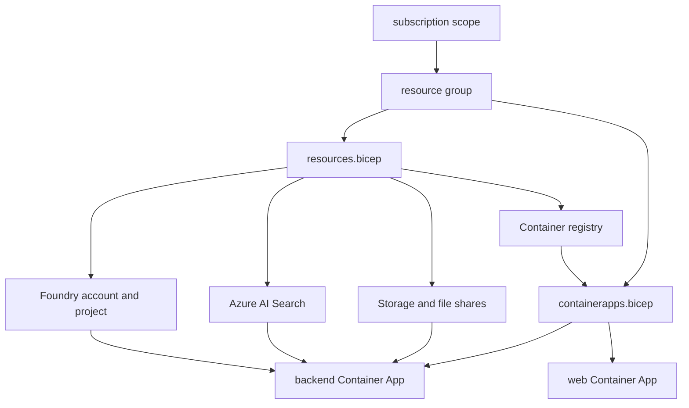

# Infrastructure topology

The infrastructure layer is split between subscription-scoped entrypoint Bicep, resource-group-scoped service provisioning, and Container Apps deployment. `infra/main.bicep` creates the resource group, invokes `resources.bicep` for data-plane and identity resources, then invokes `containerapps.bicep` for runtime apps, surfacing a large set of outputs into the azd environment ([infra/main.bicep](https://github.com/ruinosus/foundry-assured/blob/08e078d7f2b6febbc5135f0b7928b5a204c667e3/infra/main.bicep#L1-L18), [infra/main.bicep](https://github.com/ruinosus/foundry-assured/blob/08e078d7f2b6febbc5135f0b7928b5a204c667e3/infra/main.bicep#L52-L98), [infra/main.bicep](https://github.com/ruinosus/foundry-assured/blob/08e078d7f2b6febbc5135f0b7928b5a204c667e3/infra/main.bicep#L100-L122)).

## Core resource graph

`resources.bicep` provisions the shared foundational services:

- Foundry account and project,
- chat and embedding model deployments,
- Log Analytics and Application Insights wired into the Foundry account,
- Storage account with blob container and Azure Files shares,
- Azure AI Search with managed identity,
- ACR for hosted-agent images ([infra/resources.bicep](https://github.com/ruinosus/foundry-assured/blob/08e078d7f2b6febbc5135f0b7928b5a204c667e3/infra/resources.bicep#L1-L10), [infra/resources.bicep](https://github.com/ruinosus/foundry-assured/blob/08e078d7f2b6febbc5135f0b7928b5a204c667e3/infra/resources.bicep#L79-L133), [infra/resources.bicep](https://github.com/ruinosus/foundry-assured/blob/08e078d7f2b6febbc5135f0b7928b5a204c667e3/infra/resources.bicep#L184-L233), [infra/resources.bicep](https://github.com/ruinosus/foundry-assured/blob/08e078d7f2b6febbc5135f0b7928b5a204c667e3/infra/resources.bicep#L239-L259)).

The file also encodes several role-definition IDs that later scripts and hooks depend on, such as Azure AI User, Search Index Data Reader, Search Index Data Contributor, and Blob Data roles ([infra/resources.bicep](https://github.com/ruinosus/foundry-assured/blob/08e078d7f2b6febbc5135f0b7928b5a204c667e3/infra/resources.bicep#L67-L75)). These are not just output decoration; they define which identities can ingest corpora, query KBs, and run hosted agents.

## Output-to-runtime mapping

The most important wiring in this repo is the handoff from `resources.bicep` outputs to app runtime configuration. `resources.bicep` emits values such as `FOUNDRY_PROJECT_ENDPOINT`, `FOUNDRY_MODEL`, `AZURE_SEARCH_ENDPOINT`, `AZURE_SEARCH_KNOWLEDGE_BASE`, `AZURE_STORAGE_ACCOUNT`, `AZURE_FILE_SHARE`, `AZURE_PROMPTS_FILE_SHARE`, `APP_IDENTITY_ID`, and `APP_IDENTITY_CLIENT_ID` ([infra/resources.bicep](https://github.com/ruinosus/foundry-assured/blob/08e078d7f2b6febbc5135f0b7928b5a204c667e3/infra/resources.bicep#L297-L325)). `main.bicep` forwards those outputs into `containerapps.bicep` parameters named `foundryProjectEndpoint`, `foundryModel`, `azureSearchEndpoint`, `azureSearchKnowledgeBase`, `storageAccountName`, `fileShareName`, `promptsShareName`, `appIdentityId`, and `appIdentityClientId` ([infra/main.bicep](https://github.com/ruinosus/foundry-assured/blob/08e078d7f2b6febbc5135f0b7928b5a204c667e3/infra/main.bicep#L76-L98)).

`containerapps.bicep` then maps those inputs into concrete backend env vars `FOUNDRY_PROJECT_ENDPOINT`, `FOUNDRY_MODEL`, `AZURE_SEARCH_ENDPOINT`, `AZURE_SEARCH_KNOWLEDGE_BASE`, `AZURE_CLIENT_ID`, `ENTRA_TENANT_ID`, `ENTRA_API_CLIENT_ID`, `ENTRA_API_CLIENT_SECRET`, `APP_USERS_GROUP_ID`, and `AGENTS_DIR`, plus the backend’s Azure Files mounts for persisted data and prompt assets ([infra/containerapps.bicep](https://github.com/ruinosus/foundry-assured/blob/08e078d7f2b6febbc5135f0b7928b5a204c667e3/infra/containerapps.bicep#L117-L175), [infra/containerapps.bicep](https://github.com/ruinosus/foundry-assured/blob/08e078d7f2b6febbc5135f0b7928b5a204c667e3/infra/containerapps.bicep#L178-L181)). For the web app, the derived backend FQDN becomes `BACKEND_URL`, `AGUI_URL`, `HOSTED_AGUI_URL`, and `COCKPIT_AGUI_URL` at runtime ([infra/containerapps.bicep](https://github.com/ruinosus/foundry-assured/blob/08e078d7f2b6febbc5135f0b7928b5a204c667e3/infra/containerapps.bicep#L112-L115), [infra/containerapps.bicep](https://github.com/ruinosus/foundry-assured/blob/08e078d7f2b6febbc5135f0b7928b5a204c667e3/infra/containerapps.bicep#L216-L225)). The public `NEXT_PUBLIC_ENTRA_*` values are different: they are baked at image build time via `azure.yaml` build args, not supplied by Container App runtime env ([azure.yaml](https://github.com/ruinosus/foundry-assured/blob/08e078d7f2b6febbc5135f0b7928b5a204c667e3/azure.yaml#L62-L72)).

## Storage and file-share roles

The storage account serves three distinct purposes:

- corpus blobs for knowledge-base source content,
- `assured-data` Azure Files share for persisted backend app data like `tickets.jsonl`,
- `assured-prompts` Azure Files share for runtime agent definitions ([infra/resources.bicep](https://github.com/ruinosus/foundry-assured/blob/08e078d7f2b6febbc5135f0b7928b5a204c667e3/infra/resources.bicep#L188-L233)).

This maps directly into backend runtime mounts in `containerapps.bicep`, where `/app/data` persists tickets and `/mnt/agents` exposes prompt assets read-only ([infra/containerapps.bicep](https://github.com/ruinosus/foundry-assured/blob/08e078d7f2b6febbc5135f0b7928b5a204c667e3/infra/containerapps.bicep#L77-L110), [infra/containerapps.bicep](https://github.com/ruinosus/foundry-assured/blob/08e078d7f2b6febbc5135f0b7928b5a204c667e3/infra/containerapps.bicep#L166-L181)).

## Container Apps runtime topology

`containerapps.bicep` provisions a managed environment, defines Azure Files storages for data and prompts, then deploys two Container Apps: backend and web ([infra/containerapps.bicep](https://github.com/ruinosus/foundry-assured/blob/08e078d7f2b6febbc5135f0b7928b5a204c667e3/infra/containerapps.bicep#L52-L75), [infra/containerapps.bicep](https://github.com/ruinosus/foundry-assured/blob/08e078d7f2b6febbc5135f0b7928b5a204c667e3/infra/containerapps.bicep#L83-L110), [infra/containerapps.bicep](https://github.com/ruinosus/foundry-assured/blob/08e078d7f2b6febbc5135f0b7928b5a204c667e3/infra/containerapps.bicep#L117-L186), [infra/containerapps.bicep](https://github.com/ruinosus/foundry-assured/blob/08e078d7f2b6febbc5135f0b7928b5a204c667e3/infra/containerapps.bicep#L189-L229)).

The backend app’s env vars are not incidental—they wire runtime domain behavior:

- `SELFWIKI_SEARCH_KNOWLEDGE_BASE` enables the selfwiki domain,
- `MCP_ENABLED=true` enables platform mounting,
- `APP_USERS_GROUP_ID` defines the selfwiki audience,
- `AGENTS_DIR=/mnt/agents` switches prompt composition to the mounted share when present ([infra/containerapps.bicep](https://github.com/ruinosus/foundry-assured/blob/08e078d7f2b6febbc5135f0b7928b5a204c667e3/infra/containerapps.bicep#L147-L175)).

The backend is capped at one replica because its persisted JSONL store is append-based and would be unsafe under multiple concurrent writers ([infra/containerapps.bicep](https://github.com/ruinosus/foundry-assured/blob/08e078d7f2b6febbc5135f0b7928b5a204c667e3/infra/containerapps.bicep#L182-L184)). That single line is an architectural invariant, not a scaling afterthought.

This diagram shows the main Azure resource dependencies in the self-hosted runtime.

## Dedicated stamp and Lighthouse seam

The repo’s enterprise extension path is not a separate architecture; it is a different packaging of the same modules. ADR-002 records that the dedicated stamp is delivered as an Azure Managed Application and cross-tenant data-plane management uses Azure Lighthouse ([docs/adr/ADR-002-dedicated-stamp-managed-app-lighthouse.md](https://github.com/ruinosus/foundry-assured/blob/08e078d7f2b6febbc5135f0b7928b5a204c667e3/docs/adr/ADR-002-dedicated-stamp-managed-app-lighthouse.md#L14-L29)). The implementation note is important: marketplace artifacts are authored in Bicep by composing the existing `infra/` modules and compiling to ARM JSON, so the dedicated stamp is a re-parameterization of the same resources, not a forked template line ([docs/adr/ADR-002-dedicated-stamp-managed-app-lighthouse.md](https://github.com/ruinosus/foundry-assured/blob/08e078d7f2b6febbc5135f0b7928b5a204c667e3/docs/adr/ADR-002-dedicated-stamp-managed-app-lighthouse.md#L31-L39)).

## Focused validation

- `azd up` for full-stack provisioning path.
- Verify Bicep outputs consumed by azd hooks and scripts are present in `.azure/<env>/.env`.
- For prompt or ticket persistence changes, confirm Container App mounts still match backend expectations.
