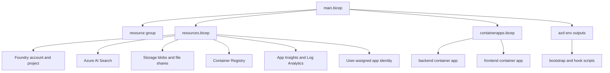

The infrastructure layer is defined in Bicep and surfaced through `azd`. It provisions the Azure resources that every other major subsystem depends on: Foundry account and project, model deployments, Search, Storage, ACR, Container Apps, observability, and the identities that make keyless auth possible. For the frontend build specifically, `azure.yaml` also bakes `NEXT_PUBLIC_ENTRA_TENANT_ID`, `NEXT_PUBLIC_ENTRA_SPA_CLIENT_ID`, and `NEXT_PUBLIC_ENTRA_API_CLIENT_ID` into the web image as build args.[`infra/main.bicep`](https://github.com/ruinosus/foundry-assured/blob/4b749e7bac56789f0b1097cd4a8212b5c5c65d05/infra/main.bicep#L1-L8) [`infra/resources.bicep`](https://github.com/ruinosus/foundry-assured/blob/4b749e7bac56789f0b1097cd4a8212b5c5c65d05/infra/resources.bicep#L1-L10) [`azure.yaml`](https://github.com/ruinosus/foundry-assured/blob/4b749e7bac56789f0b1097cd4a8212b5c5c65d05/azure.yaml#L62-L72)

## Entry points

`infra/main.bicep` is the subscription-scoped entrypoint. It creates the resource group, calls `resources.bicep`, and then calls `containerapps.bicep` with outputs from the resource module.[`infra/main.bicep`](https://github.com/ruinosus/foundry-assured/blob/4b749e7bac56789f0b1097cd4a8212b5c5c65d05/infra/main.bicep#L10-L21) [`infra/main.bicep`](https://github.com/ruinosus/foundry-assured/blob/4b749e7bac56789f0b1097cd4a8212b5c5c65d05/infra/main.bicep#L52-L72) [`infra/main.bicep`](https://github.com/ruinosus/foundry-assured/blob/4b749e7bac56789f0b1097cd4a8212b5c5c65d05/infra/main.bicep#L74-L98)

This split matters because `resources.bicep` owns Azure data plane resources and `containerapps.bicep` consumes their outputs to deploy backend and web containers.

## Core resource groups of concern

`resources.bicep` provisions these major categories:

- Foundry account, project, and model deployments.[`infra/resources.bicep`](https://github.com/ruinosus/foundry-assured/blob/4b749e7bac56789f0b1097cd4a8212b5c5c65d05/infra/resources.bicep#L79-L133)
- Log Analytics and Application Insights with a Foundry connection so tracing lands in the right observability surface.[`infra/resources.bicep`](https://github.com/ruinosus/foundry-assured/blob/4b749e7bac56789f0b1097cd4a8212b5c5c65d05/infra/resources.bicep#L135-L182)
- Storage account, blob container for corpus content, and file shares for app data and prompt definitions.[`infra/resources.bicep`](https://github.com/ruinosus/foundry-assured/blob/4b749e7bac56789f0b1097cd4a8212b5c5c65d05/infra/resources.bicep#L184-L233)
- Azure AI Search with system-assigned identity and AAD-or-API-key auth configuration.[`infra/resources.bicep`](https://github.com/ruinosus/foundry-assured/blob/4b749e7bac56789f0b1097cd4a8212b5c5c65d05/infra/resources.bicep#L235-L254)
- ACR and a shared user-assigned identity for app containers.[`infra/resources.bicep`](https://github.com/ruinosus/foundry-assured/blob/4b749e7bac56789f0b1097cd4a8212b5c5c65d05/infra/resources.bicep#L256-L310)

## Output surface to apps and scripts

`main.bicep` exports many values into the azd environment, including:

- backend and web URLs
- Foundry project/account ids and endpoints
- Search endpoint and KB name
- storage account and container names
- registry details

These outputs are not just for humans; backend bootstrap scripts, postdeploy hooks, and app deployment all consume them.[`infra/main.bicep`](https://github.com/ruinosus/foundry-assured/blob/4b749e7bac56789f0b1097cd4a8212b5c5c65d05/infra/main.bicep#L100-L122) [`scripts/bootstrap.sh`](https://github.com/ruinosus/foundry-assured/blob/4b749e7bac56789f0b1097cd4a8212b5c5c65d05/scripts/bootstrap.sh#L22-L27) [`scripts/hook-postdeploy.sh`](https://github.com/ruinosus/foundry-assured/blob/4b749e7bac56789f0b1097cd4a8212b5c5c65d05/scripts/hook-postdeploy.sh#L17-L30)

## Why storage has both blobs and files

The Container Apps layer makes those storage roles concrete. The backend container receives runtime env vars such as `FOUNDRY_PROJECT_ENDPOINT`, `FOUNDRY_MODEL`, `AZURE_SEARCH_ENDPOINT`, `AZURE_SEARCH_KNOWLEDGE_BASE`, `SELFWIKI_SEARCH_KNOWLEDGE_BASE`, `MCP_ENABLED`, `APP_USERS_GROUP_ID`, and `AGENTS_DIR`, plus Azure Files mounts at `/app/data` and `/mnt/agents`. The web container receives runtime `BACKEND_URL`, `AGUI_URL`, `HOSTED_AGUI_URL`, and `COCKPIT_AGUI_URL`, while browser-visible `NEXT_PUBLIC_*` auth values are baked earlier at image build time.[`infra/containerapps.bicep`](https://github.com/ruinosus/foundry-assured/blob/4b749e7bac56789f0b1097cd4a8212b5c5c65d05/infra/containerapps.bicep#L117-L185) [`infra/containerapps.bicep`](https://github.com/ruinosus/foundry-assured/blob/4b749e7bac56789f0b1097cd4a8212b5c5c65d05/infra/containerapps.bicep#L189-L229) [`azure.yaml`](https://github.com/ruinosus/foundry-assured/blob/4b749e7bac56789f0b1097cd4a8212b5c5c65d05/azure.yaml#L62-L72)

The storage account supports different persistence needs:

- blob container `corpus` stores knowledge source content for ingestion
- `assured-data` file share preserves app-written data such as ticket records across restarts
- `assured-prompts` file share holds runtime agent definitions mounted into the backend container

[`infra/resources.bicep`](https://github.com/ruinosus/foundry-assured/blob/4b749e7bac56789f0b1097cd4a8212b5c5c65d05/infra/resources.bicep#L206-L233)

That explains why deployment and prompt-publishing scripts care about both Storage and Container Apps.

This diagram shows the main Bicep composition and the output surface consumed by deployments and scripts.

## Deployment-mode relevance

Even though deployment modes are a backend concern, infra already contains the main Azure substrates that those modes depend on: Foundry, Search, Storage, and identities. Shared-mode control-plane storage is layered on top rather than replacing the base substrate.[`infra/main.bicep`](https://github.com/ruinosus/foundry-assured/blob/4b749e7bac56789f0b1097cd4a8212b5c5c65d05/infra/main.bicep#L23-L47) [`apps/backend/app/core/auth.py`](https://github.com/ruinosus/foundry-assured/blob/4b749e7bac56789f0b1097cd4a8212b5c5c65d05/apps/backend/app/core/auth.py#L77-L94)

## Focused validation

- `azd up` is the canonical integrated deployment path.[`scripts/up-all.sh`](https://github.com/ruinosus/foundry-assured/blob/4b749e7bac56789f0b1097cd4a8212b5c5c65d05/scripts/up-all.sh#L100-L109)
- `./scripts/bootstrap.sh` is the canonical post-provision data-plane initialization path.[`scripts/bootstrap.sh`](https://github.com/ruinosus/foundry-assured/blob/4b749e7bac56789f0b1097cd4a8212b5c5c65d05/scripts/bootstrap.sh#L58-L63)

Those are the narrowest real validation steps because the infrastructure is consumed as a system, not as isolated templates.https://github.com/ruinosus/foundry-assured/blob/4b749e7bac56789f0b1097cd4a8212b5c5c65d05/scripts/bootstrap.sh#L58-L63)

Those are the narrowest real validation steps because the infrastructure is consumed as a system, not as isolated templates.