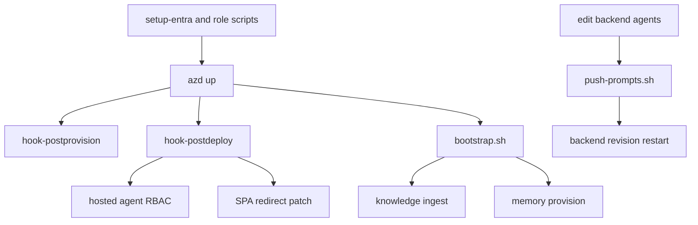

The repository’s operational path is intentionally scripted. Infrastructure, environment propagation, hosted-agent reconciliation, data-plane bootstrap, and prompt publishing are all represented as repo-owned shell scripts and azd hooks rather than tribal knowledge.[`azure.yaml`](https://github.com/ruinosus/foundry-assured/blob/4b749e7bac56789f0b1097cd4a8212b5c5c65d05/azure.yaml#L73-L81) [`scripts/up-all.sh`](https://github.com/ruinosus/foundry-assured/blob/4b749e7bac56789f0b1097cd4a8212b5c5c65d05/scripts/up-all.sh#L1-L17)

## Canonical deployment chain

The canonical full setup chain is:

1. optional Entra app registration and app-role setup
2. `azd up`
3. azd postprovision hook pushes auth/env values needed for web build
4. azd postdeploy hook reconciles hosted-agent RBAC and SPA redirect URI
5. `bootstrap.sh` ingests the KB and provisions memory

`up-all.sh` exists mainly to make that order explicit and repeatable.[`scripts/up-all.sh`](https://github.com/ruinosus/foundry-assured/blob/4b749e7bac56789f0b1097cd4a8212b5c5c65d05/scripts/up-all.sh#L7-L17) [`scripts/up-all.sh`](https://github.com/ruinosus/foundry-assured/blob/4b749e7bac56789f0b1097cd4a8212b5c5c65d05/scripts/up-all.sh#L68-L87) [`scripts/up-all.sh`](https://github.com/ruinosus/foundry-assured/blob/4b749e7bac56789f0b1097cd4a8212b5c5c65d05/scripts/up-all.sh#L89-L109)

## azd service definitions and hooks

`azure.yaml` declares backend and web Container Apps plus four hosted-agent services, then wires two hooks:

- `postprovision` → `./scripts/hook-postprovision.sh`
- `postdeploy` → `./scripts/hook-postdeploy.sh`

[`azure.yaml`](https://github.com/ruinosus/foundry-assured/blob/4b749e7bac56789f0b1097cd4a8212b5c5c65d05/azure.yaml#L6-L23) [`azure.yaml`](https://github.com/ruinosus/foundry-assured/blob/4b749e7bac56789f0b1097cd4a8212b5c5c65d05/azure.yaml#L24-L61) [`azure.yaml`](https://github.com/ruinosus/foundry-assured/blob/4b749e7bac56789f0b1097cd4a8212b5c5c65d05/azure.yaml#L73-L81)

The hook split is deliberate:

- postprovision is about env propagation before app build/deploy expectations
- postdeploy is about facts only knowable after deployment, like hosted-agent identities and deployed web URL

## Bicep outputs into azd env

Publish-time image-to-service mapping is owned by `azure.yaml`: backend and web are Docker-built Container Apps, while the hosted services are Docker-built Azure AI Agent deployments with `python main.py` as startup command. That mapping determines which outputs and hooks matter to each deployed workload.[`azure.yaml`](https://github.com/ruinosus/foundry-assured/blob/4b749e7bac56789f0b1097cd4a8212b5c5c65d05/azure.yaml#L6-L13) [`azure.yaml`](https://github.com/ruinosus/foundry-assured/blob/4b749e7bac56789f0b1097cd4a8212b5c5c65d05/azure.yaml#L14-L61)

`main.bicep` exports values such as Foundry endpoints, Search identifiers, Storage names, backend and web URLs, and registry endpoints. Scripts consume those through `azd env get-values` rather than requiring humans to copy values manually.[`infra/main.bicep`](https://github.com/ruinosus/foundry-assured/blob/4b749e7bac56789f0b1097cd4a8212b5c5c65d05/infra/main.bicep#L100-L122) [`scripts/bootstrap.sh`](https://github.com/ruinosus/foundry-assured/blob/4b749e7bac56789f0b1097cd4a8212b5c5c65d05/scripts/bootstrap.sh#L22-L27) [`scripts/push-prompts.sh`](https://github.com/ruinosus/foundry-assured/blob/4b749e7bac56789f0b1097cd4a8212b5c5c65d05/scripts/push-prompts.sh#L43-L50)

This output-to-azd-env-to-script path is a core operational invariant. If a Bicep output name changes, scripts and hooks may silently break.

## Bootstrap

`bootstrap.sh` is the canonical post-provision data-plane initializer. It:

- reads azd env values
- writes backend `.env` and frontend `.env.local`
- ingests the knowledge base
- provisions the Foundry memory store

[`scripts/bootstrap.sh`](https://github.com/ruinosus/foundry-assured/blob/4b749e7bac56789f0b1097cd4a8212b5c5c65d05/scripts/bootstrap.sh#L1-L10) [`scripts/bootstrap.sh`](https://github.com/ruinosus/foundry-assured/blob/4b749e7bac56789f0b1097cd4a8212b5c5c65d05/scripts/bootstrap.sh#L22-L27) [`scripts/bootstrap.sh`](https://github.com/ruinosus/foundry-assured/blob/4b749e7bac56789f0b1097cd4a8212b5c5c65d05/scripts/bootstrap.sh#L41-L63)

A subtle invariant is documented in comments: missing `FOUNDRY_MEMORY_STORE` should fall back correctly instead of silently becoming empty and skipping memory creation.[`scripts/bootstrap.sh`](https://github.com/ruinosus/foundry-assured/blob/4b749e7bac56789f0b1097cd4a8212b5c5c65d05/scripts/bootstrap.sh#L48-L53)

## Postdeploy reconciliation

`hook-postdeploy.sh` handles two failure-prone responsibilities:

- grant newly minted hosted-agent identities the roles they need
- patch the deployed web URL into the SPA app registration redirect URIs

[`scripts/hook-postdeploy.sh`](https://github.com/ruinosus/foundry-assured/blob/4b749e7bac56789f0b1097cd4a8212b5c5c65d05/scripts/hook-postdeploy.sh#L1-L18) [`scripts/hook-postdeploy.sh`](https://github.com/ruinosus/foundry-assured/blob/4b749e7bac56789f0b1097cd4a8212b5c5c65d05/scripts/hook-postdeploy.sh#L41-L58) [`scripts/hook-postdeploy.sh`](https://github.com/ruinosus/foundry-assured/blob/4b749e7bac56789f0b1097cd4a8212b5c5c65d05/scripts/hook-postdeploy.sh#L61-L85)

Without those steps, deployed hosted agents can 403 and cloud sign-in can fail with redirect URI mismatch.

## Prompt publishing

`push-prompts.sh` is a production prompt-update loop that uploads `apps/backend/agents/` into the Azure Files share mounted at `/mnt/agents` and restarts the backend revision so prompts are recomposed at boot. It is intentionally no-image-build and no-`azd deploy`.[`scripts/push-prompts.sh`](https://github.com/ruinosus/foundry-assured/blob/4b749e7bac56789f0b1097cd4a8212b5c5c65d05/scripts/push-prompts.sh#L1-L17) [`scripts/push-prompts.sh`](https://github.com/ruinosus/foundry-assured/blob/4b749e7bac56789f0b1097cd4a8212b5c5c65d05/scripts/push-prompts.sh#L60-L77)

The script also documents an important caveat: upload-batch overwrites but does not delete, so `--mirror` is required for removals or one-time replacement of the old prompt tree.[`scripts/push-prompts.sh`](https://github.com/ruinosus/foundry-assured/blob/4b749e7bac56789f0b1097cd4a8212b5c5c65d05/scripts/push-prompts.sh#L18-L27) [`scripts/push-prompts.sh`](https://github.com/ruinosus/foundry-assured/blob/4b749e7bac56789f0b1097cd4a8212b5c5c65d05/scripts/push-prompts.sh#L55-L63)

This diagram shows the canonical deployment and post-deploy automation chain.

## Focused validation

The narrowest operational validation steps are:

- `./scripts/up-all.sh --provision-only`
- `./scripts/bootstrap.sh`
- `./scripts/push-prompts.sh --no-restart` when verifying prompt publishing mechanics only

Those steps map directly to the operational seams that most often break.