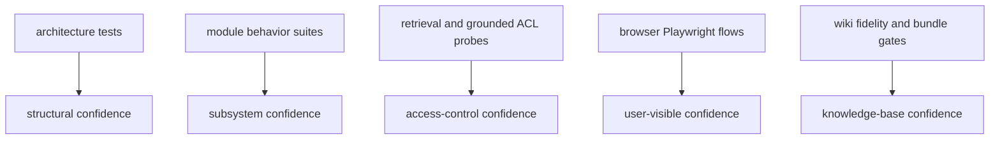

# Testing and assurance overview

The repository’s testing strategy is organized around guarantees, not just code coverage. The README defines the five assurance pillars as build fidelity, recall, completeness, access control, and red-team robustness, each backed by gates in `apps/backend/eval/assurance.yaml` rather than hand-wavy promises ([README.md](https://github.com/ruinosus/foundry-assured/blob/08e078d7f2b6febbc5135f0b7928b5a204c667e3/README.md#L155-L172)). The backend package tree and test layout reinforce that split: architecture tests pin structure, module-focused tests pin subsystem behavior, and browser E2E tests pin user-visible end-to-end flows ([apps/backend/tests](https://github.com/ruinosus/foundry-assured/blob/08e078d7f2b6febbc5135f0b7928b5a204c667e3/apps/backend/tests), [e2e/playwright.config.ts](https://github.com/ruinosus/foundry-assured/blob/08e078d7f2b6febbc5135f0b7928b5a204c667e3/e2e/playwright.config.ts#L15-L38)).

## Architecture and boundary tests

`tests/architecture/module_graph_test.py` is the highest-value structural test. It maps every Python file in `app/` to a destination module, parses imports via AST, and fails when a file is unmapped or a new cross-module edge appears without being recorded and justified ([apps/backend/tests/architecture/module_graph_test.py](https://github.com/ruinosus/foundry-assured/blob/08e078d7f2b6febbc5135f0b7928b5a204c667e3/apps/backend/tests/architecture/module_graph_test.py#L1-L18), [apps/backend/tests/architecture/module_graph_test.py](https://github.com/ruinosus/foundry-assured/blob/08e078d7f2b6febbc5135f0b7928b5a204c667e3/apps/backend/tests/architecture/module_graph_test.py#L69-L103), [apps/backend/tests/architecture/module_graph_test.py](https://github.com/ruinosus/foundry-assured/blob/08e078d7f2b6febbc5135f0b7928b5a204c667e3/apps/backend/tests/architecture/module_graph_test.py#L105-L152)). It is the practical enforcement mechanism behind ADR-017.

This family is the right first stop after file moves, new imports, or module-boundary changes because it catches structural regressions before any runtime test does.

## Backend behavior suites by module

The backend test tree mirrors the module architecture: `admin`, `grounded`, `hosted`, `knowledge`, `platform_ops`, `registry`, `shared`, `smoke`, and `tenancy` all have dedicated directories ([apps/backend/tests](https://github.com/ruinosus/foundry-assured/blob/08e078d7f2b6febbc5135f0b7928b5a204c667e3/apps/backend/tests)). High-value focused examples:

- Registry: `domain_registry_test.py` verifies four domain rows, kind mapping, grounded guards, and mount dispatch ([apps/backend/tests/registry/domain_registry_test.py](https://github.com/ruinosus/foundry-assured/blob/08e078d7f2b6febbc5135f0b7928b5a204c667e3/apps/backend/tests/registry/domain_registry_test.py#L38-L71), [apps/backend/tests/registry/domain_registry_test.py](https://github.com/ruinosus/foundry-assured/blob/08e078d7f2b6febbc5135f0b7928b5a204c667e3/apps/backend/tests/registry/domain_registry_test.py#L87-L145)).
- Tenancy: `tenant_resolution_test.py`, `enabled_domains_roundtrip_test.py`, and connection-store tests pin request-time resolution, entitlement persistence, and zero-secret control-plane storage ([apps/backend/tests/tenancy/tenant_resolution_test.py](https://github.com/ruinosus/foundry-assured/blob/08e078d7f2b6febbc5135f0b7928b5a204c667e3/apps/backend/tests/tenancy/tenant_resolution_test.py#L20-L54), [apps/backend/tests/tenancy/enabled_domains_roundtrip_test.py](https://github.com/ruinosus/foundry-assured/blob/08e078d7f2b6febbc5135f0b7928b5a204c667e3/apps/backend/tests/tenancy/enabled_domains_roundtrip_test.py#L29-L53), [apps/backend/tests/tenancy/connection_store_test.py](https://github.com/ruinosus/foundry-assured/blob/08e078d7f2b6febbc5135f0b7928b5a204c667e3/apps/backend/tests/tenancy/connection_store_test.py#L22-L43)).
- Platform ops: `rbac_per_tool_test.py` and `connection_tools_build_test.py` pin per-tool RBAC and connection-driven tool assembly ([apps/backend/tests/platform_ops/rbac_per_tool_test.py](https://github.com/ruinosus/foundry-assured/blob/08e078d7f2b6febbc5135f0b7928b5a204c667e3/apps/backend/tests/platform_ops/rbac_per_tool_test.py#L14-L45), [apps/backend/tests/platform_ops/connection_tools_build_test.py](https://github.com/ruinosus/foundry-assured/blob/08e078d7f2b6febbc5135f0b7928b5a204c667e3/apps/backend/tests/platform_ops/connection_tools_build_test.py#L16-L40)).
- Hosted: `platform_hosted_bridge_test.py` proves clean AG-UI error framing when the hosted platform endpoint is absent ([apps/backend/tests/hosted/platform_hosted_bridge_test.py](https://github.com/ruinosus/foundry-assured/blob/08e078d7f2b6febbc5135f0b7928b5a204c667e3/apps/backend/tests/hosted/platform_hosted_bridge_test.py#L18-L56)).

## Retrieval and ACL evidence family

The knowledge and grounded tests are the strongest assurance evidence because they tie data access to user-visible grounding. `retrieval_acl_parity_test.py` proves that the production `retrieve()` seam enforces per-user document ACL all the way through header attachment, native retrieval, docKey parsing, and projection ([apps/backend/tests/knowledge/retrieval_acl_parity_test.py](https://github.com/ruinosus/foundry-assured/blob/08e078d7f2b6febbc5135f0b7928b5a204c667e3/apps/backend/tests/knowledge/retrieval_acl_parity_test.py#L1-L19), [apps/backend/tests/knowledge/retrieval_acl_parity_test.py](https://github.com/ruinosus/foundry-assured/blob/08e078d7f2b6febbc5135f0b7928b5a204c667e3/apps/backend/tests/knowledge/retrieval_acl_parity_test.py#L126-L142)). `grounded_archetype_roundtrip_test.py` then proves that the same access distinction survives the real `/cockpit` endpoint and `sources` event ([apps/backend/tests/grounded/grounded_archetype_roundtrip_test.py](https://github.com/ruinosus/foundry-assured/blob/08e078d7f2b6febbc5135f0b7928b5a204c667e3/apps/backend/tests/grounded/grounded_archetype_roundtrip_test.py#L77-L105), [apps/backend/tests/grounded/grounded_archetype_roundtrip_test.py](https://github.com/ruinosus/foundry-assured/blob/08e078d7f2b6febbc5135f0b7928b5a204c667e3/apps/backend/tests/grounded/grounded_archetype_roundtrip_test.py#L125-L147)).

Complementary parsing and ingestion checks include `dockey_decode_test.py` for citation source decoding and `cockpit_acl_stamp_test.py` for Search index permission metadata ([apps/backend/tests/knowledge/dockey_decode_test.py](https://github.com/ruinosus/foundry-assured/blob/08e078d7f2b6febbc5135f0b7928b5a204c667e3/apps/backend/tests/knowledge/dockey_decode_test.py#L1-L20), [apps/backend/tests/knowledge/cockpit_acl_stamp_test.py](https://github.com/ruinosus/foundry-assured/blob/08e078d7f2b6febbc5135f0b7928b5a204c667e3/apps/backend/tests/knowledge/cockpit_acl_stamp_test.py#L48-L64)).

This diagram shows the main evidence families and what kind of confidence each provides.

## Browser Playwright flows

The Playwright suite is the user-facing confidence layer. `smoke.spec.ts` signs in, exercises all four domains, asks grounded questions, and explores hosted toggles and citations ([e2e/smoke.spec.ts](https://github.com/ruinosus/foundry-assured/blob/08e078d7f2b6febbc5135f0b7928b5a204c667e3/e2e/smoke.spec.ts#L74-L90), [e2e/smoke.spec.ts](https://github.com/ruinosus/foundry-assured/blob/08e078d7f2b6febbc5135f0b7928b5a204c667e3/e2e/smoke.spec.ts#L170-L209)). `cockpit-acl.spec.ts` verifies the full browser A/B ACL experience, including content-on-click snippets, and `trigger.spec.ts` is a targeted diagnostic harness for capturing `RUN_ERROR` details ([e2e/cockpit-acl.spec.ts](https://github.com/ruinosus/foundry-assured/blob/08e078d7f2b6febbc5135f0b7928b5a204c667e3/e2e/cockpit-acl.spec.ts#L57-L66), [e2e/cockpit-acl.spec.ts](https://github.com/ruinosus/foundry-assured/blob/08e078d7f2b6febbc5135f0b7928b5a204c667e3/e2e/cockpit-acl.spec.ts#L152-L177), [e2e/trigger.spec.ts](https://github.com/ruinosus/foundry-assured/blob/08e078d7f2b6febbc5135f0b7928b5a204c667e3/e2e/trigger.spec.ts#L17-L52)).

## Wiki fidelity and freshness evidence

The repository’s wiki assurance loop is itself tested. `openwiki/INSTRUCTIONS.md` explains that a backend fidelity gate scores pages by the fraction of citations resolving to real source files and rejects ingestion below the configured floor ([openwiki/INSTRUCTIONS.md](https://github.com/ruinosus/foundry-assured/blob/08e078d7f2b6febbc5135f0b7928b5a204c667e3/openwiki/INSTRUCTIONS.md#L6-L35)). ADR-016 turns that from process lore into an architectural rule: generation can be automated, but verification and ingest ownership remain local ([docs/adr/ADR-016-openwiki-closes-the-freshness-loop.md](https://github.com/ruinosus/foundry-assured/blob/08e078d7f2b6febbc5135f0b7928b5a204c667e3/docs/adr/ADR-016-openwiki-closes-the-freshness-loop.md#L68-L79)).

## Practical validation strategy

When changing code, choose the narrowest evidence family that matches the risk:

| Change type | Narrowest useful validation |
| --- | --- |
| File moves or imports | architecture tests first |
| Domain registry or tenant gating | registry and tenancy suites |
| Retrieval or citations | retrieval ACL parity plus grounded/browser citation tests |
| Hosted bridge changes | hosted tests plus one hosted UI turn |
| Wiki generation or adapters | fidelity-aware bundle adaptation plus ingest validation |

This is the path-compression goal of the repo’s test design: each important seam has a focused proof before you reach for a full end-to-end run.
