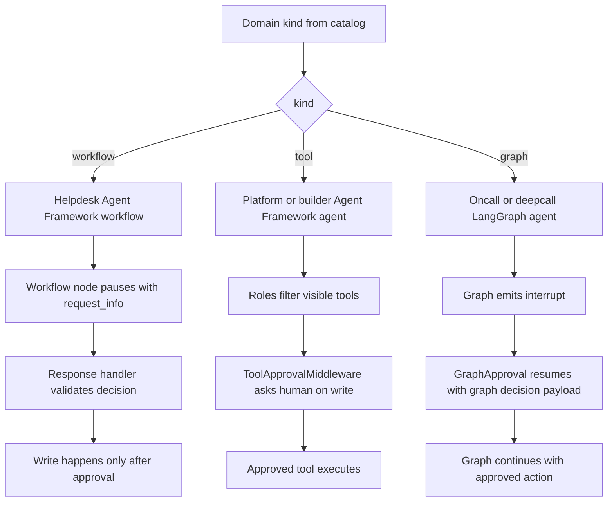

# Workflow, graph, and tool-driven approval flows

The repository exposes four runtime kinds in the domain catalog: `grounded`, `workflow`, `tool`, and `graph`. This page only covers the non-grounded kinds that can perform or authorize writes: helpdesk as a `workflow`, platform and builder as `tool`, and oncall plus deepcall as `graph`. The composition root mounts each domain by `kind`, using Agent Framework's AG-UI adapter for `workflow` and `tool`, and LangGraph's own AG-UI adapter for `graph`. [`apps/backend/app/registry.py`](https://github.com/ruinosus/foundry-assured/blob/18595cf77fa56dad04a5e646bc5dae9bcae7f6fa/apps/backend/app/registry.py#L250-L270) [`apps/frontend/lib/domains.ts`](https://github.com/ruinosus/foundry-assured/blob/18595cf77fa56dad04a5e646bc5dae9bcae7f6fa/apps/frontend/lib/domains.ts#L17-L41) [`apps/frontend/lib/domains.ts`](https://github.com/ruinosus/foundry-assured/blob/18595cf77fa56dad04a5e646bc5dae9bcae7f6fa/apps/frontend/lib/domains.ts#L43-L107)

The key difference between these kinds is not just which runtime executes them, but where write safety lives:

- **Workflow domains** encode the approval stop as part of the workflow graph itself. The write happens only in the workflow response handler after the human answer is accepted. [`apps/backend/app/modules/helpdesk/internal/escalation.py`](https://github.com/ruinosus/foundry-assured/blob/18595cf77fa56dad04a5e646bc5dae9bcae7f6fa/apps/backend/app/modules/helpdesk/internal/escalation.py#L63-L99) [`apps/backend/app/modules/helpdesk/internal/escalation.py`](https://github.com/ruinosus/foundry-assured/blob/18595cf77fa56dad04a5e646bc5dae9bcae7f6fa/apps/backend/app/modules/helpdesk/internal/escalation.py#L101-L163)
- **Tool domains** rely on the runtime's tool-approval mechanism, but still filter tool visibility by role before the agent can call them. Approval gates execution of visible write tools rather than being a custom workflow node. [`apps/backend/app/modules/platform_ops/internal/platform.py`](https://github.com/ruinosus/foundry-assured/blob/18595cf77fa56dad04a5e646bc5dae9bcae7f6fa/apps/backend/app/modules/platform_ops/internal/platform.py#L32-L46) [`apps/backend/app/modules/platform_ops/internal/mcp_registry.py`](https://github.com/ruinosus/foundry-assured/blob/18595cf77fa56dad04a5e646bc5dae9bcae7f6fa/apps/backend/app/modules/platform_ops/internal/mcp_registry.py#L5-L12) [`apps/backend/app/modules/platform_ops/internal/mcp_registry.py`](https://github.com/ruinosus/foundry-assured/blob/18595cf77fa56dad04a5e646bc5dae9bcae7f6fa/apps/backend/app/modules/platform_ops/internal/mcp_registry.py#L130-L175)
- **Graph domains** use their own runtime-native interrupt and resume vocabulary. Approval is still structurally outside the model's free-form text, but the pause and resume are carried by LangGraph interrupts instead of Agent Framework `request_info`. [`apps/backend/app/registry.py`](https://github.com/ruinosus/foundry-assured/blob/18595cf77fa56dad04a5e646bc5dae9bcae7f6fa/apps/backend/app/registry.py#L200-L247) [`apps/frontend/components/chat/GraphApproval.tsx`](https://github.com/ruinosus/foundry-assured/blob/18595cf77fa56dad04a5e646bc5dae9bcae7f6fa/apps/frontend/components/chat/GraphApproval.tsx#L18-L31) [`apps/frontend/components/chat/GraphApproval.tsx`](https://github.com/ruinosus/foundry-assured/blob/18595cf77fa56dad04a5e646bc5dae9bcae7f6fa/apps/frontend/components/chat/GraphApproval.tsx#L58-L100)

This diagram shows where each runtime kind places its human approval gate before a write can proceed.

## Runtime archetypes in the domain catalog

The frontend and backend share the same conceptual domain kinds. `helpdesk` is `workflow`; `platform` and `builder` are `tool`; `oncall` and `deepcall` are `graph`. The console uses that kind to decide which approval component to mount: `TicketApproval` for Agent Framework `workflow` and `tool` domains, `GraphApproval` for `graph`, and no approval component for `grounded`. [`apps/frontend/lib/domains.ts`](https://github.com/ruinosus/foundry-assured/blob/18595cf77fa56dad04a5e646bc5dae9bcae7f6fa/apps/frontend/lib/domains.ts#L43-L107) [`apps/frontend/components/console/AssuranceConsole.tsx`](https://github.com/ruinosus/foundry-assured/blob/18595cf77fa56dad04a5e646bc5dae9bcae7f6fa/apps/frontend/components/console/AssuranceConsole.tsx#L44-L53) [`apps/frontend/components/console/AssuranceConsole.tsx`](https://github.com/ruinosus/foundry-assured/blob/18595cf77fa56dad04a5e646bc5dae9bcae7f6fa/apps/frontend/components/console/AssuranceConsole.tsx#L150-L167)

The backend mirrors that split in `mount_domains(app)`. `workflow` domains go to `_mount_helpdesk`, `tool` domains go to `_mount_platform` or `_mount_builder`, and `graph` domains go to `_mount_graph`. The graph path is notable because LangGraph's adapter does not accept FastAPI `dependencies`, so the code mounts it on an `APIRouter` and then includes that router with the normal domain dependencies; that preserves auth and tenant entitlement even though the adapter itself has no `dependencies=` parameter. [`apps/backend/app/registry.py`](https://github.com/ruinosus/foundry-assured/blob/18595cf77fa56dad04a5e646bc5dae9bcae7f6fa/apps/backend/app/registry.py#L182-L247) [`apps/backend/app/registry.py`](https://github.com/ruinosus/foundry-assured/blob/18595cf77fa56dad04a5e646bc5dae9bcae7f6fa/apps/backend/app/registry.py#L250-L270)

## Write-safety invariants

Across all three non-grounded kinds, the important invariant is the same: **the model proposing a write is not enough to perform the write**. The implementation differs by runtime, but the repository keeps three consistent safety properties:

1. **The pause is structural, not prompt-only.** The runtime emits a real interrupt or approval request that the frontend can detect and resume. [`apps/backend/app/modules/helpdesk/internal/escalation.py`](https://github.com/ruinosus/foundry-assured/blob/18595cf77fa56dad04a5e646bc5dae9bcae7f6fa/apps/backend/app/modules/helpdesk/internal/escalation.py#L89-L96) [`apps/backend/app/modules/platform_ops/internal/platform.py`](https://github.com/ruinosus/foundry-assured/blob/18595cf77fa56dad04a5e646bc5dae9bcae7f6fa/apps/backend/app/modules/platform_ops/internal/platform.py#L32-L46) [`apps/frontend/components/chat/GraphApproval.tsx`](https://github.com/ruinosus/foundry-assured/blob/18595cf77fa56dad04a5e646bc5dae9bcae7f6fa/apps/frontend/components/chat/GraphApproval.tsx#L93-L100)
2. **The approving human does not bypass authorization.** Helpdesk delegates approval authorization to `hitl.decide()`, while platform filters write tools by role before the agent sees them. [`apps/backend/app/modules/helpdesk/internal/escalation.py`](https://github.com/ruinosus/foundry-assured/blob/18595cf77fa56dad04a5e646bc5dae9bcae7f6fa/apps/backend/app/modules/helpdesk/internal/escalation.py#L127-L156) [`apps/backend/app/modules/platform_ops/internal/mcp_registry.py`](https://github.com/ruinosus/foundry-assured/blob/18595cf77fa56dad04a5e646bc5dae9bcae7f6fa/apps/backend/app/modules/platform_ops/internal/mcp_registry.py#L142-L175) [`apps/backend/app/modules/platform_ops/internal/platform.py`](https://github.com/ruinosus/foundry-assured/blob/18595cf77fa56dad04a5e646bc5dae9bcae7f6fa/apps/backend/app/modules/platform_ops/internal/platform.py#L41-L45)
3. **Malformed or missing approval data fails closed.** Helpdesk treats unrecognized decision payloads as reject, and unclassified MCP tools are treated as writes rather than reads. [`apps/backend/app/modules/helpdesk/internal/escalation.py`](https://github.com/ruinosus/foundry-assured/blob/18595cf77fa56dad04a5e646bc5dae9bcae7f6fa/apps/backend/app/modules/helpdesk/internal/escalation.py#L172-L190) [`apps/backend/app/modules/platform_ops/internal/mcp_registry.py`](https://github.com/ruinosus/foundry-assured/blob/18595cf77fa56dad04a5e646bc5dae9bcae7f6fa/apps/backend/app/modules/platform_ops/internal/mcp_registry.py#L130-L147)

## Helpdesk: workflow-native approval around ticket creation

Helpdesk is the repository's workflow archetype. When knowledge is configured, the registry mounts an `OrderedAgentFrameworkWorkflow` whose per-request factory calls `build_helpdesk_workflow(thread_id, domain_spec_provider=...)`; without knowledge it falls back to a single concierge agent. The per-request factory matters because the workflow binds the current request's credential, memory scope, conversation history, and optionally grounded retrieval with the current user and domain spec. [`apps/backend/app/registry.py`](https://github.com/ruinosus/foundry-assured/blob/18595cf77fa56dad04a5e646bc5dae9bcae7f6fa/apps/backend/app/registry.py#L103-L135) [`apps/backend/app/modules/helpdesk/internal/graph.py`](https://github.com/ruinosus/foundry-assured/blob/18595cf77fa56dad04a5e646bc5dae9bcae7f6fa/apps/backend/app/modules/helpdesk/internal/graph.py#L34-L80)

The workflow chain is `triage -> retrieve -> resolve -> escalate`, with an optional `SourcesExecutor` inserted when retrieval is active. The `escalate` node is an `EscalationExecutor`, not an ordinary tool call. It inspects the resolve output, and if the response starts with `TICKET:` it extracts the summary, optionally extracts a `WHY:` line, and pauses the workflow with `ctx.request_info(...)`. If no ticket is needed, it simply yields the resolve text as workflow output. [`apps/backend/app/modules/helpdesk/internal/graph.py`](https://github.com/ruinosus/foundry-assured/blob/18595cf77fa56dad04a5e646bc5dae9bcae7f6fa/apps/backend/app/modules/helpdesk/internal/graph.py#L82-L100) [`apps/backend/app/modules/helpdesk/internal/escalation.py`](https://github.com/ruinosus/foundry-assured/blob/18595cf77fa56dad04a5e646bc5dae9bcae7f6fa/apps/backend/app/modules/helpdesk/internal/escalation.py#L69-L99)

That design gives helpdesk its strongest safety guarantee: ticket creation is physically placed in the response handler that runs after the approval answer returns. `on_decision()` normalizes the answer, constructs an `ApprovalRequest` that requires `Approver` or `Admin`, asks `decide(...)` to authorize and interpret the approval, and only then calls `create_ticket(summary, domain="helpdesk")`. Reject yields a message and stops; unauthorized decisions yield a refusal message and stop; only approve or edit reach the write. [`apps/backend/app/modules/helpdesk/internal/escalation.py`](https://github.com/ruinosus/foundry-assured/blob/18595cf77fa56dad04a5e646bc5dae9bcae7f6fa/apps/backend/app/modules/helpdesk/internal/escalation.py#L101-L163)

### Decision shapes and fail-closed parsing

Helpdesk accepts both the legacy boolean payload and a decision object with `type`, `args`, and `message`. That is how the runtime supports a simple approve or reject flow and an edited summary flow without breaking older clients. `_read_answer()` returns `approve` for `True`, `reject` for `False`, accepts only `approve`, `edit`, or `reject` from dict payloads, truncates reject reasons to `MAX_MOTIVO`, and converts anything unrecognized into `reject`. A malformed payload therefore cannot accidentally open a ticket. [`apps/backend/app/modules/helpdesk/internal/escalation.py`](https://github.com/ruinosus/foundry-assured/blob/18595cf77fa56dad04a5e646bc5dae9bcae7f6fa/apps/backend/app/modules/helpdesk/internal/escalation.py#L166-L190)

### Frontend handling of workflow interrupts

The Agent Framework path does not rely on CopilotKit's generic interrupt hook. `TicketApproval` subscribes directly to the agent event stream because the Agent Framework adapter emits a `request_info` custom event. When it sees that event, it discriminates between a helpdesk ticket approval payload and a platform tool approval payload, displays the card, and resumes the paused run with `agent.runAgent({ resume: [{ interruptId, status: "resolved", payload }] })`. [`apps/frontend/components/chat/TicketApproval.tsx`](https://github.com/ruinosus/foundry-assured/blob/18595cf77fa56dad04a5e646bc5dae9bcae7f6fa/apps/frontend/components/chat/TicketApproval.tsx#L3-L21) [`apps/frontend/components/chat/TicketApproval.tsx`](https://github.com/ruinosus/foundry-assured/blob/18595cf77fa56dad04a5e646bc5dae9bcae7f6fa/apps/frontend/components/chat/TicketApproval.tsx#L69-L103) [`apps/frontend/components/chat/TicketApproval.tsx`](https://github.com/ruinosus/foundry-assured/blob/18595cf77fa56dad04a5e646bc5dae9bcae7f6fa/apps/frontend/components/chat/TicketApproval.tsx#L107-L134)

The UI mirrors, but does not replace, server enforcement. It tells the user that `Approver` or `Admin` can approve, disables approve and edit buttons for callers without those roles when auth is configured, and allows reject without a privileged role. The backend remains authoritative; the comment explicitly says the role list is only a frontend mirror of backend policy. [`apps/frontend/components/chat/TicketApproval.tsx`](https://github.com/ruinosus/foundry-assured/blob/18595cf77fa56dad04a5e646bc5dae9bcae7f6fa/apps/frontend/components/chat/TicketApproval.tsx#L30-L33) [`apps/frontend/components/chat/TicketApproval.tsx`](https://github.com/ruinosus/foundry-assured/blob/18595cf77fa56dad04a5e646bc5dae9bcae7f6fa/apps/frontend/components/chat/TicketApproval.tsx#L136-L141) [`apps/frontend/components/chat/TicketApproval.tsx`](https://github.com/ruinosus/foundry-assured/blob/18595cf77fa56dad04a5e646bc5dae9bcae7f6fa/apps/frontend/components/chat/TicketApproval.tsx#L265-L293)

### Declarative workflows prove the same pause and resume contract

The helpdesk declarative workflow test exists to prove that a declared human step really becomes a runtime gate. It builds the published helpdesk YAML into a `Workflow`, runs a minimal YAML with a `Question` step until it emits a `request_info` event, resumes it with `ExternalInputResponse(user_input="aprovado")`, and verifies that the later executors run. It also verifies that a YAML referencing a nonexistent agent fails at workflow construction time rather than on first execution. [`apps/backend/tests/helpdesk/declarative_workflow_test.py`](https://github.com/ruinosus/foundry-assured/blob/18595cf77fa56dad04a5e646bc5dae9bcae7f6fa/apps/backend/tests/helpdesk/declarative_workflow_test.py#L12-L18) [`apps/backend/tests/helpdesk/declarative_workflow_test.py`](https://github.com/ruinosus/foundry-assured/blob/18595cf77fa56dad04a5e646bc5dae9bcae7f6fa/apps/backend/tests/helpdesk/declarative_workflow_test.py#L79-L99) [`apps/backend/tests/helpdesk/declarative_workflow_test.py`](https://github.com/ruinosus/foundry-assured/blob/18595cf77fa56dad04a5e646bc5dae9bcae7f6fa/apps/backend/tests/helpdesk/declarative_workflow_test.py#L112-L141)

## Platform: tool-driven operations over MCP

Platform is the tool archetype. When platform is configured, the registry mounts `platform_agent_proxy`, a `PerRequestAgent` that rebuilds the platform agent for each run so the tool set reflects the current caller's credential and roles. [`apps/backend/app/registry.py`](https://github.com/ruinosus/foundry-assured/blob/18595cf77fa56dad04a5e646bc5dae9bcae7f6fa/apps/backend/app/registry.py#L182-L197) [`apps/backend/app/modules/platform_ops/internal/platform.py`](https://github.com/ruinosus/foundry-assured/blob/18595cf77fa56dad04a5e646bc5dae9bcae7f6fa/apps/backend/app/modules/platform_ops/internal/platform.py#L98-L121)

The platform agent is built from `PLATFORM_INSTRUCTIONS`, `build_mcp_tools()`, and a `ToolApprovalMiddleware` subclass. The repository intentionally adopts the framework's native tool approval instead of recreating it. The subclass only records approval decisions into audit; the actual state machine remains the framework's. Auto-approval rules are deliberately absent, so nothing starts pre-approved. [`apps/backend/app/modules/platform_ops/internal/platform.py`](https://github.com/ruinosus/foundry-assured/blob/18595cf77fa56dad04a5e646bc5dae9bcae7f6fa/apps/backend/app/modules/platform_ops/internal/platform.py#L32-L46) [`apps/backend/app/modules/platform_ops/internal/platform.py`](https://github.com/ruinosus/foundry-assured/blob/18595cf77fa56dad04a5e646bc5dae9bcae7f6fa/apps/backend/app/modules/platform_ops/internal/platform.py#L46-L96) [`apps/backend/app/modules/platform_ops/internal/platform.py`](https://github.com/ruinosus/foundry-assured/blob/18595cf77fa56dad04a5e646bc5dae9bcae7f6fa/apps/backend/app/modules/platform_ops/internal/platform.py#L98-L109)

### Role filtering happens before approval

The important structural difference from helpdesk is that platform approval is **not** the place where role authorization is decided. Role governance lives in the MCP registry catalog. Each server declares read tools, write tools, and minimum roles. `classify_tool()` treats anything not explicitly listed as a read as a write, and `visible_tools_for()` returns only the read and write tools whose server-level and connection-level minimum-role grants are both satisfied. The platform module's own comments call out that this ordering is required so the approval middleware is only ever consulted for tools the caller is already entitled to run. [`apps/backend/app/modules/platform_ops/internal/mcp_registry.py`](https://github.com/ruinosus/foundry-assured/blob/18595cf77fa56dad04a5e646bc5dae9bcae7f6fa/apps/backend/app/modules/platform_ops/internal/mcp_registry.py#L5-L12) [`apps/backend/app/modules/platform_ops/internal/mcp_registry.py`](https://github.com/ruinosus/foundry-assured/blob/18595cf77fa56dad04a5e646bc5dae9bcae7f6fa/apps/backend/app/modules/platform_ops/internal/mcp_registry.py#L130-L175) [`apps/backend/app/modules/platform_ops/internal/platform.py`](https://github.com/ruinosus/foundry-assured/blob/18595cf77fa56dad04a5e646bc5dae9bcae7f6fa/apps/backend/app/modules/platform_ops/internal/platform.py#L41-L45)

That makes the tool path's safety model two-stage:

1. The user only sees tools allowed by role and tenant connection policy.
2. For visible write tools, the framework's approval middleware asks a human before execution.

The write gate is therefore split between catalog-time exposure and runtime approval rather than encoded as an explicit workflow node.

### Discovery and endpoint writes are tenant-local and late-authenticated

The platform domain also includes endpoint discovery and approval flows for MCP sources. `discover_endpoint()` refuses nonexistent or unapproved endpoints, derives the header provider only after loading the approved endpoint record, validates the origin including DNS resolution to public addresses when requested, takes a per-tenant lease, and only then calls discovery. For `connection` and `obo` auth modes, the bearer is resolved lazily through a cached provider; if the connection is absent, disabled, mismatched, or the origin does not match an approved registered server pattern, the code raises `MCP_AUTH_NOT_AVAILABLE`. [`apps/backend/app/modules/platform_ops/internal/mcp_egress.py`](https://github.com/ruinosus/foundry-assured/blob/18595cf77fa56dad04a5e646bc5dae9bcae7f6fa/apps/backend/app/modules/platform_ops/internal/mcp_egress.py#L181-L196) [`apps/backend/app/modules/platform_ops/internal/mcp_egress.py`](https://github.com/ruinosus/foundry-assured/blob/18595cf77fa56dad04a5e646bc5dae9bcae7f6fa/apps/backend/app/modules/platform_ops/internal/mcp_egress.py#L227-L269) [`apps/backend/app/modules/platform_ops/internal/mcp_egress.py`](https://github.com/ruinosus/foundry-assured/blob/18595cf77fa56dad04a5e646bc5dae9bcae7f6fa/apps/backend/app/modules/platform_ops/internal/mcp_egress.py#L272-L322)

The focused auth test covers that late-auth behavior end to end. It verifies that public discovery sends no auth header provider, connection-backed discovery resolves the tenant-local `connectionRef`, only asks the credential broker once per session, and passes the approved origin to the broker, and that missing, disabled, or auth-incompatible connections fail with `MCP_AUTH_NOT_AVAILABLE` before discovery runs. It also verifies that OBO discovery derives the Azure DevOps audience from the server allowlist. [`apps/backend/tests/platform_ops/mcp_discovery_auth_test.py`](https://github.com/ruinosus/foundry-assured/blob/18595cf77fa56dad04a5e646bc5dae9bcae7f6fa/apps/backend/tests/platform_ops/mcp_discovery_auth_test.py#L36-L56) [`apps/backend/tests/platform_ops/mcp_discovery_auth_test.py`](https://github.com/ruinosus/foundry-assured/blob/18595cf77fa56dad04a5e646bc5dae9bcae7f6fa/apps/backend/tests/platform_ops/mcp_discovery_auth_test.py#L58-L102) [`apps/backend/tests/platform_ops/mcp_discovery_auth_test.py`](https://github.com/ruinosus/foundry-assured/blob/18595cf77fa56dad04a5e646bc5dae9bcae7f6fa/apps/backend/tests/platform_ops/mcp_discovery_auth_test.py#L103-L167)

## Graph domains: oncall and deepcall

Graph domains are mounted through LangGraph's adapter instead of Agent Framework's. `_mount_graph()` chooses `build_oncall_graph` for `oncall` and `build_deepcall_graph` for `deepcall`, wraps the graph in `LangGraphAgent`, and uses an `APIRouter` wrapper so normal auth and entitlement dependencies still apply. [`apps/backend/app/registry.py`](https://github.com/ruinosus/foundry-assured/blob/18595cf77fa56dad04a5e646bc5dae9bcae7f6fa/apps/backend/app/registry.py#L200-L247)

`oncall` is deliberately fail-closed in shared mode. `oncall_configured()` returns `False` when `deployment_mode == "shared"` because its current checkpointer is not durable enough for interrupts that may land on another replica. The mount gate therefore prevents a graph domain from advertising human approval semantics it cannot safely preserve across replicas. [`apps/backend/app/modules/oncall/public.py`](https://github.com/ruinosus/foundry-assured/blob/18595cf77fa56dad04a5e646bc5dae9bcae7f6fa/apps/backend/app/modules/oncall/public.py#L1-L14) [`apps/backend/app/modules/oncall/public.py`](https://github.com/ruinosus/foundry-assured/blob/18595cf77fa56dad04a5e646bc5dae9bcae7f6fa/apps/backend/app/modules/oncall/public.py#L26-L34)

`deepcall` exists as the deepagents twin of `oncall`, intended for side-by-side comparison with the same problem, tools, prompt contract, and HITL semantics while changing only the harness. That makes it a graph-domain comparison surface, not a separate business capability with a different approval model. [`apps/backend/app/modules/deepcall/public.py`](https://github.com/ruinosus/foundry-assured/blob/18595cf77fa56dad04a5e646bc5dae9bcae7f6fa/apps/backend/app/modules/deepcall/public.py#L1-L18)

### Frontend handling of graph interrupts

`GraphApproval` deliberately uses CopilotKit's own `useInterrupt` hook instead of the Agent Framework event tap. The component reads the graph action request out of either the standard AG-UI interrupt metadata or the legacy `on_interrupt` payload, renders the approval card outside the transcript, and resumes with LangGraph's own decision vocabulary: `{ decisions: [{ type, edited_action? }] }`. That vocabulary supports native `edit` decisions on graph actions. [`apps/frontend/components/chat/GraphApproval.tsx`](https://github.com/ruinosus/foundry-assured/blob/18595cf77fa56dad04a5e646bc5dae9bcae7f6fa/apps/frontend/components/chat/GraphApproval.tsx#L18-L31) [`apps/frontend/components/chat/GraphApproval.tsx`](https://github.com/ruinosus/foundry-assured/blob/18595cf77fa56dad04a5e646bc5dae9bcae7f6fa/apps/frontend/components/chat/GraphApproval.tsx#L40-L69) [`apps/frontend/components/chat/GraphApproval.tsx`](https://github.com/ruinosus/foundry-assured/blob/18595cf77fa56dad04a5e646bc5dae9bcae7f6fa/apps/frontend/components/chat/GraphApproval.tsx#L93-L100)

This is intentionally not normalized into `TicketApproval`. The console mounts separate components because the two runtimes emit different approval events and require different resume payloads. [`apps/frontend/components/chat/TicketApproval.tsx`](https://github.com/ruinosus/foundry-assured/blob/18595cf77fa56dad04a5e646bc5dae9bcae7f6fa/apps/frontend/components/chat/TicketApproval.tsx#L35-L44) [`apps/frontend/components/console/AssuranceConsole.tsx`](https://github.com/ruinosus/foundry-assured/blob/18595cf77fa56dad04a5e646bc5dae9bcae7f6fa/apps/frontend/components/console/AssuranceConsole.tsx#L44-L53) [`apps/frontend/components/console/AssuranceConsole.tsx`](https://github.com/ruinosus/foundry-assured/blob/18595cf77fa56dad04a5e646bc5dae9bcae7f6fa/apps/frontend/components/console/AssuranceConsole.tsx#L150-L154)

## Comparing the three approval styles

| Kind | Example domains | Runtime pause primitive | Who decides authorization | Where the write becomes possible |
| --- | --- | --- | --- | --- |
| `workflow` | `helpdesk` | Agent Framework `request_info` inside workflow node | `hitl.decide()` on the response handler's `ApprovalRequest` | Inside the workflow response handler after approval, when `create_ticket(...)` is called |
| `tool` | `platform` | Agent Framework native tool approval middleware | Role and connection filtering before tool exposure; middleware only gates already-visible tools | When the approved tool call executes |
| `graph` | `oncall`, `deepcall` | LangGraph interrupt resumed with graph decision payload | The graph runtime and its own HITL contract | When the resumed graph continues past the interrupt |

The main architectural takeaway is that **workflow**, **tool**, and **graph** are not interchangeable names for "an agent that may ask for approval." They are different runtime contracts with different extension points:

- Add a new **workflow** when the sequence of internal steps and the approval stop are themselves part of the product behavior.
- Add a new **tool** domain when capability comes from a curated tool surface and the runtime's native tool approval should gate writes.
- Add a new **graph** domain when the runtime itself is LangGraph or deepagents and its interrupt semantics are part of what the repository is demonstrating.

In all three cases, the repository's safety invariant stays the same: a human approval event must be carried through runtime structure before any write path can complete.
